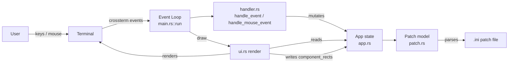
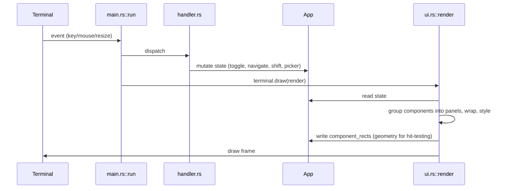

# ARCHITECTURE.md

## Architecture Overview

`droid_tui` is a single-crate Rust terminal application for loading, inspecting, and interacting with DROID hardware patch files (`.ini`). It renders the hardware components a patch defines — buttons, knobs, CV I/O, encoders, LEDs, switches — grouped into labeled panels that mirror the physical controller layout (P2B8, Faderbank, Notebuttons, …), and supports keyboard and mouse interaction plus shift-group visualization.

The system is a **layered monolith** with no framework, no async runtime, and no network: a single-threaded event loop reads terminal events, mutates an in-memory application state, and redraws the screen. The domain model and `.ini` parser are pure functions over strings; the renderer owns all layout decisions and publishes per-frame geometry back to the state for mouse hit-testing.

The app is a **patch viewer/interactor, not a hardware bridge**: it parses `.ini` files and simulates component state locally. It does not connect to DROID hardware.

## 1. Project Structure

```
droid_tui/
├── Cargo.toml              # crate manifest; deps: ratatui, crossterm, color-eyre
├── Cargo.lock
├── src/
│   ├── main.rs             # entry point, terminal lifecycle, event loop
│   ├── app.rs              # App state struct + picker helpers
│   ├── handler.rs          # keyboard + mouse event handling
│   ├── patch.rs            # domain model (Patch, HwComponent, …) + .ini parser
│   └── ui.rs               # ratatui rendering (panels, components, status, picker)
├── fixtures/               # test fixtures: arpeggio1.ini, picker_test/
├── openspec/
│   ├── changes/            # OpenSpec change proposals (archive/ holds completed ones)
│   └── specs/              # capability specs (on archive/droid-patch-tui branch):
│                           #   controller-panels, file-picker, mouse-interaction,
│                           #   patch-parsing, shift-visualization
├── .opencode/              # agent orchestration config (engineers, source roots, platform)
├── .agents/skills/         # project skills (guardrails, ratatui, rust, openspec, …)
├── .beads/                 # beads issue tracker data (Dolt-backed, tooling only)
├── .claude/skills/         # Claude Code skills (droid-patch-format, verify, …)
├── droid_living_examlpes/  # symlink to local DROID reference checkout (machine-local, untracked)
└── target/                 # build artifacts (partially tracked in git — see §15)
```

## 2. High-Level System Diagram



## 3. Core Components

### 3.1 User Interface (`src/ui.rs`)

- **Responsibility**: render the entire screen from `App` state each frame; compute layout; publish component geometry for mouse hit-testing.
- **Key functions**: `render` (picker overlay vs. header/main/status split), `render_patch` (groups components into controller panels, wraps to rows, applies shift-group border colors, records `component_rects`), `render_component`, `render_status`, `render_picker`.
- **Technologies**: ratatui 0.29 (`Frame`, `Layout`, `Flex`, `Block`, `Paragraph`), crossterm colors/modifiers.
- **Inputs**: `&mut App`; **Outputs**: terminal frame; side effect: `app.component_rects` filled per frame.
- **Key invariant**: layout is recomputed fresh from `frame.area()` on every draw — terminal resize needs no state handling.

### 3.2 Domain Model & Parser (`src/patch.rs`)

- **Responsibility**: typed model of a DROID patch and a hand-rolled `.ini` parser that builds it.
- **Types**: `Patch` (name, `hw_components`, `shift_groups`), `HwComponent` (id, label, kind, shift_group, state, controller), `ComponentKind` (Button, CvIn, CvOut, Knob, Switch, Led, Encoder), `ComponentState` (Off, On, Value(f32), Active), `ShiftGroup` (Group1–4 with `color()`/`key_label()`), `Module` / `ModuleWidth` (circuit-level containers that group components inside controller panels).
- **Key functions**: `Patch::from_ini_file` / `from_ini_str` / `sample`, `parse_ini_sections` (comment stripping, repeated-section preservation), `scan_hw_tokens` (boundary-aware token scanner), `token_kind`, `add_component`.
- **Inputs**: `.ini` file content; **Outputs**: `Result<Patch, String>` (descriptive errors, never panics on malformed input).
- **Design notes**: the parser is deliberately custom (the `ini` crate was removed from `Cargo.toml`) to preserve repeated section names and control token extraction precisely.

### 3.3 Input Handling (`src/handler.rs`)

- **Responsibility**: translate terminal events into `App` mutations.
- **Key functions**: `handle_event` (keyboard: `q`/Ctrl+C quit, `l` open picker, `1`–`4` shift groups, `o` toggle portrait/landscape orientation, `Esc` clear shift/cancel, Enter/Space toggle, `j`/`k`/arrows navigate), `handle_mouse_event` (hover highlight, left-click toggle, scroll ±0.05 on knobs/faders), `handle_picker_event` (directory navigation, Enter on dir/`.ini`, Esc cancel), `rect_contains` hit-testing.
- **Inputs**: `KeyEvent`/`MouseEvent`; **Outputs**: `bool` (quit flag) or `()`; mutates `App`.
- **Key invariant**: mouse hit-testing uses `app.component_rects` written by the renderer — the renderer, not the handler, knows where components actually landed on screen.

### 3.4 Application State (`src/app.rs`)

- **Responsibility**: single mutable state object threaded through the whole app.
- **Fields**: `patch: Option<Patch>`, `active_shift: Option<ShiftGroup>`, `hovered_component: Option<usize>`, `status_message`, file-picker state (`showing_picker`, `picker_dir`, `selected_file`, `picker_entries`, `picker_index`), `component_rects: Vec<(usize, Rect)>`, `scale_factor: f32` (uniform component-cell scaling applied by the renderer), `orientation: Orientation` (Portrait/Landscape panel direction).
- **Key functions**: `App::new`/`Default`, `refresh_picker_entries`, `load_sample_patch`; free function `is_entry_selectable` (`.ini` files and directories selectable, others dimmed).

### 3.5 Entry Point & Event Loop (`src/main.rs`)

- **Responsibility**: process lifecycle and the draw→read→dispatch loop.
- **Key functions**: `main` (color-eyre install, `ratatui::init()`, mouse capture enable, panic-hook chaining to disable mouse capture on panic, `run`, restore), `run` (loop: `terminal.draw(render)` → `event::read()` → dispatch key/mouse/resize).
- **Technologies**: crossterm 0.28 (`EnableMouseCapture`/`DisableMouseCapture`, `event::read`), ratatui `DefaultTerminal`.

## 4. Data Flow

**Main runtime loop** (per frame):



**Key user journeys**:
- **Load a patch**: press `l` → picker overlay lists current dir → navigate with `j`/`k`/arrows → Enter on `.ini` → `Patch::from_ini_file` parses → picker closes → panels render.
- **Toggle a component**: Enter/Space on hovered component, or mouse click on a component rect → `toggle_component` flips `ComponentState` → status bar shows "Toggled: <label>".
- **Shift visualization**: press `1`–`4` → `active_shift` set → panels containing matching `shift_group` get bold colored borders, others dim; `Esc` clears.
- **Resize**: `Event::Resize` is ignored — the next `draw` recomputes layout from the new `frame.area()`.

## 5. Data Stores

**None.** The application holds all state in memory (`App`) and persists nothing. The `.beads/` directory is the beads issue-tracker's Dolt-backed store — developer tooling, not application data. No database, no schema, no migration strategy.

## 6. External Integrations / APIs

**None at runtime.** The app reads local `.ini` files and simulates component state; it does not talk to DROID hardware, MIDI, or any network service. DROID reference material (`droid_living_examlpes/`) is a machine-local symlink used for development reference only.

## 7. Key Technologies

| Technology | Version | Architectural relevance |
|---|---|---|
| Rust | 2021 edition | Single-crate monolith; no unsafe code |
| ratatui | 0.29 | Terminal UI: `DefaultTerminal`, `Layout`/`Flex`, widgets; owns raw-mode/alternate-screen lifecycle via `init()`/`restore()` |
| crossterm | 0.28 | Event source (`event::read`), mouse capture enable/disable |
| color-eyre | 0.6 | Error reporting + panic hook (chained to also disable mouse capture) |
| OpenSpec | — | Change proposals + capability specs under `openspec/` |

## 8. Deployment & Infrastructure

- **Build**: `cargo build` (debug) / `cargo build --release`; single native binary `droid_tui`.
- **CI/CD**: none (no `.github/workflows`, no GitLab CI).
- **Containerization**: none.
- **Environment config**: none — no env vars, no config files; the picker starts in `std::env::current_dir()`.
- **Git**: no remote configured; branches `master` (initial commit) and `feature/droid-patch-tui` (active work); archive branch `archive/droid-patch-tui` holds the archived `droid-patch-tui` change plus synced main specs.

## 9. Security Architecture

- **Trust boundary**: the app runs locally with the user's privileges; the only external input is local `.ini` files.
- **Input validation**: the parser is defensive — malformed/empty files return descriptive `Err(String)` and never panic (tested: `rejects_empty_file`).
- **Secrets**: none handled, none stored.
- **Auth/authz**: not applicable (no network, no multi-user).
- **Terminal hygiene**: raw mode, alternate screen, and mouse capture are restored on normal exit and on panic (chained panic hook).

## 10. Monitoring & Observability

- **Logging**: none (no logging framework).
- **Error reporting**: color-eyre renders panics/errors to the terminal.
- **Metrics/tracing**: none.
- **Observability gap**: no way to observe runtime behavior outside the TUI itself; acceptable for a local interactive tool.

## 11. Performance & Scalability

- **Model**: single-threaded, no concurrency, no caching.
- **Per-frame cost**: layout and panel grouping are recomputed every draw — O(n) in component count with small constants (`COMPONENT_WIDTH = 16`, `COMPONENT_HEIGHT = 2`). Fine for real DROID patches (tens of components).
- **Known bottleneck**: none at current scale; a pathological patch with thousands of components would redraw slowly, but DROID hardware RAM limits make this unrealistic.

## 12. Development Workflow

- **Setup**: `cargo build` (no install step; no remote to clone from).
- **Test**: `cargo test` (54 unit tests).
- **Lint**: `cargo clippy --all-targets --all-features --locked -- -D warnings`.
- **Format**: `cargo fmt --check` / `cargo fmt`.
- **Verify binary**: `.claude/skills/verify/SKILL.md` drives the built binary interactively.
- **Agent orchestration**: `.opencode/` defines 4 specialized engineers (rusty, layout-designer, horst, dermannmitdermachine), `maxConcurrent: 3`; platform: backlog = browser, repo = none.
- **Change workflow**: OpenSpec — propose under `openspec/changes/`, implement, archive to `openspec/changes/archive/` and sync specs to `openspec/specs/`.

## 13. Testing Strategy

- **Location**: in-module `#[cfg(test)]` unit tests in `patch.rs`, `handler.rs`, `ui.rs`.
- **Coverage**: parser (fixture `fixtures/arpeggio1.ini`, empty-file rejection, internal-variable false-positive guard), handler (mouse hover/click/scroll, picker navigation/load/cancel, keyboard+mouse agreement, shift bindings, Ctrl+C quit), UI (renders empty/sample/real patch at various sizes, shift-group states, picker, status bar).
- **Frameworks**: std test harness only; no mocking, no property tests, no integration tests, no coverage gate.
- **Gap**: no end-to-end test driving the real binary; UI tests render into a test `Frame` rather than a live terminal.

## 14. Architectural Decisions & Rationale

1. **Hand-rolled `.ini` parser over the `ini` crate** — preserves repeated section names (DROID patches repeat `[button]` etc.) and gives precise control over token extraction; the crate was removed from `Cargo.toml`.
2. **Boundary-aware hardware-token scanner** — a token starts at a letter (`B/L/P/O/I/E/S`) followed by a digit with a non-alphanumeric/underscore boundary before it, so internal variables like `_ENV1_DECAY_POT` are not misread as hardware tokens.
3. **Components grouped by physical controller** — `HwComponent.controller` ("P2B8", "Faderbank", …) drives panel grouping, mirroring the hardware layout (design.md Decision 3).
4. **Renderer owns layout; handler consumes geometry** — `component_rects` is written by `ui.rs` each frame and read by `handler.rs` for mouse hit-testing, because only the renderer knows where components actually landed.
5. **Fresh layout per frame** — no resize state; `Event::Resize` is a no-op and the next draw reflows automatically.
6. **Chained panic hook** — ratatui's hook restores raw mode/alternate screen; the app chains `DisableMouseCapture` before it so a panic leaves a clean terminal.
7. **Shift groups as an enum** — `ShiftGroup::Group1–4` with `color()`/`key_label()`; panel borders and status bar derive from one source of truth.

## 15. Constraints, Risks, and Technical Debt

- **`target/` partially tracked in git** (725+ files) — build artifacts committed at some point; `.gitignore` only covers beads/Dolt files. Hygiene debt; `git add -A` can accidentally sweep build output into commits.
- **No README** — project has no user-facing documentation.
- **ARCHITECTURE.md / DESIGN.md** were placeholders until now; DESIGN.md still is (run `/make-design`).
- **Archived change `droid-patch-tui`** has 48 tasks never checked off in `tasks.md` (process debt; implementation is complete and tested).
- **Picker row styling** (selected yellow bold, non-selectable dim) was computed but never applied to rendered output; removed as dead code during verification. Per-row styling is a design follow-up.
- **No hardware integration** — component state is simulated; wiring to real DROID hardware (e.g., MIDI SysEx upload) is future work.
- **Single-threaded redraw** — fine at current scale; no headless/scriptable mode.

## 16. Future Considerations

- **Hardware bridge**: upload patches to a running DROID rack via USB-MIDI SysEx (see `droid-hardware-setup` skill) and reflect real state.
- **Schema validation**: validate parsed patches against the authoritative DROID circuit schema (`droid_living_examlpes/droid-lsp/src/circuits.json`, 76 circuits, 10 controllers).
- **Per-row component styling** in the picker (restore the removed style intent).
- **Persistence**: export/import of component state is a natural next step (serde removed).
- **README + DESIGN.md** generation (`/make-design`).
- **CI**: add a workflow running fmt/clippy/test on push.

## 17. Project Identification

- **Name**: droid_tui
- **Language**: Rust (edition 2021)
- **Type**: terminal UI application (ratatui)
- **Runtime**: native binary; Linux
- **Date of review**: 2026-08-20
- **Maintainer**: not evident from the repository

## 18. Glossary / Acronyms

- **DROID**: Der Mann mit der Maschine — Eurorack modular-synthesizer controller hardware; patches are `.ini` files.
- **Hardware token**: address of a physical control in a patch, e.g. `B1.1` (button), `L1.2` (LED), `P1.1` (pot), `O1` (CV out), `I1` (CV in), `E1.1` (encoder), `S1.3` (switch).
- **Controller**: physical panel type — P2B8, Faderbank, Notebuttons, Encoder, Pot, Unusedfaders, etc.
- **Shift group**: a set of components whose behavior/labels change while a shift key (1–4) is held.
- **Herdr / tmux**: terminal multiplexers; mouse events must pass through them.
- **ratatui / crossterm**: Rust TUI framework / terminal backend.
- **OpenSpec**: spec-driven change workflow (`openspec/changes/`, `openspec/specs/`).
- **beads (bd)**: Dolt-backed issue tracker used for task tracking.

<!-- Last updated: 2026-08-22 -->