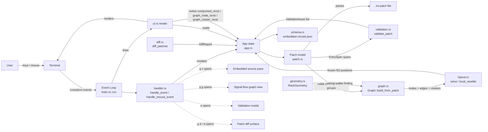
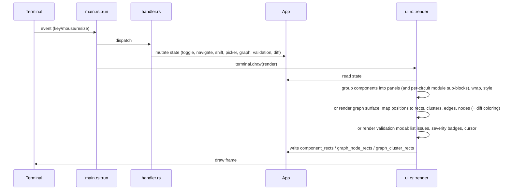
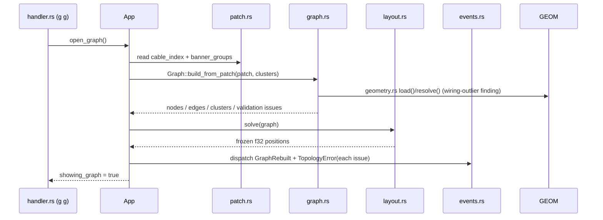

# ARCHITECTURE.md

## Architecture Overview

`droid_tui` is a single-crate Rust terminal application for loading, inspecting, and interacting with DROID hardware patch files (`.ini`). It renders the hardware components a patch defines — buttons, knobs, CV I/O, encoders, LEDs, switches — grouped into labeled panels that mirror the physical controller layout (P2B8, Faderbank, Notebuttons, …), and supports keyboard and mouse interaction plus shift-group visualization. Several optional full-screen surfaces sit on top of the panel view: an embedded source pane, opened with `g` then `v`, shows line-accurate patch text beside the panels and links selected hardware components to their occurrences and modifier relationships; a signal-flow graph view, opened with `g` then `g`, renders circuits as nodes and virtual `_cable` connections as directed edges, laid out by a deterministic force-directed solver with banner-group clusters, topology validation, and wiring-outlier detection; a validation modal, opened with `e`, lists schema and lint findings when a patch fails or warns; and a patch diff surface, opened with `g` then `d`, highlights the differences between the loaded patch and a second one. The main panel view is a **physical 1:1 layout**: a millimeter-accurate grid model of the rack — case rows, fold bars, mount sections, module faceplates — rendered to scale with pan (arrow keys / wheel) and zoom (`+`/`-`), plus an optional skeleton reference presentation (`s`) that swaps the full render for a pure geometry outline.

The system is a **layered monolith** with no framework, no async runtime, and no network: a single-threaded event loop reads terminal events, mutates an in-memory application state, and redraws the screen. The domain model, `.ini` parser, signal-flow graph model, layout solver, circuit-schema validator, diff model, rack-geometry model, and physical-layout model are pure functions over strings/structs (no terminal dependency); the renderer owns all layout decisions and publishes per-frame geometry back to the state for mouse hit-testing.

The app is a **patch viewer/interactor, not a hardware bridge**: it parses `.ini` files and simulates component state locally. It does not connect to DROID hardware.

## 1. Project Structure

```
droid_tui/
├── Cargo.toml              # crate manifest; deps: ratatui, crossterm, color-eyre, serde, toml
├── Cargo.lock
├── src/
│   ├── lib.rs              # module wiring: app, config, diff, events, gallery, geometry,
│   │                       #   graph, handler, layout, patch, physical, plugin, schema, theme,
│   │                       #   ui, validation (+ regression in cfg(test))
│   ├── main.rs             # entry point, config/theme init, event loop
│   ├── app.rs              # App state struct + picker/graph/validation/diff helpers + event bus
│   │                       #   + LabelStore (XDG labels.toml per-patch hw/circuits) + overlay EditState
│   ├── handler.rs          # keyboard + mouse event handling (incl. graph drag + label overlay
│   │                       #   `e`/`1..N` + validation modal `j`/`k`/Enter/Esc + diff `g d`/`d`/Esc
│   │                       #   + physical view `s` skeleton toggle + arrow/wheel pan)
│   ├── patch.rs            # domain model (Patch, HwComponent, …) + .ini parser, virtual-cable index
│   │                       #   + banner-group extraction + preamble_labels (per-entry EntrySpan spans)
│   │                       #   + display_label/circuit_label (store[layer]→store[1]→preamble[1]→derived)
│   ├── schema.rs           # authoritative DROID circuit schema + jack table (embedded circuits.json,
│   │                       #   prefix/count/start_at param expansion, Levenshtein suggestion)
│   ├── validation.rs       # pure patch validation (9 checks ported 1:1 from droid-lsp diagnostics);
│   │                       #   Severity + ValidationIssue{span,severity,code,message}
│   ├── diff.rs             # pure patch diff model (DiffReport: added/removed/changed cables + nodes)
│   ├── geometry.rs         # pure rack-geometry model (RackGeometry/ControllerSlot, load via
│   │                       #   CARGO_MANIFEST_DIR, resolve, distance/is_adjacent)
│   ├── physical.rs         # pure physical-layout model (mm grid: PhysicalLayout/CellGrid; RackSpec/
│   │                       #   RackLayout rack packing + fold bars/mounts; ScreenMapping mm→chars)
│   ├── plugin.rs           # plugin-circuit TOML loader (XDG discovery + serde parse); see §3.14
│   ├── graph.rs            # signal-flow graph model (nodes/edges/clusters) + topology validation
│   │                       #   + wiring-outlier detection (learned decision table)
│   ├── latency.rs          # forward-loop latency metric + CostModel (shared per-circuit AVG provider, design D2)
│   ├── layout.rs           # force-directed layout solver (one-shot, deterministic)
│   ├── events.rs           # synchronous observer event bus (GraphRebuilt/NodeMoved/TopologyError/
│   │                       #   ValidationCompleted/DiffComputed)
│   ├── theme.rs            # semantic color-token layer + built-in palettes (incl. validation + diff
│   │                       #   + physical-skeleton tokens)
│   ├── config.rs           # XDG config.toml load/save (theme + [labels] layers_enabled/max_shift_layer
│   │                       #   + [latency] per_circuit + [physical]/[physical.rack] rack definition)
│   └── ui.rs               # ratatui rendering (physical 1:1 view + skeleton, viewer, graph, validation
│                           #   modal, diff, status, picker + label overlay z-layer)
├── ext/droid-lsp/          # vendored droid-lsp git submodule (src/circuits.json = schema source of truth,
│                           #   src/diagnostics.ts = validation reference port)
├── fixtures/               # test fixtures: arpeggio1.ini, picker_test/, validation/*.ini (9 fixtures),
│                           #   led_pairs.ini / switch_value.ini / physical_multirow_rack.ini (physical view)
├── corpus/                 # patch corpus for analysis tooling
├── tools/                  # developer analysis tools
├── scripts/                # developer scripts (e.g. archive-gallery.sh)
├── openspec/
│   ├── changes/            # OpenSpec change proposals (archive/ holds completed ones)
│   └── specs/              # capability specs: controller-panels, file-picker, mouse-interaction,
│                           #   patch-parsing, shift-visualization, keybinding, module-scaling,
│                           #   module-orientation, viewer-layout, source-navigation, signal-flow-graph,
│                           #   physical-scale-model
├── .opencode/              # agent orchestration config (engineers, source roots, platform)
├── .agents/skills/         # project skills (guardrails, ratatui, rust, openspec, …)
├── .beads/                 # beads issue tracker data (Dolt-backed, tooling only)
├── .claude/skills/         # Claude Code skills (droid-patch-format, verify, …)
├── droid_living_examlpes/  # symlink to local DROID reference checkout (machine-local, untracked)
└── target/                 # build artifacts (partially tracked in git — see §15)
```

## 2. High-Level System Diagram



## 3. Core Components

### 3.1 User Interface (`src/ui.rs`)

- **Responsibility**: render the entire screen from `App` state each frame; compute layout; publish component and graph geometry for mouse hit-testing.
- **Key functions**: `render` (picker overlay, else a header/main/status split; the main area dispatches on view state — graph surface → `render_graph`, embedded viewer → `render_embedded_main`, validation modal → `render_validation_modal` (checked before the graph), else → `render_main`), `render_patch` / `render_patch_grouped` (groups components into controller panels, wraps to rows, applies shift-group border colors, renders LED-associated elements as single boxed cells with kind-colored borders — for every control kind with a resolvable LED association, with a narrow-width fallback so a boxed cell never emits partial border fragments (content shrinks to fit or the cell falls back to unboxed two-line rendering) — keeps uniform vertical row spacing between same-kind rows, ellipsizes over-long labels, dims all panel content while `app.processing_paused` is set, subdivides a multi-circuit panel into per-instance module sub-blocks — "Panel contains modules" — and records `component_rects`), `render_component_grid` (shared per-panel/per-module grid renderer), `render_component`, `render_status` (status hint plus trailing transient status message, each segment composed exactly once — no Scale/Orientation duplication; when `diff_showing`, `status_for_scope()` shows "Diff scope: {token} (N cables)"; when a patch load is predicted to render degraded at the current terminal width/theme, a trailing hint in the `render_outlier_warning` token reads "Renders degraded at N cols — use ≥ M cols or reduce scale"), `render_picker` (lists `picker_entries`; the parent-directory entry renders as `..` as the first entry when not at the filesystem root) `render_embedded_main` (splits panels | source columns by `app.viewer_split_ratio`, clamped 0.3–0.7), `render_source_pane`, `render_source_sidebar`, `render_source_content`, `render_minimap`, `render_viewer_status`, `render_validation_modal` (centered 60% × 70% overlay listing `validation_issues` sorted by (line,col), severity badges E/W/H via `validation_error`/`validation_warning`/`validation_hint` tokens, selected row highlighted via `validation_selected_bg` + bold, non-selected dimmed, empty state when none; header "Validation (N) — e:toggle j/k:navigate Enter:jump Esc:close"), and the graph surface: `render_graph` (full-screen surface; empty state "No patch loaded. Press 'l' to load."; maps frozen `graph_positions` floats onto the main area via a deterministic bounding-box fit into `graph_node_rects` — `GRAPH_NODE_WIDTH = 22`, `GRAPH_NODE_HEIGHT = 5`; renders titled plain-bordered cluster containers (`GRAPH_CLUSTER_PADDING = 2`) first, publishing `graph_cluster_rects`; then box-drawing polyline edges whose port cells are covered by the node frames; then rounded node frames with title = circuit name (+ instance index when repeated) and left `◉` input port on edge sinks / right `●` output port on edge sources; circuit instances in `app.disabled_circuits` render with the `graph_node_dim`/`graph_edge_dim` tokens (dim modifier, overriding the modifier hue, preserving the red error highlight and hover styling)). The diff state colors graph cables: when `diff_showing` and a `DiffReport` is present, cables in `added_cables` render with `graph_edge_diff_added`, `removed_cables` with `graph_edge_diff_removed`, and changed cables via `changed_cables`; added/removed nodes carry the same added/removed styling (`cable_color_with_diff`, `node_color_with_diff`, cluster/all-members diff styling). The main view renders the physical 1:1 layout — `render_physical_full` (default) or `render_physical_skeleton` (`s` toggles the presentation) — computing screen geometry via `physical_skeleton_geometry` (D5 mm→screen formula) and publishing `physical_skeleton_rects` plus `physical_rack_size` per frame.
- **Technologies**: ratatui 0.29 (`Frame`, `Layout`, `Flex`, `Block`, `Paragraph`, `BorderType::Rounded`), crossterm colors/modifiers.
- **Inputs**: `&mut App`; **Outputs**: terminal frame; side effect: `app.component_rects`, `app.graph_node_rects`, `app.graph_cluster_rects` filled per frame.
- **Key invariant**: layout is recomputed fresh from `frame.area()` on every draw — terminal resize needs no state handling.

### 3.2 Domain Model & Parser (`src/patch.rs`)

- **Responsibility**: typed model of a DROID patch and a hand-rolled `.ini` parser that builds it.
- **Types**: `Patch` (name, `hw_components`, `modules`, `sections`, raw lines, token spans, occurrence index, modifier index, `shift_groups`, `cable_index`, `banner_groups`, `preamble_labels` — leading `# TOKEN: label` map), `Span` (0-based line and byte-column range), `EntrySpan` (per-entry key/value byte spans carried on `IniSection`, captured before lowercasing, alongside `header_span`/`raw_lines` — feeds the validation modal's jump-to-source), `ModifierAffect` (resolved modifier span/source/selectat), `HwComponent` (id, label, kind, shift_group, state, controller, led, plus `module_instance()` deriving the component's circuit-instance number from the leading digit run of its token id), `ComponentKind` (Button, CvIn, CvOut, Knob, Switch, Led, Encoder), `ComponentState` (Off, On, Value(f32), Active), `ShiftGroup` (Group1–4 with `color()`/`key_label()`), `Module` / `ModuleWidth`, `IniSection` (with per-entry `EntrySpan`), `CableIndexEntry` (cable name → producing circuits + ordered sink references), `BannerGroup` (banner text + section range), and `ViewerCircuit` for prettified blocks.
- **Key functions**: `Patch::from_ini_file` / `from_ini_str` / `sample`, `parse_ini_sections` (comment stripping, repeated-section preservation and header spans + per-entry `EntrySpan` capture), `collect_token_spans`, `scan_hw_tokens` (boundary-aware token scanner), `build_occurrence_index`, `build_modifier_index` (cycle-safe `select`/`selectat` resolution), `token_kind`, `add_component`, `collect_cable_index` (each `output = _NAME` registers a cable source for the section's circuit; each `input = _NAME` / similar sink param records an ordered `(section_name, param_key)` reference; preamble cable maps that must not produce edges are excluded), `parse_banner` / `collect_banner_groups` (a `# ---- Name ----` comment banner owns the ordered circuit-section range from its line until the next banner or EOF; sections before the first banner form an implicit unnamed group ordered first); LED-association detection (a bare `led = L.N` entry, plus numbered circuit params `ledN = L.M` paired by shared numeric suffix with a same-suffix element entry — `buttonN`/`potN`/`encoderN`/`switchN`/`faderN`, the DROID convention for circuits like `matrixmixer`; `M` tokens resolve to `ComponentKind::Knob` so faders share the knob rendering path); rack-recognition API `module_types` / `needs_by_type` / `master_requirement`; `occurrences_for`, `modifier_affected_spans`, `modifier_entries_for`, `viewer_circuits`, `parse_preamble_labels` (leading `# B3.17: [RATC]` map; `I4:` empty treated as absent) and label resolution `effective_shift` + `display_label(token, shift, layers_enabled, max_shift_layer, hw_store)` with fallback `store[layer]→store[1]→preamble[1]→derived` and clamping/disabled coercion + `circuit_label`/`circuit_display_label` per-`NodeId` override; lossless writer `write_to_ini`/`render_ini` (block-slices `raw_lines` by section header line, preamble first, comment/banner runs travel with their section, byte-identical round-trip; refuses the source's canonicalized path, atomic tmp→rename, auto-suffix on destination collision).
- **Inputs**: `.ini` file content; **Outputs**: `Result<Patch, String>` (descriptive errors, never panics on malformed input).
- **Design notes**: the parser is deliberately custom (the `ini` crate was removed from `Cargo.toml`) to preserve repeated section names and control token extraction precisely.

### 3.3 Input Handling (`src/handler.rs`)

- **Responsibility**: translate terminal events into `App` mutations.
- **Key functions**: `handle_event` (priority order: overlay → picker → armed prefix → graph surface → embedded-viewer focus → normal keys; overlay eats all keys while `App.editing.is_some()`; modifier chord: `Mouse Down` on modifier-eligible component without mods = momentary (hit-test via `component_rects`), `Up`/`Leave` clears; `Ctrl+Shift+Click` (alias `Ctrl+Click`) toggles latched modifier (single-var replacement today, aspirational additive union); `m` keyboard alias for hovered component; `Esc` clears shift + modifier; rendering priority `graph_edge_error` (red) > modifier hue > `CableKind`); keyboard: `q`/Ctrl+C quit, `l` open picker, `g` arms a vim-style prefix (`g v` opens the embedded source pane, `g g` opens the signal-flow graph surface, `g d` opens the picker to choose the B patch for a diff), `t` toggles raw/prettified mode, `p` toggles the global processing pause (panels dim + `PROCESSING PAUSED` status, component mutations blocked while paused), `e` toggles the validation modal (from the status/view; `j`/`k` navigate issues, `Enter` jumps the source-pane scroll to the issue's line:col, `Esc` closes via `clear_validation`), `d` toggles the diff overlay (diff surface; `Esc` clears the diff scope then hides the overlay), Tab switches pane focus, `+`/`-` cycle scale presets 75 %–200 % with wrap-around, `[`/`]` adjust the panels/source split ratio ±0.1 while the source pane is open (clamped 30 %–70 %), `1`–`4` shift groups, `o` toggle portrait/landscape orientation, `Esc` closes the surface or cancels prefix, Enter/Space toggle/select components, `j`/`k` scroll or navigate, and Up/Down/Home/End navigate occurrences; label overlay: `e` opens single-field overlay for focused panel token / source header instance / hovered graph node (`hovered_graph_node`); inside overlay `1..N` (N=`max_shift_layer` clamped 1..8) cycles the edited HW layer preserving per-layer drafts, char/Backspace edits draft, `Enter` saves via `LabelStore` atomic rewrite, `Esc` cancels), `handle_mouse_event` (hover highlight, panel click toggle/select, empty-space deselection, scroll ±0.05 on knobs/faders, minimap click-to-scroll), `handle_graph_mouse` (while the graph surface is open it owns all mouse input: left-button Down on a `graph_node_rects` entry starts a `GraphDrag` with the node index and drags a marker image so node movement keeps pace with the cursor without layout jitter until `Up`; drag single-steps into `layout::local_resettle`; hover sets `app.hovered_graph_node` for the `x` toggle / `e` label overlay / diff scope). Physical-view input: `s` toggles the skeleton reference presentation (`Skeleton: on/off` status); `+`/`-` cycle the zoom presets 75 %–200 % with wrap-around (synced to `physical_zoom`, status reads `Scaling: N%` or the rack-aware `physical_status_hint`); arrow keys pan the rack when it overflows the main area (`physical_pan_if_overflow`) and Up/Down fall back to panel navigation when it fits; `j`/`k` always navigate. The mouse wheel pans on overflow — a wheel over a knob/fader cell still adjusts its value when no overflow forces panning (D5).
- **Inputs**: `KeyEvent`/`MouseEvent`; **Outputs**: `bool` (quit flag) or `()`; mutates `App`.
- **Key invariant**: mouse hit-testing uses `app.component_rects` / `app.graph_node_rects` written by the renderer — the renderer, not the handler, knows where components actually landed on screen.
- **Graph surface keys**: `x` toggles processing for the hovered circuit instance (hit-test via `graph_node_rects` and `app.hovered_graph_node`; rebuilds the graph, recomputes influence dead-ending at disabled sinks, emits `GraphRebuilt`, sets status `Processing disabled/enabled: <name> <instance>`; silent no-op with no hover); `p` toggles the global processing pause. `Esc` closes it and restores the prior view; `q`/Ctrl+C still quit and `l` opens the picker, mirroring the viewer's global-key behavior; the graph has no focus split, so nothing else routes there while it is open. While the graph is open, `e` on a hovered node opens the label overlay and `d` activates the diff overlay (diff cells are rendered inside the graph surface).
- **Validation modal keys**: the modal is a full-screen surface below the picker/prefix priority; `j`/`k` move `validation_cursor`, `Enter` jumps the embedded source pane to the issue's source location, `Esc`/`e` closes it. It never blocks loading; a patch with only Warning/Hint findings still loads and the modal lists them.
- **Viewer focus**: `ViewerFocus::Source` isolates panel actions; Tab returns focus to panels, while Esc closes the pane and keeps selection and source position. Picker remains highest priority.

### 3.4 Application State (`src/app.rs`)

- **Responsibility**: single mutable state object threaded through the whole app.
- **Fields**: `patch: Option<Patch>`, modifier influence single-var `active_modifier_var: Option<String>` + `influence: Option<InfluenceSubtree>` derived from `selected_component` via `Patch.hw_token_to_vars` → `Patch.influence_subtree` (`recompute_influence`, structural forward-BFS over `cable_index` + `circuit_outputs`, cycle-safe, sorted; no `influence_cache` — single selection, additive union aspirational, `B1.1`→`_TRIG` example; `hash(token)%16` hue via `theme::modifier_hue`), `active_shift: Option<ShiftGroup>`, `hovered_component: Option<usize>`, `processing_paused: bool` (global processing pause, `p` key; panels dim + `PROCESSING PAUSED` status while set, component mutations blocked, reset on `load_patch`), `disabled_circuits: HashSet<(String, usize)>` (per circuit-instance processing disable, `x` key on the graph surface; influence dead-ends at disabled sinks, reset on `load_patch`), `hovered_graph_node: Option<usize>` (graph node under the mouse, for the `x` toggle and drag), `status_message`, file-picker state (`showing_picker`, `picker_dir`, `selected_file`, `picker_entries`, `picker_index`), validation state (`validation_issues: Vec<ValidationIssue>`, `showing_validation: bool`, `validation_cursor: usize`), diff state (`diff_patch: Option<Patch>`, `diff_report: Option<DiffReport>`, `diff_showing: bool`, `diff_scope: Option<String>`, `diff_cursor: usize`, `diff_picker_active: bool`), `component_rects: Vec<(usize, Rect)>`, label overlay state (`label_store: LabelStore` XDG `labels.toml` per-patch `hw` per-`ShiftGroup` + `circuits` per-`NodeId`, `editing: Option<EditState>` with `kind` HW/Circuit, `token`/`node`, `shift`/`effective_shift`, `draft`+`drafts_by_layer` per-layer drafts, `original`), `scale_factor: f32` (uniform component-cell scaling applied by the renderer, presets 75–200 %, floor 75 % so module cells stay boxable), `viewer_split_ratio: f32` (panels/source column ratio, default 0.6, clamped 0.3–0.7, persists across `load_patch`), `orientation: Orientation` (Portrait/Landscape panel direction), `prefix: Option<PrefixState>` (armed vim-style prefix + start instant for the lazy 1 s timeout), physical-view state (`physical_rack_spec: RackSpec` seeded from `[physical.rack]` config, `physical_show_skeleton: bool` presentation toggle, `physical_offset: (f32, f32)` pan in screen cells, `physical_zoom: f64` linked from `scale_factor`, `physical_skeleton_rects` / `physical_rack_size` published per frame), embedded viewer state (`showing_viewer`, `selected_component: Option<String>`, `viewer_focus: ViewerFocus`, `source_view_mode: SourceViewMode`, `occurrence_cursor`, `source_scroll` ...).
- **Key functions**: `App::new`/`Default`, `load_patch` (stores the patch, runs `validation::validate_patch` over the parsed `Patch`; if any `Error`-severity issue is present the patch is rejected (gated to `patch=None`, a failure modal) and `clear_validation` runs, otherwise Warning/Hint findings still load and populate `validation_issues`; loads the per-patch bucket from `LabelStore` canonicalized absolute path, and resets source-navigation *and* graph/quad state plus `processing_paused` and `disabled_circuits`), `validate_patch` dispatch wiring (`Event::ValidationCompleted` on completion), `clear_validation`, `select_component`/`clear_selected_component` (derive `active_modifier_var` via `hw_token_to_vars` then `influence` via structural forward-BFS over `cable_index` (`input+output` hop, cycle-safe, sorted, `B1.1`→`_TRIG`); `hash(token)%16` hue via `modifier_hue`), `status_hint` (`MOD B1.1 → N cells / M cables` in hue, single-var today; `MOD B1.1+B1.2 → N cells / M cables` additive aspirational, most-recent-wins on overlap; single-var reality: second select replaces first — additive union is aspirational), `open_graph` (builds the graph from the current patch via `Graph::build_from_patch(patch, clusters_from_patch(patch))`, runs a fresh full `layout::solve`, opens the view, and emits `GraphRebuilt` plus a `TopologyError` per validation finding; with no patch loaded the view still opens with an empty graph so the renderer shows the empty-patch message), `close_graph`, `rebuild_graph` (re-runs `Graph::build_from_patch` + `layout::solve` and emits `GraphRebuilt` — used by `toggle_circuit_processing` so a disable/enable re-solves the layout), `toggle_circuit_processing` (flips a `(name, instance)` in `disabled_circuits` after the `x` key, calls `rebuild_graph` + `recompute_influence`, and returns whether the circuit is now disabled), `toggle_processing_pause` (flips `processing_paused` and clears `hovered_graph_node`), diff helpers `load_diff_patch` (parses the B patch, computes `diff::diff_patches(base, new)` → `DiffReport`, sets `diff_patch`/`diff_report`, `diff_showing=true`, seeds `diff_scope` from `selected_component`, and dispatches `Event::DiffComputed` with cable/node counts), `toggle_diff_showing` / `clear_diff_scope` / `diff_scope_cable_count` / `status_for_scope` ("Diff scope: {token} (N cables)"), label editing `begin_edit`/`save_edit`/`cancel_edit`/`cycle_edit_layer`/`push_edit_char`/`delete_edit_char` (overlay draft lifecycle; `1..N` cycles `N=max_shift_layer` clamped 1..8 preserving per-layer drafts, `Enter` persists via `LabelStore` atomic tmp→rename, `Esc` cancels, `recompute_influence` for `<token> / Group<N> → N ckts / M cables` status in `modifier_hue`), and physical-view helpers `physical_pan_by` (pure offset mutation), `physical_pan_if_overflow` (pans only when the rack overflows the main area, otherwise reports it fits), `physical_status_hint` (rack/zoom status segment).

### 3.5 Signal-Flow Graph Model (`src/graph.rs`)

- **Responsibility**: pure model of the patch's signal topology — circuits as nodes, virtual cables as directed edges, banner groups as clusters — plus topology validation and wiring-outlier detection. No terminal dependency (testable without rendering).
- **Types**: `NodeId = (circuit_name, instance_index)` (repeated section names are distinct instances), `GraphNode` (id, circuit, instance_index, section_index), `GraphEdge` (cable name, source `NodeId`, sink `NodeId`), `Cluster` (title + `Range<usize>` into `Patch.sections`), `TopologySeverity` (`Warning` for a dangling sink, `Error` for `n → 1`), `TopologyIssue` (cable, severity, message), `Graph` (nodes, edges, clusters, validation).
- **Key functions**: `Graph::build_from_patch(patch, clusters)` — every section becomes a node with distinct instance indices in file order; each cable in `patch.cable_index` fans its source out to every sink reference, one directed edge per (cable, source, sink); unresolvable names are skipped rather than panicking; edges are sorted deterministically by `(cable, source, sink)` (the cable index is a `HashMap` whose iteration order is randomized per process, and edge order feeds the layout solver's f32 accumulation and the renderer's shared-cell ownership — stable order is required for reproducible layouts); `validate_topology` runs as a build step — exactly one source per cable is valid, zero sources (a dangling reference) is a `Warning`, two or more sources is an invalid `n → 1` topology and an `Error`; produced-but-unused cables are fine; findings travel with the graph for the renderer to highlight and never block building or viewing. `validate_topology` also runs `geometry::RackGeometry` resolution and delegates wiring-outlier scoring to `WiringOutlierScorer` (src/geometry.rs) — an embedded learned decision table (`tools/outlier_artifact.txt` via `include_str!`, schema.rs precedent) that classifies `BindingFeatures` as implausible, with a preserved threshold fallback (`euclidean > 8.0 && cable_hops == 0`) on a table miss (design D1); invariant guards (adjacent / co-located / via-cable) stay explicit at the call site and never reach the scorer (design D5). `validate_topology` also emits the per-token influence second opinion (`InfluenceStats` in src/patch.rs, embedded `tools/influence_stats.txt`): every distinct hardware token is z-scored against per-kind corpus mean/std of `influence_subtree` size; tokens beyond the 3.0 band produce a `Warning` attached to the token's first root-var cable (design D4). Findings travel with the graph, never block building or viewing, and never gate patch loading.
- **Cable attribution**: by section *name* (the cable index records names, not instance indices), so a name shared by several instances resolves to the first instance for edge building; instance-accurate attribution is the topology-validation pass's concern, keeping that convention consistent.

### 3.6 Layout Solver (`src/layout.rs`)

- **Responsibility**: deterministic force-directed layout — a one-shot convergence solver, not a simulation.
- **Key functions**: `solve(graph) -> Vec<(f32, f32)>` (positions parallel to `graph.nodes`; full solve from scratch: seed → bounded iterations until total kinetic energy drops below `ENERGY_THRESHOLD` (0.5) or `MAX_ITERATIONS` (300), then freeze), `local_resettle(graph, positions, moved, radius, iterations) -> bool` (damped re-settle after a node move — only nodes within `radius` (`LOCAL_RADIUS` 200, default `LOCAL_ITERATIONS` 40) are active; distant nodes act as unmoved anchors; no-op for an unknown node).
- **Determinism (design D9)**: initial positions are seeded from topological depth (sources left, sinks right) with banner clusters banded vertically plus a hash of the node id — no RNG, so the same patch converges to the same arrangement on the same machine. Constants: `FRICTION` 0.5, `SPRING_REST` 80, `SPRING_K` 0.05, `REPULSION_STRENGTH` 4000, `REPULSION_RADIUS` 120, `MAX_DISPLACEMENT` 20, `HORIZONTAL_SPACING` 80, `VERTICAL_SPACING` 120.
- **Performance**: repulsion uses uniform-grid cell hashing (rebuilt per iteration; cell size = repulsion radius) so a node only repels against nodes in neighboring cells, keeping the 600-node case near-linear instead of O(n²).

### 3.7 Observer Event Bus (`src/events.rs`)

- **Responsibility**: synchronous observer event bus connecting model, graph, renderer, and validation (design D6). Deliberately minimal: an event enum, inline dispatch to subscribers, no queueing, no async, single-threaded.
- **Events**: `Event::GraphRebuilt` (graph (re)built and re-solved; subscribers re-render), `Event::NodeMoved(NodeId)` (node dragged to a new position after a local re-settle), `Event::TopologyError(TopologyIssue)` (topology-validation finding — a path to the status surface), `Event::ValidationCompleted(Vec<ValidationIssue>)` (schema/lint validation finished for a loaded patch), `Event::DiffComputed { added_cables, removed_cables, changed_cables, added_nodes, removed_nodes, changed_nodes }` (a B patch was loaded and its diff computed).
- **Key functions**: `subscribe -> Subscription` (plain `FnMut` closures invoked in subscription order on dispatch), `unsubscribe` (stale/duplicate handle is a no-op), `dispatch` (inline, no-op with no subscribers).
- **Wiring today**: dispatch sites are live — `App::open_graph` emits `GraphRebuilt` plus one `TopologyError` per validation finding; `App::notify_node_moved` emits `NodeMoved` after a drag re-settle; `App::validate_patch` emits `ValidationCompleted`; `App::load_diff_patch` emits `DiffComputed`. No production subscriber is registered yet (design D6 extension point; the API is exercised by tests).

### 3.8 Entry Point & Event Loop (`src/main.rs`)

- **Responsibility**: process lifecycle and the draw→read→dispatch loop.
- **Key functions**: `main` (color-eyre install, config load + `theme::init` BEFORE `ratatui::init()` so stderr warnings are visible and rendering never starts half-themed, mouse capture enable, panic-hook chaining to disable mouse capture on panic, `run`, restore), `run` (loop: `terminal.draw(render)` → `event::read()` → dispatch key/mouse/resize; all view routing lives in `handler::handle_event` — no unconditional close in the loop).
- **Technologies**: crossterm 0.28 (`EnableMouseCapture`/`DisableMouseCapture`, `event::read`), ratatui `DefaultTerminal`.

### 3.9 Authoritative Schema (`src/schema.rs`)

- **Responsibility**: embed the authoritative DROID circuit schema and expose it as typed lookups for validation. No terminal dependency.
- **Caching**: `load_schema() -> &'static Schema` returns the process-wide cached schema behind a `Mutex<Option<&'static Schema>>` — a `Mutex`, not a `OnceLock`, so tests can reset it via `set_test_schema` / `reset_test_schema` (theme.rs idiom, pinning or clearing per-thread views without cross-test poisoning); an uninitialized fallback parses the embedded JSON once and leaks it. `merge_plugins(base, files) -> Schema` performs the plugin overlay (insert-or-override on name collision, warn-once shadow per file); `schema::init()` (embedded base + merged plugins, honoring `[plugins]`) is called from `main()` before `ratatui::init()` so plugin shadow/skip warnings land on a clean terminal (ADR 14). `CircuitDef` now carries optional `cable_kind` + `color` (declared rendering metadata; `None` defers to substring inference).
- **Embedding**: `const CIRCUITS_JSON: &str = include_str!("../ext/droid-lsp/droid-lsp/src/circuits.json")` — the vendored `ext/droid-lsp` git submodule (GitHub `moonstruxx/droid-lsp`) is the schema source of truth, compiled in at build time.
- **Types**: serde mirror structs over the JSON (`RawSchema` with `firmware_version`, `jacktable_initial_size`, `available_memory`, `circuits`, `controllers`, `manual_references`; `RawCircuitDef` with `category`, `title`, `description`, `ramsize`, `inputs`/`outputs` params, `presets`, `manual`; `RawParam` with `name`, `short`, `type`, `default`, `prefix`, `count`, `start_at`, …); `JackTable` (jack-name set derived from the schema for valid-jack checks).
- **Key functions**: `load_schema` (parse the embedded JSON once into a `HashMap` keyed by circuit name, cache a `&'static Schema`), circuit/param expansion that accounts for `prefix`/`count`/`start_at` (a repeated param like `potN` expands to its numbered instances), and a Levenshtein-based suggestion helper used by the `unknown_circuit` validation check to propose the nearest named circuit.
- **Inputs**: embedded `circuits.json`; **Outputs**: typed circuit definitions + jack table for `validation.rs`.

### 3.10 Patch Validation (`src/validation.rs`)

- **Responsibility**: pure, deterministic validation of a parsed `Patch` against the authoritative schema. No terminal dependency.
- **Types**: `Severity` (`Error`, `Warning`, `Hint`), `ValidationIssue` (`span`, `severity`, `code`, `message`), sorted by (line, col) for stable modal ordering.
- **Checks** (9, ported 1:1 from `ext/droid-lsp/droid-lsp/src/diagnostics.ts`): `unknown_circuit` (`Error` + Levenshtein suggestion via `schema.rs`), `duplicate_param` (`Warning`), `unknown_param` (`Error`), `invalid_jack` (`Warning`), `missing_required` (`Warning` at the header), `undefined_cable` (`Warning`), `duplicate_cable` (`Warning`), `unused_cable` (`Hint`), and RAM sizing (`ramsize` `Error`).
- **Key function**: `validate_patch(&Patch) -> Vec<ValidationIssue>` — pure over the parsed patch and the embedded schema; the span data come from `IniSection::EntrySpan` so each finding can be located and jumped to in the source pane.
- **Wiring**: `App::load_patch` runs validation on load, gates the patch on any `Error` finding (rejected → modal), and dispatches `Event::ValidationCompleted`.

### 3.11 Patch Diff (`src/diff.rs`)

- **Responsibility**: pure model of the differences between two patches. No terminal dependency.
- **Types**: `DiffReport` (`added_cables`, `removed_cables`, `changed_cables: Vec<ChangedCable>`, `added_nodes`, `removed_nodes`, `changed_nodes: Vec<ChangedNode>`; each sorted for stable output); `ChangedCable { cable, … }`, `ChangedNode { … }`.
- **Key function**: `diff_patches(base: &Patch, new: &Patch) -> DiffReport` — compares cables and circuit instances between the loaded (base) patch and a second (new) patch, classifying each as added/removed/changed.
- **Wiring**: `g d` opens the picker to choose the B patch → `App::load_diff_patch` computes the report and dispatches `Event::DiffComputed`; `d` toggles the overlay, `Esc` clears the diff scope, and the graph surface colors cables/nodes by their diff classification via the theme `graph_edge_diff_added`/`graph_edge_diff_removed` tokens.

### 3.12 Rack Geometry (`src/geometry.rs`)

- **Responsibility**: pure model of the physical DROID rack layout used to detect wiring outliers. No terminal dependency.
- **Types**: `RackGeometry`, `Rack`, `ControllerSlot`.
- **Key functions**: `load()` (reads `rack_geometry.json` resolved via `CARGO_MANIFEST_DIR`), `resolve()` (places controllers into slots), `distance()` / `is_adjacent()` (physical distance between two modules' slots).
- **Wiring**: `graph::validate_topology` delegates wiring-outlier classification to `geometry::WiringOutlierScorer` (embedded learned decision table + preserved threshold fallback) with call-site invariant guards (adjacent / co-located / via-cable never scored), and adds the per-token `influence_subtree` z-score second opinion (`patch::InfluenceStats`) — both `Warning` channel, neither gates loading.

### 3.13 Physical Layout (`src/physical.rs`)

- **Responsibility**: pure model of the physical DROID rack — the 1:1 main view's geometry source. No terminal dependency.
- **Types**: `PhysicalLayout` (modules resolved from `hw_components` with mm extents and faceplate cells), `CellGrid`/`CellRect`, `RectMm`, `ScreenMapping` (aspect-compensated mm→chars factors, zoom, pan offset), `RackSpec` (ordered rows `{he, hp, label?}`, `top_mount_te`/`side_mount_te`, per-module `assign` overrides), `RackLayout` (rows with placed modules, fold bars, mount regions, total mm bounds).
- **Key functions**: `PhysicalLayout::build(&Patch)` (chain order from patch declaration order, D3), `RackSpec::default_case` (a single 3-HE row wide enough for the whole chain — no config required), `RackLayout::pack` (auto-pack rows left-to-right with per-module row overrides, D10), `ScreenMapping` (`mm × factor × zoom − offset` per D4/D5, `pan`, `screen_size` for overflow detection).
- **Wiring**: config `[physical.rack]` parses into `RackSpec` (`config.rs`, D12); `ui.rs` maps the rack to screen via `ScreenMapping` for both the full render and the skeleton presentation; controller geometry loads from `controller_geometry.json` with fallback width + warn (D6); `FOLD_BAR_HEIGHT_MM` drives fold-bar dividers (D11).

### 3.14 Plugin Circuits (`src/plugin.rs`)

- **Responsibility**: discover and parse user-supplied DROID circuit definitions (TOML plugin files) that extend the embedded schema without editing the vendored submodule or rebuilding. Discovery + parse only — merging into `Schema` lives in `schema.rs`.
- **Types**: `RawPluginCircuit` / `RawPluginParam` (serde mirrors over the TOML, `ramsize` an `Option` so its absence is a *semantic* error handled after parse, not a serde failure), `PluginDocument` (top-level `[[circuit]]` array), the normalized `PluginCircuit` (lowercased `name`, `category`, `ramsize: u32`, `title` defaulting to the declared name, `description` defaulting to `""`, optional `cable_kind`/`color`), `PluginParam` (`name`, `short`, `param_type`, `default`, `prefix`, `count`, `start_at`), and `PluginFile` (`path` + `circuits: Vec<PluginCircuit>`, one per successfully parsed file).
- **Key functions**: `discover_plugins(xdg_config_home, home)` (resolve the XDG directory, then delegate), `discover_plugins_from_dir(dir)` (list every `*.toml` under an explicit directory in sorted-filename order and `load_file` each — the `[plugins].dir` override entry point), and `load_file(path)` (`pub(crate)`, so schema tests load real fixtures) — reads, parses, and semantically validates one file, returning `None` (with one warn-once stderr notice) for an unreadable, malformed-Toml, or missing-`ramsize` file. Helper `plugin_dir` mirrors `config::config_dir`: a non-absolute `$XDG_CONFIG_HOME` is treated as unset, falling back to `$HOME/.config`.
- **Discovery path**: `$XDG_CONFIG_HOME/droid-tui/plugins/*.toml` (or `$HOME/.config/droid-tui/plugins/` when XDG is unset). A missing directory yields an empty list with no warning; non-`.toml` files are ignored; files load in sorted-filename order so the schema overlay is deterministic (later files win on collision).
- **Skip semantics**: a plugin never aborts startup — an unreadable file, a malformed TOML file, or a circuit without the required `ramsize` all reject *that one file* with a single stderr warning naming the file (and circuit), and the remaining files still load. Circuit names are lowercased here (case-insensitive, matching the embedded `load_schema` key convention).
- **TOML shape**: one `[[circuit]]` table per circuit with `name`, `category`, required `ramsize` (bytes), optional `title`/`description`/`cable_kind`/`color`, and `inputs`/`outputs` arrays (both `#[serde(default)]`) of param tables carrying `name`, `short`, `type`, optional `default`, and the `prefix`/`count`/`start_at` expansion trio — preserved intact so numbered plugin params expand through the same `expand_names` path as embedded ones.
- **Merge**: `schema::merge_plugins(base, files) -> Schema` applies `files` in slice (sorted) order over the embedded base — insert-or-override on name collision; a plugin name shadowing an embedded circuit warns once per file. Neutral defaults (`presets`, `manual`, per-param `essential`/`ramhint`/`autotitle`) are applied by `circuit_def`/`circuit_param` here, not in `plugin.rs`.
- **Declared metadata**: a plugin circuit's optional `cable_kind` (`control`/`audio`/`midi`/`unknown`) and `color` (a component-kind theme token) ride `CircuitDef`. `CableKind::from_circuit` and `circuit_color` (`src/ui.rs`) consult the declared fields first and keep the name-substring tables as fallback — so the 76 embedded circuits (which declare nothing) classify byte-for-byte as before, while plugin circuits can declare their edge kind and node color explicitly.
- **Inputs**: the plugin directory + env values (injected as `Option<&OsStr>` so tests never touch process env); **Outputs**: `Vec<PluginFile>` for the schema merge.

## 4. Data Flow

**Main runtime loop** (per frame):



**Graph build & solve flow** (on `g g`):



**Validation flow** (on patch load):

```mermaid
sequenceDiagram
    participant H as handler.rs (l / Enter)
    participant A as App
    participant P as patch.rs
    participant V as validation.rs
    participant S as schema.rs
    participant E as events.rs
    H->>A: load_patch(path)
    A->>P: Patch::from_ini_file (EntrySpan spans)
    A->>V: validate_patch(&Patch)
    V->>S: loadSchema / JackTable / Levenshtein
    V-->>A: Vec<ValidationIssue> (sorted by line,col)
    alt any Error
        A-->>A: patch gated (None), failure modal, clear_validation
    else Warning/Hint only
        A-->>A: patch loads; validation_issues populated
    end
    A->>E: dispatch ValidationCompleted
```

**Diff flow** (on `g d` then `d`):

```mermaid
sequenceDiagram
    participant H as handler.rs (g d)
    participant A as App
    participant D as diff.rs
    participant E as events.rs
    H->>A: diff_picker_active (choose B patch)
    A->>A: load_diff_patch(path)
    A->>D: diff_patches(base, new)
    D-->>A: DiffReport (sorted)
    A->>E: dispatch DiffComputed(counts)
    A-->>A: diff_showing = true; diff_scope = selected_component
    Note over A: render_graph colors added/removed/changed cables + nodes
```

**Key user journeys**:
- **Load a patch**: press `l` → picker overlay lists current dir → navigate with `j`/`k`/arrows → Enter on `.ini` → `Patch::from_ini_file` parses → `validate_patch` runs (Error findings gate the load; Warning/Hint still load) → picker closes → panels render.
- **Toggle a component**: Enter/Space on hovered component, or mouse click on a component rect → `toggle_component` flips `ComponentState` → status bar shows "Toggled: <label>".
- **Shift visualization**: press `1`–`4` → `active_shift` set → panels containing matching `shift_group` get bold colored borders, others dim; `Esc` clears.
- **Open the source viewer**: press `g` then `v` within 1 s → `open_embedded_viewer` sets `showing_viewer`, focuses the source pane, and starts at BOF or the selected component's first occurrence. Raw lines render by default; `t` switches to prettified circuit blocks. `j`/`k` scroll, Up/Down/Home/End navigate selected-token occurrences, Tab changes focus, and Esc closes while keeping selection and scroll.
- **Open the signal-flow graph**: press `g` then `g` → `open_graph` builds the graph from the current patch's cable index and banner groups, runs a fresh full force-directed solve, and opens the full-screen surface. The renderer draws titled banner-group cluster containers, box-drawing cable edges (colored by cable kind — the producing circuit's declared `cable_kind` when present, else name-substring inference: control/audio/midi — or by the topology-error token when the cable has a validation finding), and rounded circuit-node frames with input/output port markers. Dragging a node with the mouse re-settles the local neighborhood (damped, bounded iteration budget) and emits `NodeMoved`. `Esc` closes the surface and restores the previous view; `q`/Ctrl+C still quit.
- **Review validation findings**: after a load, press `e` to open the validation modal; `j`/`k` move between issues, `Enter` jumps the source pane to the issue's `line:col`, `Esc` closes. Error-severity findings gate the load; Warning/Hint findings still load.
- **Diff two patches**: press `g` then `d` → picker chooses the second (B) patch → `load_diff_patch` computes and shows the diff; `d` toggles the overlay, `Esc` clears the diff scope. The graph colors added/removed/changed cables and nodes; `status_for_scope` shows "Diff scope: {token} (N cables)".
- **Scale modules**: press `+`/`-` → cycle presets 75 % → 100 % → 150 % → 200 % (wrapping at both ends) → the renderer multiplies the component cell size; status bar shows "Scaling: N%".
- **Adjust the panels/source split**: press `[` or `]` while the embedded source pane is open → `adjust_viewer_split_ratio(∓0.1)` moves the column boundary in exact 10 % steps between 30 % and 70 % panels; the layout reflows immediately and the viewer status bar trails "Panels/Source split: N%/M%".
- **Edit a label**: focus a panel cell / source header instance / hovered graph node → press `e` → centered single-field overlay opens (hint in `modifier_hue`, `1..N` cycles Group layer); `Enter` saves via `LabelStore` atomic rewrite, `Esc` cancels. HW merges `store[layer]→store[1]→preamble[1]→derived`; circuit label overrides source header + graph node title in both FULL and FILTERED panes; status shows `<token> / Group<N> → N ckts / M cables` in `modifier_hue` (`graph_edge_error` red precedence kept).
- **Resize**: `Event::Resize` is ignored — the next `draw` recomputes layout from the new `frame.area()`.

## 5. Data Stores

**None at runtime.** The application holds all state in memory (`App`) and persists nothing during normal use. The `.beads/` directory is the beads issue-tracker's Dolt-backed store, developer tooling, not application data. No database, no schema, no migration strategy.

Two build-time data inputs are embedded, not consulted at runtime: the authoritative DROID circuit schema is compiled in from `ext/droid-lsp/droid-lsp/src/circuits.json` via `schema.rs::include_str!`, and the rack layout is read from `rack_geometry.json` via `geometry::load()` (resolved through `CARGO_MANIFEST_DIR`). Both are static, deterministic inputs that ship inside the binary.

## 6. External Integrations / APIs

The app reads local `.ini` files and simulates component state; it does not talk to DROID hardware, MIDI, or any network service. The source viewer is rendered in-process from the loaded `Patch`; the graph view is rendered in-process from the parsed cable index; validation runs in-process against the embedded schema; the diff runs in-process over two parsed patches. No subprocess, terminal multiplexer, terminal emulator, IPC, or network integration is used.

DROID reference material (`droid_living_examlpes/` and the `ext/droid-lsp` submodule) is used for development reference and as the vendored schema source of truth.

## 7. Key Technologies

| Technology | Version | Architectural relevance |
|---|---|---|
| Rust | 2021 edition | Single-crate monolith; no unsafe code |
| ratatui | 0.29 | Terminal UI: `DefaultTerminal`, `Layout`/`Flex`, widgets; owns raw-mode/alternate-screen lifecycle via `init()`/`restore()` |
| crossterm | 0.28 | Event source (`event::read`), mouse capture enable/disable |
| color-eyre | 0.6 | Error reporting + panic hook (chained to also disable mouse capture) |
| serde | 1 | Serialization derives for the in-memory patch domain model, the schema JSON mirror, and the v1 `Settings` schema |
| serde_json | 1 | Deserializing the embedded `circuits.json` schema into typed `RawSchema` structures |
| toml | 0.9 | `config.toml` + `labels.toml` parse/serialize (`theme` + `[labels]` layers + `[latency]` per_circuit), and the plugin-file loader (`src/plugin.rs`) parses `[[circuit]]` TOML via serde |
| insta | 1 (dev) | Golden-file snapshot testing across UI frames |
| OpenSpec | — | Change proposals + capability specs under `openspec/` |

## 8. Deployment & Infrastructure

- **Build**: `cargo build` (debug) / `cargo build --release`; single native binary `droid_tui`.
- **CI/CD**: `.github/workflows/ci.yml` runs `cargo fmt --check`, `cargo clippy --all-targets --all-features --locked -- -D warnings`, `cargo test --locked`, strict gate `cargo insta test --check`, `cargo build --release --locked`, and uploads ephemeral `evidence/gallery/` + pending `*.snap.new` as `visual-gallery` artifact (retention 14 days).
- **Containerization**: none.
- **Environment config**: no application-specific environment configuration; the picker starts in `std::env::current_dir()`. User config lives at `$XDG_CONFIG_HOME/droid-tui/config.toml` (`theme` + `[labels] layers_enabled=true, max_shift_layer=4` clamped 1..8, disabled coerces display to layer 1 while preserving 2..N; `[latency] per_circuit` overrides the per-circuit `AVG` cost model; `[plugins] dir` = optional absolute plugin-directory override (a non-absolute value is treated as unset, falling back to the XDG plugins dir) and `[plugins] enabled` = bool default `true`; a malformed `[plugins]` section follows the existing warn-once-then-defaults contract); per-patch labels live at `$XDG_CONFIG_HOME/droid-tui/labels.toml` keyed by canonicalized absolute patch path (`hw` per-`HwToken` per-`ShiftGroup` slot + `circuits` per-`NodeId`), atomic tmp→rename, warn-once on corrupt TOML.
- **Git**: `ext/droid-lsp` is a git submodule (`https://github.com/moonstruxx/droid-lsp`) vendored as the schema/validation reference; no remote configured for the main repo; `main` holds the initial commit; per-change feature branches exist (`feature/patch-validation`, `feature/rack-wiring-outlier-detection`, `feature/patch-latency-visualization`, `feature/latency-optimized-patch-generation` (current), `feature/circuit-processing-switch-detail`, `feature/label-management`, `feature/modifier-flow-quad-view`, `feature/modifier-panel-highlight`), and archived changes live on `archive/patch-validation` / `archive/patch-latency-visualization` branches plus `openspec/changes/archive/` (e.g. `2026-08-24-add-visual-validation/`).

## 9. Security Architecture

- **Trust boundary**: the app runs locally with the user's privileges; the only file input is local `.ini` files. The embedded viewer executes no external commands.
- **Input validation**: the parser is defensive — malformed/empty files return descriptive `Err(String)` and never panic (tested: `rejects_empty_file`); graph edge building skips unresolvable cable names instead of panicking; patch validation gates the load on `Error`-severity findings.
- **Secrets**: none handled, none stored.
- **Auth/authz**: not applicable (no network, no multi-user).
- **Terminal hygiene**: raw mode, alternate screen, and mouse capture are restored on normal exit and on panic (chained panic hook).

## 10. Monitoring & Observability

- **Logging**: none (no logging framework).
- **Error reporting**: color-eyre renders panics/errors to the terminal.
- **Metrics/tracing**: none.
- **Observability gap**: no way to observe runtime behavior outside the TUI itself; acceptable for a local interactive tool. The event bus (design D6) provides an internal extension point for observing graph rebuilds, node moves, topology findings, validation completion, and diff computation.

## 11. Performance & Scalability

- **Model**: single-threaded, no concurrency, no caching.
- **Per-frame cost**: layout and panel grouping are recomputed every draw — O(n) in component count with small constants (`COMPONENT_WIDTH = 16`, `COMPONENT_HEIGHT = 2`). Fine for real DROID patches (tens of components).
- **Graph solve**: one-shot, bounded — full solve ≤ 300 iterations (freezes early at the energy threshold), local re-settle ≤ 40; repulsion is near-linear via uniform-grid cell hashing (600-node chain tested finite); re-solve triggers are exactly two: patch load and node drag.
- **Validation**: `validate_patch` runs once per load over the parsed patch and the in-memory schema; the 9 checks are linear in sections/params with schema lookups. Diff runs once per B-patch load over two patch models.
- **Known bottleneck**: none at current scale; a pathological patch with thousands of components would redraw slowly, but DROID hardware RAM limits make this unrealistic.

## 12. Development Workflow

- **Setup**: `cargo build` (no install step; no remote to clone from). `ext/droid-lsp` requires `git submodule update --init` to fetch the vendored schema.
- **Test**: `cargo test` (519 unit/regression/snapshot tests) — strict gate; any `insta` snapshot mismatch fails the run.
- **Lint**: `cargo clippy --all-targets --all-features --locked -- -D warnings`.
- **Format**: `cargo fmt --check` / `cargo fmt`.
- **Snapshots**: `insta` (`insta = "1"` dev-dep) manages `src/snapshots/*.snap`; `cargo insta review` / `INSTA_UPDATE=always cargo test` accepts intentional face changes; `cargo insta test --check` is the CI source of truth.
- **Gallery**: ephemeral `evidence/gallery/` (HTML + ANSI sidecars, `index.html` per scenario) generated via `cargo run --bin snapshot-gallery` or `cargo test -- --generate-gallery`, `.gitignore`'d; durable mirror via `scripts/archive-gallery.sh` into `openspec/changes/archive/2026-08-24-add-visual-validation/evidence/gallery/`.
- **Verify binary**: `.claude/skills/verify/SKILL.md` drives the built binary interactively.
- **Agent orchestration**: `.opencode/` defines specialized engineers (rusty, layout-designer, horst, dermannmitdermachine), `maxConcurrent: 3`; platform: backlog = browser, repo = none.
- **Change workflow**: OpenSpec — propose under `openspec/changes/`, implement, archive to `openspec/changes/archive/` and sync specs to `openspec/specs/` (archive hook `scripts/archive-gallery.sh` carries ephemeral gallery into durable archive).

## 13. Testing Strategy

- **Location**: in-module `#[cfg(test)]` unit tests in `patch.rs`, `handler.rs`, `ui.rs`, `graph.rs`, `layout.rs`, `events.rs`, `validation.rs`, `schema.rs`, `diff.rs`, `geometry.rs`, `physical.rs`, plus cross-layer, per-theme frame-rendering, and `insta` snapshot tests in `regression.rs` (`buffer_to_ansi` / `buffer_to_html` helpers) and `src/snapshots/`.
- **Coverage**: 537 tests cover parser spans, raw-line round trips, occurrence indexes, cycle-safe modifier graphs, rack recognition, LED-`=` association, numbered-circuit `ledN = L.M` pairing (all element families), module-instance grouping, selection-driven jumps, focus isolation, occurrence navigation, picker and minimap mouse behavior, scale-correct hit rects, panel geometry, UI frames, per-theme rendering, config discovery/load/save/fallback; graph-model tests (model shapes, cable fan-out, cluster membership, topology validation: dangling → warning, `n → 1` → error, valid fan-out clean; wiring-outlier detection via `RackGeometry`); layout-solver tests (finite/deterministic/freeze/local-resettle, cluster seed, energy-threshold convergence); event-bus tests; schema tests (circuit/param expansion, `prefix`/`count`/`start_at`, Levenshtein suggestion, jack table); validation tests (the 9-check matrix over `fixtures/validation/*.ini`: `unknown_circuit`, `duplicate_param`, `unknown_param`, `invalid_jack`, `missing_required`, `undefined_cable`, `duplicate_cable`, `unused_cable`, `ram_overflow`, with severity + span assertions); diff tests (added/removed/changed cables and nodes, sorted stable output); physical-layout tests (mm grid model, controller-geometry resolution — b32 → 4×8 —, rack packing/overrides, fold-bar/mount geometry, and the 5.1 coincidence proof: skeleton cell rects equal the full-render rects for every token across fixtures and viewports); plus the visual-validation matrix via snapshot harness, including graph-surface snapshots.
- **Visual validation**: deterministic `TestBackend` → ANSI + HTML gallery (`evidence/gallery/index.html`, one row per scenario, columns per theme) — no live terminal/pty; ephemeral in worktree (`.gitignore` covers `src/snapshots/`, `evidence/gallery/`, `*.snap.new`) and durable in archive; strict gate — `cargo test` generates and asserts `insta` snapshots and fails on any face regression (`cargo insta test --check` in CI); HTML side-by-side proves spec-to-face for `visual-validation` (`openspec/specs/visual-validation/spec.md`).
- **Frameworks**: std test harness + `insta` 1 for golden-file management; no mocking, no property tests, no live-terminal end-to-end test, no coverage gate.
- **Gap**: no end-to-end test driving the real binary; UI tests render into a test `Frame` rather than a live terminal (visual snapshots are `TestBackend` determinism, not pty capture); validation modal and diff-overlay rendering are covered via unit/snapshot but not full interactive flows.

## 14. Architectural Decisions & Rationale

1. **Hand-rolled `.ini` parser over the `ini` crate** — preserves repeated section names (DROID patches repeat `[button]` etc.) and gives precise control over token extraction; the crate was removed from `Cargo.toml`.
2. **Boundary-aware hardware-token scanner** — a token starts at a letter (`B/L/P/O/I/E/S`) followed by a digit with a non-alphanumeric/underscore boundary before it, so internal variables like `_ENV1_DECAY_POT` are not misread as hardware tokens.
3. **Components grouped by physical controller** — `HwComponent.controller` ("P2B8", "Faderbank", …) drives panel grouping, mirroring the hardware layout (design.md Decision 3).
4. **Renderer owns layout; handler consumes geometry** — `component_rects` is written by `ui.rs` each frame and read by `handler.rs` for mouse hit-testing, because only the renderer knows where components actually landed on screen. The graph surface extends the same pattern with `graph_node_rects` / `graph_cluster_rects` (ADR 22).
5. **Fresh layout per frame** — no resize state; `Event::Resize` is a no-op and the next draw reflows automatically.
6. **Chained panic hook** — ratatui's hook restores raw mode/alternate screen; the app chains `DisableMouseCapture` before it so a panic leaves a clean terminal.
7. **Shift groups as an enum** — `ShiftGroup::Group1–4` with `color()`/`key_label()`; panel borders and status bar derive from one source of truth.
8. **Vim-style `g` prefix with lazy timeout** — arming stores only `PrefixState { started: Instant }`; expiry against `PREFIX_TIMEOUT` (1 s) is checked when the next event arrives instead of running a timer thread, keeping the event loop single-threaded and synchronous. `g v` opens the source viewer; `g g` opens the graph surface (ADR 16); `g d` opens the B-patch picker for a diff (ADR 25).
9. **Embedded source viewer** — `g v` opens a source pane in the same TUI and `App`; raw lines and parser-recorded spans support selection jumps, occurrence navigation, modifier highlights, and minimap interaction without IPC or a process boundary.
10. **Boxed rendering gated on parse-time LED association** — a component renders as ONE bordered cell only when its `.ini` section carries an LED association (stored as `HwComponent.led`): a bare `led = L.N` entry, or a numbered circuit `ledN = L.M` param paired by shared numeric suffix with a same-suffix element entry (`buttonN`/`potN`/`encoderN`/`switchN`/`faderN`) as used by circuits like `matrixmixer` (the `ledN` value is authoritative for the LED token). The boxed path covers every control kind that can carry a resolvable LED association — button, knob/pot, encoder, switch, fader — each rendering its own state inside the box (ON/OFF with a glyph for buttons/switches, percentage for knobs/encoders/faders). The border uses the component-kind color; the label lives in the block's top title row and the single interior row holds state + the LED glyph (one state, not a duplicate textual LED state). LED-less components keep two-line text rendering; LEDs are never rendered as standalone cells. At cell widths narrower than the box content the cell either shrinks its content to fit inside a complete box or falls back to unboxed two-line rendering — it never emits partial border fragments.
11. **Adjustable panels/source split** — the embedded viewer's column ratio lives in `App.viewer_split_ratio` (default 0.6, clamped 0.3–0.7, persisted across patch loads as a view preference); `[`/`]` nudge it in exact 0.1 steps only while the viewer is open.
12. **Semantic color-token layer** — every rendered color comes from `Theme` tokens in `src/theme.rs`; no `Color::` literals outside tests. Built-in palettes `classic` (byte-identical to pre-theming colors), `terminal` (all `Reset`), and `mono` (grayscale, shift tokens pairwise distinct) are resolved by name and installed globally via `theme::init` at startup. Graph tokens cover node/port/cluster surfaces, edge kinds (`control`/`audio`/`midi`/`unknown`), the `graph_edge_error` highlight, the diff tokens `graph_edge_diff_added`/`graph_edge_diff_removed`, and the validation tokens `validation_error`/`validation_warning`/`validation_hint`/`validation_modal_border`/`validation_selected_bg`, and the render-outlier token `render_outlier_warning` (predicted-degraded render status hint).
13. **XDG user config with injected validation** — `src/config.rs` discovers `droid-tui/config.toml` under `$XDG_CONFIG_HOME` (or `$HOME/.config`); name validation is injected as a canonicalizer function so the loader stays decoupled from the theme catalog. Missing file silently yields defaults; malformed TOML and unknown themes warn once on stderr and fall back to `classic`. `[labels] layers_enabled` (bool, default true) and `max_shift_layer` (u8, default 4, clamped 1..8 on load and on save) live alongside `theme`; disabled coerces `display_label` to layer 1 while preserving 2..N in `labels.toml`. `[latency] per_circuit` (map of lowercased circuit name → f32 `AVG` override, default empty = ramsize heuristic) feeds `latency::CostModel`, the shared cost provider for the latency ramp and the optimizer (design D2). Writes are atomic (temp-file + rename).
14. **Config load before terminal init** — `main()` loads settings and initializes the active theme before `ratatui::init()` so warnings print to a clean terminal. The global theme lives behind a `Mutex<Option<&'static Theme>>` (not `OnceLock`) because test-ordering must not poison the palette across tests.
15. **Panel contains modules** — a controller panel whose components come from more than one circuit instance (detected via `HwComponent.module_instance()`, the leading digit run of the token id) is subdivided into per-instance module sub-blocks, each bordered and titled with the instance number (e.g. `P2B8 1`, `P2B8 2`); a single-instance panel renders as one flat grid and CV I/O never subdivides. Panel height is sized from the visible (LED-folded) component count so trailing rows like knobs are not clipped, and the published `component_rects` hit rects exactly match the rendered cell size (a prior scale-factor inflation spilled a hit rect into its neighbor's screen area, misresolving hover/selection).
16. **Signal-flow graph as a third full-screen surface (`g g`)** — an optional view focused purely on signal topology, distinct from the controller-panel representation (the primary map to physical hardware). It keeps the header and status bars, owns all mouse input while open (node dragging), and Esc restores the prior view; `q`/Ctrl+C/`l` keep their global meaning.
17. **Cable attribution by section name, first-instance resolution** — the cable index records names, not instance indices, so repeated instances resolve to instance 0 for edge building; instance-accurate attribution is left to the topology-validation pass, keeping the convention consistent across the model.
18. **One-shot deterministic force-directed solver, not a simulation** — bounded iterations (≤ 300 full, ≤ 40 local) until the energy threshold, then freeze; re-solve triggers are exactly two (patch load → full solve, node drag → damped local re-settle). Seed positions derive from topological depth + cluster bands + node-id hash — no RNG; edges are sorted deterministically because the cable index is a `HashMap` with per-process-random iteration order and f32 spring-force accumulation is order-sensitive (design D9: same patch, same machine → identical layout).
19. **Grid-hashed repulsion** — repulsion is the O(n²) risk in force-directed layouts; uniform-grid cell hashing (cell = repulsion radius, rebuilt per iteration) restricts each node's repulsion to neighboring cells, keeping the 600-node case near-linear.
20. **Synchronous observer event bus** — `GraphRebuilt` / `NodeMoved` / `TopologyError` (and, since patch-validation and patch-diff, `ValidationCompleted` and `DiffComputed`) dispatched inline to `FnMut` subscribers in subscription order; no queueing or async, keeping the single-threaded event loop intact. It decouples re-solve triggers (patch load, node move) from both the solver and the renderer and gives topology errors a path to the status surface.
21. **Topology validation at graph build time** — the exactly-one-source rule runs as a build step: dangling sink → `Warning`, `n → 1` → `Error`, produced-but-unused cable → fine. Findings travel with the graph (never block building or viewing) and the renderer colors offending cables with the `graph_edge_error` token.
22. **Renderer publishes graph geometry per frame** — `graph_node_rects` and `graph_cluster_rects` are written by `ui.rs` each draw (mirroring `component_rects`) and consumed by `handler.rs` for node-drag hit-testing; `render_graph` splits `App` field borrows (`graph`, `graph_positions`, `graph_cluster_rects`, `graph_node_rects`) because rendering both reads and mutates the same struct.
23. **Per-patch label overlay (edit-in-place, no `.ini` mutation)** — `LabelStore` (`$XDG_CONFIG_HOME/droid-tui/labels.toml`, atomic tmp→rename, warn-once on corrupt TOML) keys buckets by canonicalized absolute patch path: `hw` per-`HwToken` per-`ShiftGroup` slot (`1..=max_shift_layer` uniform for all `B*`/`P*`/`S*`/`E*`/`I*`/`G*`/`O*`) and `circuits` per-`NodeId=(circuit,instance)`. `Patch::display_label` merges `store[layer]→store[1]→preamble[1]→derived` (empty `I4:` treated as absent) with `effective_shift` clamping and `layers_enabled` coercion; `circuit_label` is a single override for source header + graph node title in both FULL and FILTERED panes. `App.editing: Option<EditState>` holds `kind` HW/Circuit, `token`/`node`, `shift`, per-layer `drafts_by_layer` drafts and `draft`; overlay is the top z-layer eating all keys (priority overlay→picker→prefix→graph→source→panels), `e` enters for focused panel token / source header instance / `hovered_graph_node`, `1..N` cycles `N=max_shift_layer` preserving drafts, `Enter` saves + `recompute_influence` for `<token> / Group<N> → N ckts / M cables` status in `modifier_hue` (`graph_edge_error` red > modifier hue > `CableKind`), `Esc` cancels. No `.ini` mutation, no network, no async.
24. **Schema-authoritative validation (embedded schema, gating on Error)** — `src/schema.rs` embeds the vendored `ext/droid-lsp/droid-lsp/src/circuits.json` at build time (`include_str!`) as the single source of truth and exposes typed circuit lookups, prefix/count/start_at expansion, a jack table, and Levenshtein suggestion; `src/validation.rs` implements 9 checks ported 1:1 from `ext/droid-lsp/droid-lsp/src/diagnostics.ts` and returns `ValidationIssue{span,severity,code,message}` sorted by (line,col). `App::load_patch` runs validation on load and gates the patch on any `Error` finding (rejected → modal), while `Warning`/`Hint` findings still load and populate the list — so the app enforces a correctness floor without blocking useful inspection. `EntrySpan` captured by the parser routes each finding to its exact source location.
25. **In-process patch diff viewer** — `src/diff.rs` is a pure model (`DiffReport` of added/removed/changed cables + nodes) with no terminal dependency; `g d` opens the picker to choose the B patch, `load_diff_patch` computes the report once and emits `Event::DiffComputed`, `d` toggles the overlay, `Esc` clears the diff scope, and the graph colors cables/nodes by classification via `graph_edge_diff_added`/`graph_edge_diff_removed`. The diff is read-only and never mutates either patch.
26. **Learned wiring-outlier detection with preserved fallback** — `src/geometry.rs` hosts `WiringOutlierScorer`, a pure scorer over an embedded decision table (`tools/outlier_artifact.txt` via `include_str!`, schema.rs precedent) fitted offline by `tools/fit_outlier_model.py` on `corpus/features.csv` (28 rules, first-match-wins; gate precision ≥ 0.60 at recall ≥ 0.86 on holdout — fitted 0.824/1.000 vs baseline 8.0 rule 0.124/0.714). A table miss falls back to the preserved threshold rule (`euclidean > 8.0 && cable_hops == 0`, design D1); invariant guards (adjacent / co-located / via-cable) stay at the call site in `graph::validate_wiring_outliers` and never reach the scorer (design D5). The per-token influence second opinion (`patch::InfluenceStats`, embedded `tools/influence_stats.txt`) z-scores each token's `influence_subtree` size against per-kind corpus mean/std; tokens beyond the 3.0 band produce a `Warning` on the token's first root-var cable (design D4). Both channels reuse the existing `TopologyIssue`/`graph_edge_error` surfacing (ADR 21).
27. **Physical 1:1 layout as the main view (millimeter grid model + skeleton reference presentation)** — the wrapped-panel main view is replaced by a rack model in millimeters (`src/physical.rs`): one grid unit (mm), aspect-compensated mm→chars mapping (columns/mm ≠ rows/mm so physical proportions survive ~2:1 terminal cells, D4), a viewport of pan offset + zoom (screen = mm × factor × zoom − offset, D5), and a data-driven per-controller geometry file with load-time validation and fallback (D6). The skeleton is a render *presentation* of the same layout, not a new surface (`s` toggles, D7); the rack is an ordered list of rows plus optional TE mount sections with auto-pack + per-module override (`[physical.rack]` config, D9/D10/D12); fold-bar dividers render at row boundaries in both presentations (D11). Zoom reuses the `+`/`-` scale presets `[0.75, 1.0, 1.5, 2.0]` with wrap-around (floor 0.75 keeps cells boxable); arrows/wheel pan only when the rack overflows, preserving their legacy navigation meaning otherwise. Module borders abut exactly at every supported zoom preset (edge-rounded mm→screen spans share boundary values — regression `adjacent_module_rects_never_overlap_across_zoom_presets`); each element renders its live state on its physical-view cell (buttons/switches glyph, knobs/encoders/faders percentage, CV I/O direction); switch cells place per controller geometry and never collapse onto a neighboring control's cell when geometry lacks a matching switch cell.

## 15. Constraints, Risks, and Technical Debt

- **`target/` partially tracked in git** (725+ files) — build artifacts committed at some point; `.gitignore` only covers beads/Dolt files. Hygiene debt; `git add -A` can accidentally sweep build output into commits.
- **`ext/droid-lsp` is a vendored git submodule** — the schema source of truth (`src/circuits.json`) and validation reference (`src/diagnostics.ts`) live in a large multi-project clone; the build depends on the submodule being initialized, so a fresh checkout must run `git submodule update --init`.
- **No README** — project has no user-facing documentation.
- **ARCHITECTURE.md / DESIGN.md** were placeholders until 2026-08-20; both now hold full generated content and are maintained incrementally.
- **Archived change `droid-patch-tui`** has 48 tasks never checked off in `tasks.md` (process debt; implementation is complete and tested).
- **Stale code comment in `graph.rs`** — the `Graph.validation` field's doc comment claims the slot is "always empty today" (reserved for task 2.2), but `validate_topology` already populates it at build time and the renderer already highlights offending cables.
- **Event bus has no production subscribers** — `open_graph`, drag-release, `validate_patch`, and `load_diff_patch` dispatch `GraphRebuilt` / `TopologyError` / `NodeMoved` / `ValidationCompleted` / `DiffComputed`, but no renderer/status consumer registers yet (design D6 extension point); topology findings therefore do not currently surface in the UI beyond the edge-error coloring, and validation/diff results reach the UI through direct `App` state rather than the bus.
- **Graph port markers are presence-only** — nodes show a left input port when they are edge sinks and a right output port when they are edge sources; exact per-parameter pairing is future refinement.
- **Validation modal and diff overlay are rich surfaces** — each is covered by unit/snapshot tests but not by full interactive end-to-end flows; the failure modal path (patch gated on Error) is exercised in tests but not smoked through a live terminal.
- **No hardware integration** — component state is simulated; wiring to real DROID hardware (e.g., MIDI SysEx upload) is future work.
- **Single-threaded redraw** — fine at current scale; no headless/scriptable mode.
- **Source pane scales with terminal width** — sidebar and minimap hide below their width thresholds to preserve a usable source area; very narrow terminals show only source content.

## 16. Future Considerations

- **Hardware bridge**: upload patches to a running DROID rack via USB-MIDI SysEx (see `droid-hardware-setup` skill) and reflect real state.
- **Schema-validation follow-ups**: since schema-authoritative validation is implemented, extend the check set (e.g. cross-referencing `missing_required` with controller master requirements, `essential` param coverage), surface severity filters in the modal, and refactor the validation/diff result paths onto the event bus.
- **Graph follow-ups**: this change adds wiring-outlier detection; remaining items are surface topology errors via the event bus to the status bar, exact per-parameter port pairing, and instance-accurate cable attribution.
- **Per-row component styling** in the picker (restore the removed style intent).
- **Persistence**: export/import of component state remains a possible future feature; serde derives currently serve the in-memory domain model only.
- **README + DESIGN.md** generation (`/make-design`).
- **CI**: add a workflow running fmt/clippy/test on push.

## 17. Project Identification

- **Name**: droid_tui
- **Language**: Rust (edition 2021)
- **Type**: terminal UI application (ratatui)
- **Runtime**: native binary; Linux
- **Date of review**: 2026-08-28
- **Maintainer**: not evident from the repository

## 18. Glossary / Acronyms

- **DROID**: Der Mann mit der Maschine — Eurorack modular-synthesizer controller hardware; patches are `.ini` files.
- **Hardware token**: address of a physical control in a patch, e.g. `B1.1` (button), `L1.2` (LED), `P1.1` (pot), `O1` (CV out), `I1` (CV in), `E1.1` (encoder), `S1.3` (switch).
- **Controller**: physical panel type — P2B8, Faderbank, Notebuttons, Encoder, Pot, Unusedfaders, etc.
- **Shift group**: a set of components whose behavior/labels change while a shift key (1–4) is held.
- **Source viewer**: embedded readonly source pane showing raw `.ini` lines or prettified circuit blocks, with sidebar, selection-driven highlighting, occurrence navigation, and optional minimap; opened with `g` then `v`.
- **Signal-flow graph view**: full-screen surface opened with `g` then `g`; circuits as nodes, virtual `_cable` connections as directed edges, banner-group clusters as containers, laid out by the force-directed solver; supports node dragging, topology-error edge highlighting, wiring-outlier detection, and diff coloring.
- **Virtual cable**: a connection named with a leading underscore (e.g. `_PULSARCLOCK`) that a circuit produces via `output = _NAME` and others consume via parameters like `input = _NAME`; one source may feed many sinks, `n → 1` is invalid.
- **Cable index**: `Patch.cable_index` — map from cable name to producing circuits and ordered sink references, built at parse time.
- **Banner group**: the ordered circuit-section range owned by a `# ---- Name ----` comment banner (until the next banner or EOF); the implicit group before the first banner carries `banner: None`.
- **Cluster**: the graph's rendering of a banner group — a titled, bordered container around the member nodes' rects.
- **Force-directed layout**: one-shot deterministic solver (spring attraction + grid-hashed repulsion + friction) that converges then freezes; re-solved only on patch load (full) or node drag (local).
- **Topology validation**: the exactly-one-source rule per cable — a dangling sink is a `Warning`, multiple sources are an `Error`; findings travel with the graph.
- **Schema-authoritative validation**: `src/validation.rs` validating a `Patch` against the embedded authoritative DROID circuit schema (`src/schema.rs`, compiled from `ext/droid-lsp/droid-lsp/src/circuits.json`) — 9 checks ported 1:1 from droid-lsp `diagnostics.ts`; `Error` findings gate the load, `Warning`/`Hint` still load.
- **EntrySpan**: the per-entry key/value byte spans recorded by the parser on `IniSection` (captured before lowercasing, alongside `header_span`/`raw_lines`); used to jump a validation finding to its exact source location.
- **Validation modal**: the centered full-screen overlay (opened with `e`) listing `validation_issues` sorted by (line,col) with severity badges E/W/H; `j`/`k` navigate, `Enter` jumps to source, `Esc` closes.
- **Patch diff**: in-process comparison of the loaded patch and a second B patch (`src/diff.rs`, `DiffReport`); opened with `g d`, toggled with `d`, colored on the graph via `graph_edge_diff_added`/`graph_edge_diff_removed`; read-only.
- **Rack geometry / wiring-outlier**: physical module slot layout (`src/geometry.rs`, loaded from `rack_geometry.json`) feeding `BindingFeatures` for the learned-outlier scorer; wiring-outlier classification is a learned decision table (`WiringOutlierScorer`) plus a per-token `influence_subtree` z-score second opinion (`InfluenceStats`), both surfacing `Warning`s through the `TopologyIssue` channel without gating patch loading.
- **Theme token**: a named color role in `src/theme.rs` (e.g. `knob`, `shift2`, `graph_edge_control`, `graph_edge_diff_added`, `validation_error`); rendering reads tokens, never raw colors.
- **config.toml**: user preferences file under `$XDG_CONFIG_HOME/droid-tui/` (schema: `theme` + `[labels] layers_enabled/max_shift_layer` + `[latency] per_circuit`).
- **labels.toml**: per-patch label store under `$XDG_CONFIG_HOME/droid-tui/` — `hw` per-`HwToken` per-`ShiftGroup` slot + `circuits` per-`NodeId`, keyed by canonicalized absolute patch path.
- **Label overlay**: centered single-field z-layer for HW per-shift / per-circuit labels; `e` enters, `1..N` cycles Group layer, `Enter` saves + `recompute_influence`, `Esc` cancels; hint/status in `modifier_hue` with `graph_edge_error` red precedence.
- **Prefix key**: an armed `g` waits up to 1 s for a follow-up key (`v` source viewer, `g` graph, `d` diff picker); expiry is checked lazily on the next event.
- **Viewer focus**: `ViewerFocus::Panels` or `ViewerFocus::Source`; controls whether panel or source-pane keys act (the graph surface has no focus split).
- **Event bus**: synchronous observer bus (`events.rs`) carrying `GraphRebuilt`, `NodeMoved`, `TopologyError`, `ValidationCompleted`, and `DiffComputed` events to subscribers.
- **ratatui / crossterm**: Rust TUI framework / terminal backend.
- **OpenSpec**: spec-driven change workflow (`openspec/changes/`, `openspec/specs/`).
- **beads (bd)**: Dolt-backed issue tracker used for task tracking.

<!-- Last updated: 2026-08-31 · circuit-plugin-system: src/plugin.rs (XDG discovery + TOML parse, PluginFile/PluginCircuit/PluginParam, sorted-filename order, skip-on-malformed/missing-ramsize) + schema.rs (merge_plugins insert-or-override + warn-once shadow, schema::init honoring [plugins] before ratatui::init, CircuitDef cable_kind/color) + ui.rs (CableKind::from_circuit / circuit_color declared-first with substring fallback) + config.rs [plugins] dir/enabled -->
<!-- Last updated: 2026-08-30 · physical-scale-model: physical 1:1 mm-accurate main view (src/physical.rs grid model + RackSpec/RackLayout rack packing + ScreenMapping pan/zoom, `s` skeleton reference presentation, [physical]/[physical.rack] config, physical_skeleton_* theme tokens, 5.1 coincidence proof) -->
<!-- Last updated: 2026-08-29 · patch-validation + patch-diff-viewer + rack-wiring-outlier-detection (8.0 rule) + nn-ui-outlier-detection + nn-ui-render-outlier-detection: schema.rs (embedded circuits.json) + validation.rs (9 checks, Error gating via EntrySpan), patch-diff-viewer (diff.rs, g d/d/Esc, graph diff coloring), rack-wiring-outlier-detection (geometry.rs BindingFeatures), nn-ui-outlier-detection (geometry.rs WiringOutlierScorer learned table, patch.rs InfluenceStats z-score second opinion, tools/fit_outlier_model.py + influence_stats.txt artifacts), nn-ui-render-outlier-detection (ui.rs render_outlier_hint status hint + theme.rs render_outlier_warning token, tools/build_rendermetrics.py + fit_render_model.py + render_artifact.txt, gallery-CI render-outlier flag) -->
