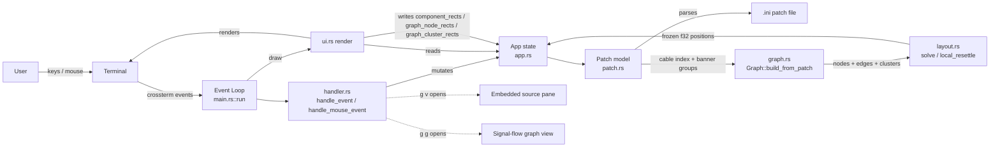
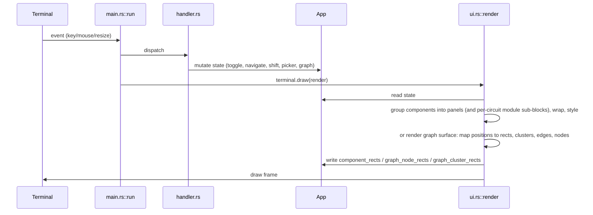
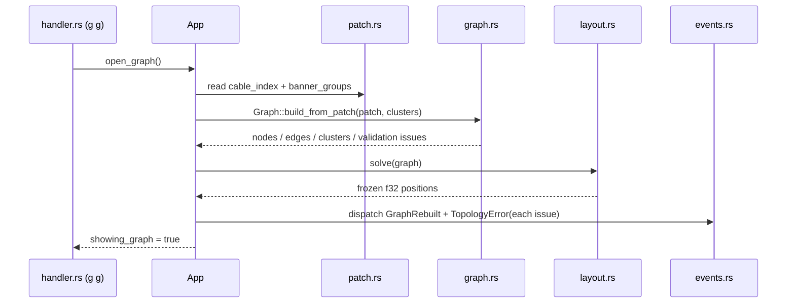

# ARCHITECTURE.md

## Architecture Overview

`droid_tui` is a single-crate Rust terminal application for loading, inspecting, and interacting with DROID hardware patch files (`.ini`). It renders the hardware components a patch defines — buttons, knobs, CV I/O, encoders, LEDs, switches — grouped into labeled panels that mirror the physical controller layout (P2B8, Faderbank, Notebuttons, …), and supports keyboard and mouse interaction plus shift-group visualization. Two optional full-screen surfaces sit on top of the panel view: an embedded source pane, opened with `g` then `v`, shows line-accurate patch text beside the panels and links selected hardware components to their occurrences and modifier relationships; a signal-flow graph view, opened with `g` then `g`, renders circuits as nodes and virtual `_cable` connections as directed edges, laid out by a deterministic force-directed solver with banner-group clusters and topology validation.

The system is a **layered monolith** with no framework, no async runtime, and no network: a single-threaded event loop reads terminal events, mutates an in-memory application state, and redraws the screen. The domain model, `.ini` parser, signal-flow graph model, and layout solver are pure functions over strings/structs; the renderer owns all layout decisions and publishes per-frame geometry back to the state for mouse hit-testing.

The app is a **patch viewer/interactor, not a hardware bridge**: it parses `.ini` files and simulates component state locally. It does not connect to DROID hardware.

## 1. Project Structure

```
droid_tui/
├── Cargo.toml              # crate manifest; deps: ratatui, crossterm, color-eyre
├── Cargo.lock
├── src/
│   ├── lib.rs              # module wiring: app, config, events, graph, handler,
│   │                       #   layout, patch, theme, ui
│   ├── main.rs             # entry point, config/theme init, event loop
│   ├── app.rs              # App state struct + picker/graph helpers + event bus field
│   ├── handler.rs          # keyboard + mouse event handling (incl. graph drag)
│   ├── patch.rs            # domain model (Patch, HwComponent, …) + .ini parser,
│   │                       #   virtual-cable index + banner-group extraction
│   ├── graph.rs            # signal-flow graph model (nodes/edges/clusters) +
│   │                       #   cable-index→edge builder + topology validation
│   ├── layout.rs           # force-directed layout solver (one-shot, deterministic)
│   ├── events.rs           # synchronous observer event bus (GraphRebuilt/NodeMoved/TopologyError)
│   ├── theme.rs            # semantic color-token layer + built-in palettes
│   ├── config.rs           # XDG config.toml load/save (theme preference)
│   └── ui.rs               # ratatui rendering (panels, viewer, graph, status, picker)
├── fixtures/               # test fixtures: arpeggio1.ini, picker_test/
├── openspec/
│   ├── changes/            # OpenSpec change proposals (archive/ holds completed ones)
│   └── specs/              # capability specs: controller-panels, file-picker,
│                           #   mouse-interaction, patch-parsing, shift-visualization,
│                           #   keybinding, module-scaling, module-orientation,
│                           #   viewer-layout, source-navigation, signal-flow-graph
├── .opencode/              # agent orchestration config (engineers, source roots, platform)
├── .agents/skills/         # project skills (guardrails, ratatui, rust, openspec, …)
├── .beads/                 # beads issue tracker data (Dolt-backed, tooling only)
├── .claude/skills/         # Claude Code skills (droid-patch-format, verify, …)
├── droid_living_examlpes/  # symlink to local DROID reference checkout (machine-local, untracked)
└── target/                 # build artifacts (partially tracked in git — see §15)
```

## 2. High-Level System Diagram



## 3. Core Components

### 3.1 User Interface (`src/ui.rs`)

- **Responsibility**: render the entire screen from `App` state each frame; compute layout; publish component and graph geometry for mouse hit-testing.
- **Key functions**: `render` (picker overlay, else a header/main/status split; the main area dispatches on view state — graph surface → `render_graph`, embedded viewer → `render_embedded_main`, else → `render_main`), `render_patch` / `render_patch_grouped` (groups components into controller panels, wraps to rows, applies shift-group border colors, renders LED-associated elements as single boxed cells with kind-colored borders, subdivides a multi-circuit panel into per-instance module sub-blocks — "Panel contains modules" — and records `component_rects`), `render_component_grid` (shared per-panel/per-module grid renderer), `render_component`, `render_status`, `render_picker`, `render_embedded_main` (splits panels | source columns by `app.viewer_split_ratio`, clamped 0.3–0.7), `render_source_pane`, `render_source_sidebar`, `render_source_content`, `render_minimap`, `render_viewer_status` (hints plus trailing transient status message), and the graph surface: `render_graph` (full-screen surface; empty state "No patch loaded. Press 'l' to load."; maps frozen `graph_positions` floats onto the main area via a deterministic bounding-box fit into `graph_node_rects` — `GRAPH_NODE_WIDTH = 22`, `GRAPH_NODE_HEIGHT = 5`; renders titled plain-bordered cluster containers (`GRAPH_CLUSTER_PADDING = 2`) first, publishing `graph_cluster_rects`; then box-drawing polyline edges whose port cells are covered by the node frames; then rounded node frames with title = circuit name (+ instance index when repeated) and left `◉` input port on edge sinks / right `●` output port on edge sources), `render_graph_empty`, `render_graph_cluster_frame`, `render_graph_edges`, `render_graph_node`, `graph_node_rects` (float→Rect mapping), `cable_kind`/`cable_color` (edge color = `graph_edge_error` when any validation issue references the cable, else the inferred-kind token from `CableKind` — `Control`/`Audio`/`Midi`/`Unknown`, classified by producing-circuit name substrings).
- **Technologies**: ratatui 0.29 (`Frame`, `Layout`, `Flex`, `Block`, `Paragraph`, `BorderType::Rounded`), crossterm colors/modifiers.
- **Inputs**: `&mut App`; **Outputs**: terminal frame; side effect: `app.component_rects`, `app.graph_node_rects`, `app.graph_cluster_rects` filled per frame.
- **Key invariant**: layout is recomputed fresh from `frame.area()` on every draw — terminal resize needs no state handling.

### 3.2 Domain Model & Parser (`src/patch.rs`)

- **Responsibility**: typed model of a DROID patch and a hand-rolled `.ini` parser that builds it.
- **Types**: `Patch` (name, `hw_components`, `modules`, `sections`, raw lines, token spans, occurrence index, modifier index, `shift_groups`, `cable_index`, `banner_groups`), `Span` (0-based line and byte-column range), `ModifierAffect` (resolved modifier span/source/selectat), `HwComponent` (id, label, kind, shift_group, state, controller, led, plus `module_instance()` deriving the component's circuit-instance number from the leading digit run of its token id), `ComponentKind` (Button, CvIn, CvOut, Knob, Switch, Led, Encoder), `ComponentState` (Off, On, Value(f32), Active), `ShiftGroup` (Group1–4 with `color()`/`key_label()`), `Module` / `ModuleWidth`, `IniSection`, `CableIndexEntry` (cable name → producing circuits + ordered sink references), `BannerGroup` (banner text + section range), and `ViewerCircuit` for prettified blocks.
- **Key functions**: `Patch::from_ini_file` / `from_ini_str` / `sample`, `parse_ini_sections` (comment stripping, repeated-section preservation and header spans), `collect_token_spans`, `scan_hw_tokens` (boundary-aware token scanner), `build_occurrence_index`, `build_modifier_index` (cycle-safe `select`/`selectat` resolution), `token_kind`, `add_component`, `collect_cable_index` (each `output = _NAME` registers a cable source for the section's circuit; each `input = _NAME` / similar sink param records an ordered `(section_name, param_key)` reference; preamble cable maps that must not produce edges are excluded), `parse_banner` / `collect_banner_groups` (a `# ---- Name ----` comment banner owns the ordered circuit-section range from its line until the next banner or EOF; sections before the first banner form an implicit unnamed group ordered first); LED-association detection (a bare `led = L.N` entry, plus numbered circuit params `ledN = L.M` paired by shared numeric suffix with a same-suffix element entry such as `buttonN`/`potN` — the DROID convention for circuits like `matrixmixer`); rack-recognition API `module_types` / `needs_by_type` / `master_requirement`; `occurrences_for`, `modifier_affected_spans`, `modifier_entries_for`, and `viewer_circuits`.
- **Inputs**: `.ini` file content; **Outputs**: `Result<Patch, String>` (descriptive errors, never panics on malformed input).
- **Design notes**: the parser is deliberately custom (the `ini` crate was removed from `Cargo.toml`) to preserve repeated section names and control token extraction precisely.

### 3.3 Input Handling (`src/handler.rs`)

- **Responsibility**: translate terminal events into `App` mutations.
- **Key functions**: `handle_event` (priority order: picker → armed prefix → graph surface → embedded-viewer focus → normal keys; modifier chord: `Mouse Down` on modifier-eligible component without mods = momentary (hit-test via `component_rects`), `Up`/`Leave` clears; `Ctrl+Shift+Click` (alias `Ctrl+Click`) toggles latched modifier (single-var replacement today, aspirational additive union); `m` keyboard alias for hovered component; `Esc` clears shift + modifier; rendering priority `graph_edge_error` (red) > modifier hue > `CableKind`); keyboard: `q`/Ctrl+C quit, `l` open picker, `g` arms a vim-style prefix (`g v` opens the embedded source pane, `g g` opens the signal-flow graph surface), `t` toggles raw/prettified mode, Tab switches pane focus, `+`/`-` cycle scale presets 50 %–200 % with wrap-around, `[`/`]` adjust the panels/source split ratio ±0.1 while the source pane is open (clamped 30 %–70 %), `1`–`4` shift groups, `o` toggle portrait/landscape orientation, `Esc` closes the surface or cancels prefix, Enter/Space toggle/select components, `j`/`k` scroll or navigate, and Up/Down/Home/End navigate occurrences), `handle_mouse_event` (hover highlight, panel click toggle/select, empty-space deselection, scroll ±0.05 on knobs/faders, minimap click-to-scroll), `handle_graph_mouse` (while the graph surface is open it owns all mouse input: left-button Down on a `graph_node_rects` entry starts a `GraphDrag` with the node index and grab offset, motion updates the node's position bounded to a sane virtual-plane window, Up ends the drag, runs `layout::local_resettle` around the moved node, and emits `NodeMoved`), `handle_picker_event` (directory navigation, Enter on dir/`.ini`, Esc cancel), and `rect_contains` hit-testing.
- **Inputs**: `KeyEvent`/`MouseEvent`; **Outputs**: `bool` (quit flag) or `()`; mutates `App`.
- **Key invariant**: mouse hit-testing uses `app.component_rects` / `app.graph_node_rects` written by the renderer — the renderer, not the handler, knows where components actually landed on screen.
- **Graph surface keys**: `Esc` closes it and restores the prior view; `q`/Ctrl+C still quit and `l` opens the picker, mirroring the viewer's global-key behavior; the graph has no focus split, so nothing else routes there while it is open.
- **Viewer focus**: `ViewerFocus::Source` isolates panel actions; Tab returns focus to panels, while Esc closes the pane and keeps selection and source position. Picker remains highest priority.

### 3.4 Application State (`src/app.rs`)

- **Responsibility**: single mutable state object threaded through the whole app.
- **Fields**: `patch: Option<Patch>`, modifier influence single-var `active_modifier_var: Option<String>` + `influence: Option<InfluenceSubtree>` derived from `selected_component` via `Patch.hw_token_to_vars` → `Patch.influence_subtree` (`recompute_influence`, structural forward-BFS over `cable_index` + `circuit_outputs`, cycle-safe, sorted; no `influence_cache` — single selection, additive union aspirational, `B1.1`→`_TRIG` example; `hash(token)%16` hue via `theme::modifier_hue`), `active_shift: Option<ShiftGroup>`, `hovered_component: Option<usize>`, `status_message`, file-picker state (`showing_picker`, `picker_dir`, `selected_file`, `picker_entries`, `picker_index`), `component_rects: Vec<(usize, Rect)>`, `scale_factor: f32` (uniform component-cell scaling applied by the renderer, presets 50–200 %), `viewer_split_ratio: f32` (panels/source column ratio, default 0.6, clamped 0.3–0.7, persists across `load_patch`), `orientation: Orientation` (Portrait/Landscape panel direction), `prefix: Option<PrefixState>` (armed vim-style prefix + start instant for the lazy 1 s timeout), embedded viewer state (`showing_viewer`, `selected_component: Option<String>`, `viewer_focus: ViewerFocus`, `source_view_mode: SourceViewMode`, `occurrence_cursor`, `source_scroll`, `minimap_rect`), graph-view state (`showing_graph`, `graph: Option<Graph>`, `graph_positions: Vec<(f32, f32)>` parallel to `graph.nodes`, `graph_cluster_rects: Vec<(usize, Rect)>`, `graph_node_rects: Vec<(usize, Rect)>`, `graph_drag: Option<GraphDrag>`), and `events: EventBus`.
- **Key functions**: `App::new`/`Default`, `load_patch` (stores the patch and resets source-navigation *and* graph/quad state; no `influence_cache` — influence built lazily via `recompute_influence` on selection), `select_component`/`clear_selected_component` (derive `active_modifier_var` via `hw_token_to_vars` then `influence` via structural forward-BFS over `cable_index` (`input+output` hop, cycle-safe, sorted, `B1.1`→`_TRIG`); `hash(token)%16` hue via `modifier_hue`), `status_hint` (`MOD B1.1 → N cells / M cables` in hue, single-var today; `MOD B1.1+B1.2 → N cells / M cables` additive aspirational, most-recent-wins on overlap; single-var reality: second select replaces first — additive union is aspirational), `open_graph" (builds the graph from the current patch via `Graph::build_from_patch(patch, clusters_from_patch(patch))`, runs a fresh full `layout::solve`, opens the view, and emits `GraphRebuilt` plus a `TopologyError` per validation finding; with no patch loaded the view still opens with an empty graph so the renderer shows the empty-patch message), `close_graph`, `notify_node_moved` (emits `NodeMoved` after a drag re-settle), `clear_graph_cluster_rects` / `clear_graph_node_rects` (renderer-called per frame, mirroring `component_rects`), `reset_graph_state`, `select_component` (selects token and jumps to its first occurrence), `clear_selected_component`, `jump_to_occurrence`, `refresh_picker_entries`, `load_sample_patch`; free helpers `clusters_from_patch` (maps `Patch.banner_groups` to `Cluster` with `(unnamed)` fallback titles) and `is_entry_selectable` (`.ini` files and directories selectable, others dimmed).

### 3.5 Signal-Flow Graph Model (`src/graph.rs`)

- **Responsibility**: pure model of the patch's signal topology — circuits as nodes, virtual cables as directed edges, banner groups as clusters — plus topology validation. No terminal dependency (testable without rendering).
- **Types**: `NodeId = (circuit_name, instance_index)` (repeated section names are distinct instances), `GraphNode` (id, circuit, instance_index, section_index), `GraphEdge` (cable name, source `NodeId`, sink `NodeId`), `Cluster` (title + `Range<usize>` into `Patch.sections`), `TopologySeverity` (`Warning` for a dangling sink, `Error` for `n → 1`), `TopologyIssue` (cable, severity, message), `Graph` (nodes, edges, clusters, validation).
- **Key functions**: `Graph::build_from_patch(patch, clusters)` — every section becomes a node with distinct instance indices in file order; each cable in `patch.cable_index` fans its source out to every sink reference, one directed edge per (cable, source, sink); unresolvable names are skipped rather than panicking; edges are sorted deterministically by `(cable, source, sink)` (the cable index is a `HashMap` whose iteration order is randomized per process, and edge order feeds the layout solver's f32 accumulation and the renderer's shared-cell ownership — stable order is required for reproducible layouts); `validate_topology` runs as a build step — exactly one source per cable is valid, zero sources (a dangling reference) is a `Warning`, two or more sources is an invalid `n → 1` topology and an `Error`; produced-but-unused cables are fine; findings travel with the graph for the renderer to highlight and never block building or viewing.
- **Cable attribution**: by section *name* (the cable index records names, not instance indices), so a name shared by several instances resolves to the first instance for edge building; instance-accurate attribution is the topology-validation pass's concern, keeping that convention consistent.

### 3.6 Layout Solver (`src/layout.rs`)

- **Responsibility**: deterministic force-directed layout — a one-shot convergence solver, not a simulation.
- **Key functions**: `solve(graph) -> Vec<(f32, f32)>` (positions parallel to `graph.nodes`; full solve from scratch: seed → bounded iterations until total kinetic energy drops below `ENERGY_THRESHOLD` (0.5) or `MAX_ITERATIONS` (300), then freeze), `local_resettle(graph, positions, moved, radius, iterations) -> bool` (damped re-settle after a node move — only nodes within `radius` (`LOCAL_RADIUS` 200, default `LOCAL_ITERATIONS` 40) are active; distant nodes act as unmoved anchors; no-op for an unknown node).
- **Determinism (design D9)**: initial positions are seeded from topological depth (sources left, sinks right) with banner clusters banded vertically plus a hash of the node id — no RNG, so the same patch converges to the same arrangement on the same machine. Constants: `FRICTION` 0.5, `SPRING_REST` 80, `SPRING_K` 0.05, `REPULSION_STRENGTH` 4000, `REPULSION_RADIUS` 120, `MAX_DISPLACEMENT` 20, `HORIZONTAL_SPACING` 80, `VERTICAL_SPACING` 120.
- **Performance**: repulsion uses uniform-grid cell hashing (rebuilt per iteration; cell size = repulsion radius) so a node only repels against nodes in neighboring cells, keeping the 600-node case near-linear instead of O(n²).

### 3.7 Observer Event Bus (`src/events.rs`)

- **Responsibility**: synchronous observer event bus connecting model, graph, and renderer (design D6). Deliberately minimal: an event enum, inline dispatch to subscribers, no queueing, no async, single-threaded.
- **Events**: `Event::GraphRebuilt` (graph (re)built and re-solved; subscribers re-render), `Event::NodeMoved(NodeId)` (node dragged to a new position after a local re-settle), `Event::TopologyError(TopologyIssue)` (topology-validation finding — a path to the status surface).
- **Key functions**: `subscribe -> Subscription` (plain `FnMut` closures invoked in subscription order on dispatch), `unsubscribe` (stale/duplicate handle is a no-op), `dispatch` (inline, no-op with no subscribers).
- **Wiring today**: dispatch sites are live — `App::open_graph` emits `GraphRebuilt` plus one `TopologyError` per validation finding; `App::notify_node_moved` emits `NodeMoved` after a drag re-settle. No production subscriber is registered yet (design D6 extension point; the API is exercised by tests).

### 3.8 Entry Point & Event Loop (`src/main.rs`)

- **Responsibility**: process lifecycle and the draw→read→dispatch loop.
- **Key functions**: `main` (color-eyre install, config load + `theme::init` BEFORE `ratatui::init()` so stderr warnings are visible and rendering never starts half-themed, mouse capture enable, panic-hook chaining to disable mouse capture on panic, `run`, restore), `run` (loop: `terminal.draw(render)` → `event::read()` → dispatch key/mouse/resize; all view routing lives in `handler::handle_event` — no unconditional close in the loop).
- **Technologies**: crossterm 0.28 (`EnableMouseCapture`/`DisableMouseCapture`, `event::read`), ratatui `DefaultTerminal`.

## 4. Data Flow

**Main runtime loop** (per frame):



**Graph build & solve flow** (on `g g`):



**Key user journeys**:
- **Load a patch**: press `l` → picker overlay lists current dir → navigate with `j`/`k`/arrows → Enter on `.ini` → `Patch::from_ini_file` parses → picker closes → panels render.
- **Toggle a component**: Enter/Space on hovered component, or mouse click on a component rect → `toggle_component` flips `ComponentState` → status bar shows "Toggled: <label>".
- **Shift visualization**: press `1`–`4` → `active_shift` set → panels containing matching `shift_group` get bold colored borders, others dim; `Esc` clears.
- **Open the source viewer**: press `g` then `v` within 1 s → `open_embedded_viewer` sets `showing_viewer`, focuses the source pane, and starts at BOF or the selected component's first occurrence. Raw lines render by default; `t` switches to prettified circuit blocks. `j`/`k` scroll, Up/Down/Home/End navigate selected-token occurrences, Tab changes focus, and Esc closes while keeping selection and scroll.
- **Open the signal-flow graph**: press `g` then `g` → `open_graph` builds the graph from the current patch's cable index and banner groups, runs a fresh full force-directed solve, and opens the full-screen surface. The renderer draws titled banner-group cluster containers, box-drawing cable edges (colored by inferred kind — control/audio/midi — or by the topology-error token when the cable has a validation finding), and rounded circuit-node frames with input/output port markers. Dragging a node with the mouse re-settles the local neighborhood (damped, bounded iteration budget) and emits `NodeMoved`. `Esc` closes the surface and restores the previous view; `q`/Ctrl+C still quit.
- **Scale modules**: press `+`/`-` → cycle presets 50 % → 100 % → 150 % → 200 % (wrapping at both ends) → the renderer multiplies the component cell size; status bar shows "Scaling: N%".
- **Adjust the panels/source split**: press `[` or `]` while the embedded source pane is open → `adjust_viewer_split_ratio(∓0.1)` moves the column boundary in exact 10 % steps between 30 % and 70 % panels; the layout reflows immediately and the viewer status bar trails "Panels/Source split: N%/M%".
- **Resize**: `Event::Resize` is ignored — the next `draw` recomputes layout from the new `frame.area()`.

## 5. Data Stores

**None.** The application holds all state in memory (`App`) and persists nothing. The `.beads/` directory is the beads issue-tracker's Dolt-backed store, developer tooling, not application data. No database, no schema, no migration strategy.

## 6. External Integrations / APIs

The app reads local `.ini` files and simulates component state; it does not talk to DROID hardware, MIDI, or any network service. The source viewer is rendered in-process from the loaded `Patch`; the graph view is rendered in-process from the parsed cable index. No subprocess, terminal multiplexer, terminal emulator, IPC, or network integration is used.

DROID reference material (`droid_living_examlpes/`) remains a machine-local symlink used for development reference only.

## 7. Key Technologies

| Technology | Version | Architectural relevance |
|---|---|---|
| Rust | 2021 edition | Single-crate monolith; no unsafe code |
| ratatui | 0.29 | Terminal UI: `DefaultTerminal`, `Layout`/`Flex`, widgets; owns raw-mode/alternate-screen lifecycle via `init()`/`restore()` |
| crossterm | 0.28 | Event source (`event::read`), mouse capture enable/disable |
| color-eyre | 0.6 | Error reporting + panic hook (chained to also disable mouse capture) |
| serde | 1 | Serialization derives for the in-memory patch domain model and the v1 `Settings` schema |
| toml | 0.9 | `config.toml` parse/serialize (single `theme` key) |
| OpenSpec | — | Change proposals + capability specs under `openspec/` |

## 8. Deployment & Infrastructure

- **Build**: `cargo build` (debug) / `cargo build --release`; single native binary `droid_tui`.
- **CI/CD**: `.github/workflows/ci.yml` runs `cargo fmt --check`, `cargo clippy --all-targets --all-features --locked -- -D warnings`, `cargo test --locked`, strict gate `cargo insta test --check`, `cargo build --release --locked`, and uploads ephemeral `evidence/gallery/` + pending `*.snap.new` as `visual-gallery` artifact (retention 14 days).
- **Containerization**: none.
- **Environment config**: no application-specific environment configuration; the picker starts in `std::env::current_dir()`.
- **Git**: no remote configured; branches `master` (initial commit) and `feature/droid-patch-tui` (active work); archive branch `archive/droid-patch-tui` holds the archived `droid-patch-tui` change plus synced main specs; `feature/add-visual-validation` carried the `visual-validation` change with ephemeral `evidence/gallery` and durable archive mirror via `scripts/archive-gallery.sh`; archived 2026-08-24 as `openspec/changes/archive/2026-08-24-add-visual-validation/` with synced main spec `openspec/specs/visual-validation/spec.md`.

## 9. Security Architecture

- **Trust boundary**: the app runs locally with the user's privileges; the only file input is local `.ini` files. The embedded viewer executes no external commands.
- **Input validation**: the parser is defensive — malformed/empty files return descriptive `Err(String)` and never panic (tested: `rejects_empty_file`); graph edge building skips unresolvable cable names instead of panicking.
- **Secrets**: none handled, none stored.
- **Auth/authz**: not applicable (no network, no multi-user).
- **Terminal hygiene**: raw mode, alternate screen, and mouse capture are restored on normal exit and on panic (chained panic hook).

## 10. Monitoring & Observability

- **Logging**: none (no logging framework).
- **Error reporting**: color-eyre renders panics/errors to the terminal.
- **Metrics/tracing**: none.
- **Observability gap**: no way to observe runtime behavior outside the TUI itself; acceptable for a local interactive tool. The event bus (design D6) provides an internal extension point for observing graph rebuilds, node moves, and topology findings.

## 11. Performance & Scalability

- **Model**: single-threaded, no concurrency, no caching.
- **Per-frame cost**: layout and panel grouping are recomputed every draw — O(n) in component count with small constants (`COMPONENT_WIDTH = 16`, `COMPONENT_HEIGHT = 2`). Fine for real DROID patches (tens of components).
- **Graph solve**: one-shot, bounded — full solve ≤ 300 iterations (freezes early at the energy threshold), local re-settle ≤ 40; repulsion is near-linear via uniform-grid cell hashing (600-node chain tested finite); re-solve triggers are exactly two: patch load and node drag.
- **Known bottleneck**: none at current scale; a pathological patch with thousands of components would redraw slowly, but DROID hardware RAM limits make this unrealistic.

## 12. Development Workflow

- **Setup**: `cargo build` (no install step; no remote to clone from).
- **Test**: `cargo test` (265+ unit/regression/snapshot tests) — strict gate; any `insta` snapshot mismatch fails the run.
- **Lint**: `cargo clippy --all-targets --all-features --locked -- -D warnings`.
- **Format**: `cargo fmt --check` / `cargo fmt`.
- **Snapshots**: `insta` (`insta = "1"` dev-dep) manages `src/snapshots/*.snap`; `cargo insta review` / `INSTA_UPDATE=always cargo test` accepts intentional face changes; `cargo insta test --check` is the CI source of truth.
- **Gallery**: ephemeral `evidence/gallery/` (HTML + ANSI sidecars, `index.html` per scenario) generated via `cargo run --bin snapshot-gallery` or `cargo test -- --generate-gallery`, `.gitignore`'d; durable mirror via `scripts/archive-gallery.sh` into `openspec/changes/archive/2026-08-24-add-visual-validation/evidence/gallery/`.
- **Verify binary**: `.claude/skills/verify/SKILL.md` drives the built binary interactively.
- **Agent orchestration**: `.opencode/` defines specialized engineers (rusty, layout-designer, horst, dermannmitdermachine), `maxConcurrent: 3`; platform: backlog = browser, repo = none.
- **Change workflow**: OpenSpec — propose under `openspec/changes/`, implement, archive to `openspec/changes/archive/` and sync specs to `openspec/specs/` (archive hook `scripts/archive-gallery.sh` carries ephemeral gallery into durable archive).

## 13. Testing Strategy

- **Location**: in-module `#[cfg(test)]` unit tests in `patch.rs`, `handler.rs`, `ui.rs`, `graph.rs`, `layout.rs`, `events.rs`, plus cross-layer, per-theme frame-rendering, and `insta` snapshot tests in `regression.rs` (`buffer_to_ansi` / `buffer_to_html` helpers) and `src/snapshots/`.
- **Coverage**: 265+ tests cover parser spans, raw-line round trips, occurrence indexes, cycle-safe modifier graphs, rack recognition, LED-`=` association (button with LED, section without), numbered-circuit `ledN = L.M` pairing by shared suffix, module-instance grouping (multi-instance panels split into sub-blocks, physical order preserved), selection-driven jumps, focus isolation, occurrence navigation, picker and minimap mouse behavior, scale-correct hit rects (no overlap at non-default scale), panel geometry overflow/overlap and knob-clipping with the viewer open, UI frames for raw/prettified source, highlights, minimap geometry, narrow layouts, panels, shifts, and status, per-theme rendering of boxed cells/shift surfaces/picker/viewer panes under `classic`/`terminal`/`mono`, config discovery/load/save/fallback paths; graph-model tests (arpeggio/alg27 model shapes match circuit instances, cable fan-out edge counts, cluster membership covers every node via banner groups, topology validation: dangling cable → warning, `n → 1` → error, valid fan-out clean); layout-solver tests (single/disconnected/cyclic/600-node graphs stay finite, determinism — same input → identical positions, freeze stability, local-resettle leaves distant anchors unmoved and is cheaper than a full solve, cluster seed bands vertically, convergence by energy threshold before the iteration cap); event-bus tests (subscriber notification, dispatch order, no-subscriber no-op, unsubscribe); plus the visual-validation matrix (`arpeggio1.ini`, `led_pairs.ini`, `source_navigation.ini` × `classic`/`terminal`/`mono` × widths 80/120/100, viewer open/closed, shift1) via snapshot harness, including graph-surface snapshots.
- **Visual validation**: deterministic `TestBackend` → ANSI + HTML gallery (`evidence/gallery/index.html`, one row per scenario, columns per theme) — no live terminal/pty; ephemeral in worktree (`.gitignore` covers `src/snapshots/`, `evidence/gallery/`, `*.snap.new`) and durable in archive (`scripts/archive-gallery.sh` mirrors to `openspec/changes/archive/2026-08-24-add-visual-validation/evidence/gallery/`); strict gate — `cargo test` generates and asserts `insta` snapshots and fails on any face regression (`cargo insta test --check` in CI); HTML side-by-side proves spec-to-face for `visual-validation` (`openspec/specs/visual-validation/spec.md`).
- **Frameworks**: std test harness + `insta` 1 for golden-file management; no mocking, no property tests, no live-terminal end-to-end test, no coverage gate.
- **Gap**: no end-to-end test driving the real binary; UI tests render into a test `Frame` rather than a live terminal (visual snapshots are `TestBackend` determinism, not pty capture).

## 14. Architectural Decisions & Rationale

1. **Hand-rolled `.ini` parser over the `ini` crate** — preserves repeated section names (DROID patches repeat `[button]` etc.) and gives precise control over token extraction; the crate was removed from `Cargo.toml`.
2. **Boundary-aware hardware-token scanner** — a token starts at a letter (`B/L/P/O/I/E/S`) followed by a digit with a non-alphanumeric/underscore boundary before it, so internal variables like `_ENV1_DECAY_POT` are not misread as hardware tokens.
3. **Components grouped by physical controller** — `HwComponent.controller` ("P2B8", "Faderbank", …) drives panel grouping, mirroring the hardware layout (design.md Decision 3).
4. **Renderer owns layout; handler consumes geometry** — `component_rects` is written by `ui.rs` each frame and read by `handler.rs` for mouse hit-testing, because only the renderer knows where components actually landed on screen. The graph surface extends the same pattern with `graph_node_rects` / `graph_cluster_rects` (ADR 22).
5. **Fresh layout per frame** — no resize state; `Event::Resize` is a no-op and the next draw reflows automatically.
6. **Chained panic hook** — ratatui's hook restores raw mode/alternate screen; the app chains `DisableMouseCapture` before it so a panic leaves a clean terminal.
7. **Shift groups as an enum** — `ShiftGroup::Group1–4` with `color()`/`key_label()`; panel borders and status bar derive from one source of truth.
8. **Vim-style `g` prefix with lazy timeout** — arming stores only `PrefixState { started: Instant }`; expiry against `PREFIX_TIMEOUT` (1 s) is checked when the next event arrives instead of running a timer thread, keeping the event loop single-threaded and synchronous. `g v` opens the source viewer; `g g` opens the graph surface (ADR 16).
9. **Embedded source viewer** — `g v` opens a source pane in the same TUI and `App`; raw lines and parser-recorded spans support selection jumps, occurrence navigation, modifier highlights, and minimap interaction without IPC or a process boundary.
10. **Boxed rendering gated on parse-time LED association** — a component renders as ONE bordered cell only when its `.ini` section carries an LED association (stored as `HwComponent.led`): a bare `led = L.N` entry, or a numbered circuit `ledN = L.M` param paired by shared numeric suffix with a same-suffix element entry (`buttonN`/`potN`) as used by circuits like `matrixmixer` (the `ledN` value is authoritative for the LED token). The border uses the component-kind color; the label lives in the block's top title row and the single interior row holds state + the LED glyph (one state, not a duplicate textual LED state). LED-less components keep two-line text rendering; LEDs are never rendered as standalone cells.
11. **Adjustable panels/source split** — the embedded viewer's column ratio lives in `App.viewer_split_ratio` (default 0.6, clamped 0.3–0.7, persisted across patch loads as a view preference); `[`/`]` nudge it in exact 0.1 steps only while the viewer is open.
12. **Semantic color-token layer** — every rendered color comes from `Theme` tokens in `src/theme.rs`; no `Color::` literals outside tests. Built-in palettes `classic` (byte-identical to pre-theming colors), `terminal` (all `Reset`), and `mono` (grayscale, shift tokens pairwise distinct) are resolved by name and installed globally via `theme::init` at startup. Graph tokens cover node/port/cluster surfaces, edge kinds (`control`/`audio`/`midi`/`unknown`), and the `graph_edge_error` highlight.
13. **XDG user config with injected validation** — `src/config.rs` discovers `droid-tui/config.toml` under `$XDG_CONFIG_HOME` (or `$HOME/.config`); name validation is injected as a canonicalizer function so the loader stays decoupled from the theme catalog. Missing file silently yields defaults; malformed TOML and unknown themes warn once on stderr and fall back to `classic`. Writes are atomic (temp-file + rename).
14. **Config load before terminal init** — `main()` loads settings and initializes the active theme before `ratatui::init()` so warnings print to a clean terminal. The global theme lives behind a `Mutex<Option<&'static Theme>>` (not `OnceLock`) because test-ordering must not poison the palette across tests.
15. **Panel contains modules** — a controller panel whose components come from more than one circuit instance (detected via `HwComponent.module_instance()`, the leading digit run of the token id) is subdivided into per-instance module sub-blocks, each bordered and titled with the instance number (e.g. `P2B8 1`, `P2B8 2`); a single-instance panel renders as one flat grid and CV I/O never subdivides. Panel height is sized from the visible (LED-folded) component count so trailing rows like knobs are not clipped, and the published `component_rects` hit rects exactly match the rendered cell size (a prior scale-factor inflation spilled a hit rect into its neighbor's screen area, misresolving hover/selection).
16. **Signal-flow graph as a third full-screen surface (`g g`)** — an optional view focused purely on signal topology, distinct from the controller-panel representation (the primary map to physical hardware). It keeps the header and status bars, owns all mouse input while open (node dragging), and Esc restores the prior view; `q`/Ctrl+C/`l` keep their global meaning.
17. **Cable attribution by section name, first-instance resolution** — the cable index records names, not instance indices, so repeated instances resolve to instance 0 for edge building; instance-accurate attribution is left to the topology-validation pass, keeping the convention consistent across the model.
18. **One-shot deterministic force-directed solver, not a simulation** — bounded iterations (≤ 300 full, ≤ 40 local) until the energy threshold, then freeze; re-solve triggers are exactly two (patch load → full solve, node drag → damped local re-settle). Seed positions derive from topological depth + cluster bands + node-id hash — no RNG; edges are sorted deterministically because the cable index is a `HashMap` with per-process-random iteration order and f32 spring-force accumulation is order-sensitive (design D9: same patch, same machine → identical layout).
19. **Grid-hashed repulsion** — repulsion is the O(n²) risk in force-directed layouts; uniform-grid cell hashing (cell = repulsion radius, rebuilt per iteration) restricts each node's repulsion to neighboring cells, keeping the 600-node case near-linear.
20. **Synchronous observer event bus** — `GraphRebuilt` / `NodeMoved` / `TopologyError` dispatched inline to `FnMut` subscribers in subscription order; no queueing or async, keeping the single-threaded event loop intact. It decouples re-solve triggers (patch load, node move) from both the solver and the renderer and gives topology errors a path to the status surface.
21. **Topology validation at graph build time** — the exactly-one-source rule runs as a build step: dangling sink → `Warning`, `n → 1` → `Error`, produced-but-unused cable → fine. Findings travel with the graph (never block building or viewing) and the renderer colors offending cables with the `graph_edge_error` token.
22. **Renderer publishes graph geometry per frame** — `graph_node_rects` and `graph_cluster_rects` are written by `ui.rs` each draw (mirroring `component_rects`) and consumed by `handler.rs` for node-drag hit-testing; `render_graph` splits `App` field borrows (`graph`, `graph_positions`, `graph_cluster_rects`, `graph_node_rects`) because rendering both reads and mutates the same struct.

## 15. Constraints, Risks, and Technical Debt

- **`target/` partially tracked in git** (725+ files) — build artifacts committed at some point; `.gitignore` only covers beads/Dolt files. Hygiene debt; `git add -A` can accidentally sweep build output into commits.
- **No README** — project has no user-facing documentation.
- **ARCHITECTURE.md / DESIGN.md** were placeholders until 2026-08-20; both now hold full generated content and are maintained incrementally.
- **Archived change `droid-patch-tui`** has 48 tasks never checked off in `tasks.md` (process debt; implementation is complete and tested).
- **Stale code comment in `graph.rs`** — the `Graph.validation` field's doc comment claims the slot is "always empty today" (reserved for task 2.2), but `validate_topology` already populates it at build time and the renderer already highlights offending cables.
- **Event bus has no production subscribers** — `open_graph` and drag-release dispatch `GraphRebuilt` / `TopologyError` / `NodeMoved`, but no renderer/status consumer registers yet (design D6 extension point); topology findings therefore do not currently surface in the UI beyond the edge-error coloring.
- **Graph port markers are presence-only** — nodes show a left input port when they are edge sinks and a right output port when they are edge sources; exact per-parameter pairing is future refinement.
- **Picker row styling** (selected yellow bold, non-selectable dim) was computed but never applied to rendered output; removed as dead code during verification. Per-row styling is a design follow-up.
- **No hardware integration** — component state is simulated; wiring to real DROID hardware (e.g., MIDI SysEx upload) is future work.
- **Single-threaded redraw** — fine at current scale; no headless/scriptable mode.
- **Source pane scales with terminal width** — sidebar and minimap hide below their width thresholds to preserve a usable source area; very narrow terminals show only source content.

## 16. Future Considerations

- **Hardware bridge**: upload patches to a running DROID rack via USB-MIDI SysEx (see `droid-hardware-setup` skill) and reflect real state.
- **Schema validation**: validate parsed patches against the authoritative DROID circuit schema (`droid_living_examlpes/droid-lsp/src/circuits.json`, 76 circuits, 10 controllers).
- **Graph follow-ups**: surface topology errors via the event bus to the status bar; exact per-parameter port pairing; instance-accurate cable attribution; graph-surface status/hint line.
- **Per-row component styling** in the picker (restore the removed style intent).
- **Persistence**: export/import of component state remains a possible future feature; serde derives currently serve the in-memory domain model only.
- **README + DESIGN.md** generation (`/make-design`).
- **CI**: add a workflow running fmt/clippy/test on push.

## 17. Project Identification

- **Name**: droid_tui
- **Language**: Rust (edition 2021)
- **Type**: terminal UI application (ratatui)
- **Runtime**: native binary; Linux
- **Date of review**: 2026-08-25
- **Maintainer**: not evident from the repository

## 18. Glossary / Acronyms

- **DROID**: Der Mann mit der Maschine — Eurorack modular-synthesizer controller hardware; patches are `.ini` files.
- **Hardware token**: address of a physical control in a patch, e.g. `B1.1` (button), `L1.2` (LED), `P1.1` (pot), `O1` (CV out), `I1` (CV in), `E1.1` (encoder), `S1.3` (switch).
- **Controller**: physical panel type — P2B8, Faderbank, Notebuttons, Encoder, Pot, Unusedfaders, etc.
- **Shift group**: a set of components whose behavior/labels change while a shift key (1–4) is held.
- **Source viewer**: embedded readonly source pane showing raw `.ini` lines or prettified circuit blocks, with sidebar, selection-driven highlighting, occurrence navigation, and optional minimap; opened with `g` then `v`.
- **Signal-flow graph view**: full-screen surface opened with `g` then `g`; circuits as nodes, virtual `_cable` connections as directed edges, banner-group clusters as containers, laid out by the force-directed solver; supports node dragging and topology-error edge highlighting.
- **Virtual cable**: a connection named with a leading underscore (e.g. `_PULSARCLOCK`) that a circuit produces via `output = _NAME` and others consume via parameters like `input = _NAME`; one source may feed many sinks, `n → 1` is invalid.
- **Cable index**: `Patch.cable_index` — map from cable name to producing circuits and ordered sink references, built at parse time.
- **Banner group**: the ordered circuit-section range owned by a `# ---- Name ----` comment banner (until the next banner or EOF); the implicit group before the first banner carries `banner: None`.
- **Cluster**: the graph's rendering of a banner group — a titled, bordered container around the member nodes' rects.
- **Force-directed layout**: one-shot deterministic solver (spring attraction + grid-hashed repulsion + friction) that converges then freezes; re-solved only on patch load (full) or node drag (local).
- **Topology validation**: the exactly-one-source rule per cable — a dangling sink is a `Warning`, multiple sources are an `Error`; findings travel with the graph.
- **Theme token**: a named color role in `src/theme.rs` (e.g. `knob`, `shift2`, `graph_edge_control`); rendering reads tokens, never raw colors.
- **config.toml**: user preferences file under `$XDG_CONFIG_HOME/droid-tui/` (v1 schema: single `theme` key).
- **Prefix key**: an armed `g` waits up to 1 s for a follow-up key (`v` source viewer, `g` graph); expiry is checked lazily on the next event.
- **Viewer focus**: `ViewerFocus::Panels` or `ViewerFocus::Source`; controls whether panel or source-pane keys act (the graph surface has no focus split).
- **Event bus**: synchronous observer bus (`events.rs`) carrying `GraphRebuilt`, `NodeMoved`, and `TopologyError` events to subscribers.
- **ratatui / crossterm**: Rust TUI framework / terminal backend.
- **OpenSpec**: spec-driven change workflow (`openspec/changes/`, `openspec/specs/`).
- **beads (bd)**: Dolt-backed issue tracker used for task tracking.

<!-- Last updated: 2026-08-25 · signal-flow-graph view (`g g`): graph.rs/layout.rs/events.rs modules, cable index + banner groups in patch.rs, topology validation, deterministic force-directed solver, node drag, graph snapshot tests -->
