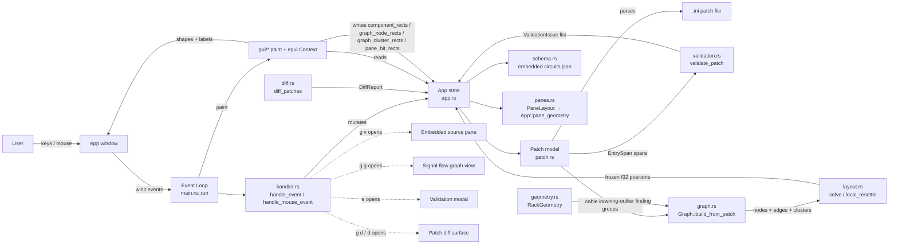
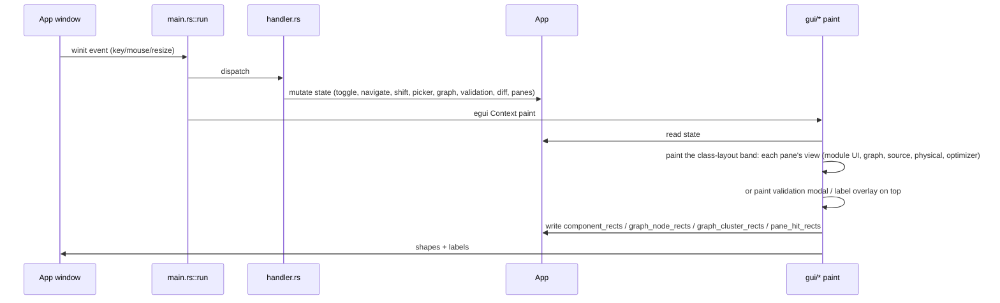
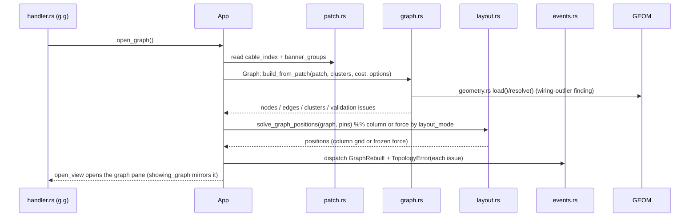

# ARCHITECTURE.md

## Architecture Overview

`droid_tui` is a single-crate Rust desktop application for loading, inspecting, and interacting with DROID hardware patch files (`.ini`). It renders the hardware components a patch defines — buttons, knobs, CV I/O, encoders, LEDs, switches — as physical faceplates that mirror the controller layout (P2B8, Faderbank, Notebuttons, …), and supports keyboard and mouse interaction, shift-group visualization, and a modifier wash that recolors the cells a held or latched modifier influences across every surface. Clicking a module-UI element focuses it across surfaces: the cell stays selected on the faceplate, the source pane jumps to its occurrence, and the signal-flow graph highlights the element's register entity plus its influence subtree (a click never toggles component state — that stays on `Enter`/`Space`). The main band is a **class-based pane layout**: every view belongs to a window class (`PaneClass::Big` or `Small`), and the adaptive band splits into a full-height left big pane plus a right half that is either a single big pane (when no small-class view is open) or two stacked small panes. The module UI opens at startup in the left big pane with the source viewer in a small pane; the signal-flow graph (`g g`) and the module UI (`Physical`) are big-class views, while the source viewer (`g v`) and the latency optimizer (`g o`) are small-class views. Focus routing sends keys to exactly one pane at a time (`Tab`/`Shift+Tab` cycle focus in tree order; focused/unfocused borders use `pane_focus_border`/`pane_unfocused_border`), `r` rotates the focused pane through its class carousel, `z` maximizes a pane, and `Alt+b`/`Alt+s` swap same-class panes. The module UI is a **physical 1:1 layout**: a millimeter-accurate grid model of the rack — case rows, fold bars, mount sections, module faceplates — rendered to scale with pan (arrow keys / wheel) and zoom (`+`/`-`), plus an optional skeleton reference presentation (`s`) that swaps the full render for a pure geometry outline. Clicking the graph minimap pans the camera to the clicked world point. Centered overlays sit on top of the pane layout unchanged: the source pane links selected hardware components to their occurrences and modifier relationships; the signal-flow graph renders circuits as nodes and virtual `_cable` connections as directed edges, laid out by a deterministic column arrangement by default (the force-directed solver is retained and reachable via `h` or `[layout] mode = "force"`), with banner-group clusters, topology validation, and wiring-outlier detection; a validation modal, opened with `e`, lists schema and lint findings when a patch fails or warns; a patch diff surface, opened with `g` then `d`, highlights the differences between the loaded patch and a second one; and the latency optimizer (`g o`) opens as a small pane with the other panes still visible.

The system is a **layered monolith** with no framework, no async runtime, and no network: a single-threaded winit event loop reads window/keyboard/mouse events, mutates an in-memory application state, and repaints the egui surfaces. The domain model, `.ini` parser, signal-flow graph model, layout solver, circuit-schema validator, diff model, rack-geometry model, and physical-layout model are pure functions over strings/structs (no UI dependency); the gui paint layer owns all layout decisions and publishes per-frame geometry back to the state for mouse hit-testing.

The app is a **patch viewer/interactor with a one-way hardware bridge**: it parses `.ini` files and simulates component state locally, and it can send the in-memory patch to DROID hardware over MIDI SysEx (USB or DIN) through a confirm modal and a background transfer. It receives nothing back — no state is read from the rack.

## 1. Project Structure

```
droid_tui/
├── Cargo.toml              # crate manifest; deps: winit, egui, egui-winit, wgpu, color-eyre, serde,
│   #                       #   toml (native window stack; no terminal or kitty rasterizer stack)
├── Cargo.lock
├── src/
│   ├── lib.rs              # module wiring: app, config, diff, events, expression, favorites,
│   │                       #   geometry, graph, graph_anim, graph_render, gui, handler, help, latency, layout,
│   │                       #   optimize, panes, patch, performance, physical, plugin, rendermetrics, schema,
│   │                       #   sysex, theme, validation (+ regression in cfg(test))
│   ├── main.rs             # entry point, config init, seed_app, demo fallback, startup
│   │                       #   window-open request + startup pane arrangement, winit event loop + egui paint
│   ├── app.rs              # App state struct + class-based pane layout (PaneLayout/PaneId) +
│   │                       #   legacy tile_stack/FocusSlot compat mirrors + picker/graph/
│   │                       #   validation/diff helpers + event bus
│   │                       #   + LabelStore (XDG labels.toml per-patch hw/circuits) + overlay EditState
│   │                       #   + held/latched modifier wash (hold_component/latched_component
│   │                       #   + modifier_influence + cached influence_subset)
│   │                       #   + element→graph register focus (extend_with_register_focus)
│   │                       #   + center_graph_camera_on_nodes)
│   ├── handler.rs          # keyboard + mouse event handling (pane-class routing + graph drag
│   │                       #   + label overlay `e`/`1..N` + validation modal `j`/`k`/Enter/Esc
│   │                       #   + diff `g d`/`d`/Esc + physical view `s` toggle + arrow/wheel pan
│   │                       #   + window frame → App (module-UI pointer hover/click → element
│   │                       #   focus, else pointer/wheel via graph_pane_origin))
│   ├── patch.rs            # domain model (Patch, HwComponent, …) + .ini parser, virtual-cable index
│   │                       #   + banner-group extraction + preamble_labels (per-entry EntrySpan spans)
│   │                       #   + display_label/circuit_label (store[layer]→store[1]→preamble[1]→derived)
│   │                       #   + select-signal discovery (SelectSignal Register|Cable + SelectCandidate)
│   ├── schema.rs           # authoritative DROID circuit schema + jack table (embedded circuits.json,
│   │                       #   prefix/count/start_at param expansion, Levenshtein suggestion)
│   ├── validation.rs       # pure patch validation (9 checks ported 1:1 from droid-lsp diagnostics);
│   │                       #   Severity + ValidationIssue{span,severity,code,message}
│   ├── diff.rs             # pure patch diff model (DiffReport: added/removed/changed cables + nodes)
│   ├── geometry.rs         # pure rack-geometry model (RackGeometry/ControllerSlot, load via
│   │                       #   CARGO_MANIFEST_DIR, resolve, distance/is_adjacent)
│   ├── physical.rs         # pure physical-layout model (mm grid: PhysicalLayout/CellGrid; RackSpec/
│   │                       #   RackLayout rack packing + fold bars/mounts; ScreenMapping mm→chars)
│   ├── performance.rs      # pure side-bound callout layout model (Side/quadrant assignment +
│   │                       #   stacking + leader anchors; no egui dependency)
│   ├── sysex.rs            # pure MIDI SysEx payload builder (7-bit strip + F0 00 66 66 50 … F7)
│   ├── panes.rs            # class-based pane layout model (PaneLayout/PaneId/PaneClass/Pane); see §3.17
│   ├── plugin.rs           # plugin-circuit TOML loader (XDG discovery + serde parse); see §3.14
│   ├── graph.rs            # signal-flow graph model (nodes/edges/clusters) + topology validation
│   │                       #   + wiring-outlier detection (learned decision table)
│   │                       #   + label guessing (nearest explicit upstream label per circuit)
│   ├── graph_anim.rs       # pure settle-animation driver (cubic ease-out interpolation + GraphSettle over solved positions)
│   ├── graph_render.rs     # backend-neutral SceneSpec types + world-extent/fit API (graph scene description)
│   ├── gui/                # egui surfaces (winit/egui/wgpu window shell): mod.rs (paint_panes +
│   │   │                   #   pane view dispatch + paint_overlays + publish_window_canvas +
│   │   │                   #   WindowFrame/WindowGraphKey),
│   │   │                   #   physical.rs (module UI: 1:1 rack view, pane-anchored spec,
│   │   │                   #   component_rects hit geometry), viewer.rs (source pane +
│   │   │                   #   minimap), picker.rs (file picker overlay), overlays.rs (validation
│   │   │                   #   modal, select-state menu, label editor, diff, latency optimizer),
│   │   │                   #   graph.rs (signal-flow canvas + minimap + tooltip, zoom-proportional
│   │   │                   #   node geometry + label level of detail, graph_pane_rect from
│   │   │                   #   App::pane_geometry, build_scene_spec pane-origin scene build)
│   ├── latency.rs          # forward-loop latency metric + CostModel (shared per-circuit AVG provider, design D2)
│   ├── optimize.rs         # latency-optimized patch generation (candidate strategies: banner/global
│   │                       #   min-sum, min-max, FAS-indegree first pass, multilevel coarsening + VNS,
│   │                       #   SA w/ seeded PRNG; weighted slider objective w); see §3.15
│   ├── layout.rs           # layout solvers: deterministic column arrangement (default, width-aware, dense-normalized) + retained force-directed solver (tension/pins/drag); its per-node width estimate is also the world width the graph renderer draws
│   ├── events.rs           # synchronous observer event bus (GraphRebuilt/NodeMoved/TopologyError/
│   │                       #   ValidationCompleted/DiffComputed)
│   ├── expression.rs       # pure Droid expression evaluator (left-to-right, no precedence/parens,
│   │                       #   1V = 0.1, div-by-zero → 0.0, unknown token → None); select-state values
│   ├── favorites.rs        # FavoritesStore (XDG favourites.toml, canonical absolute paths)
│   ├── help.rs             # pure help-content module for the `?` modal (HelpView + per-view key tables)
│   ├── rendermetrics.rs    # pure render-feature extractor + scorer (render-outlier detector, D1–D5)
│   ├── theme.rs            # semantic color-token layer + built-in palettes (incl. validation + diff
│   │                       #   + physical-skeleton tokens) + Theme::egui_color bridge
│   ├── config.rs           # XDG config.toml load/save (theme + [labels] layers_enabled/max_shift_layer
│   │                       #   + [latency] per_circuit + [layout] mode/ordering + [plugins]
│   │                       #   + [physical]/[physical.rack] rack definition)
├── tests/
│   └── perf_gate.rs        # profiling gate: budgeted watchdog phases over the scale anchor (see §11)
├── ext/droid-lsp/          # vendored droid-lsp git submodule (src/circuits.json = schema source of truth,
│                           #   src/diagnostics.ts = validation reference port)
├── fixtures/               # test fixtures: arpeggio1.ini, picker_test/, validation/*.ini (9 fixtures),
│                           #   graph_dependency_walk.ini / graph_select_state.ini (select + dependency walk)
│                           #   led_pairs.ini / switch_value.ini / physical_multirow_rack.ini (physical view)
├── corpus/                 # patch corpus for analysis tooling
├── tools/                  # developer analysis tools
├── scripts/                # developer scripts (profile-gate.sh, regenerate.sh)
├── openspec/
│   ├── changes/            # OpenSpec change proposals (archive/ holds completed ones)
│   └── specs/              # capability specs: controller-panels, file-picker, mouse-interaction,
│                           #   patch-parsing, shift-visualization, keybinding, module-scaling,
│                           #   module-orientation, viewer-layout, source-navigation, signal-flow-graph,
│                           #   physical-scale-model, graph-arrange, midi-upload
├── .opencode/              # agent orchestration config (engineers, source roots, platform)
├── .agents/skills/         # project skills (guardrails, tui, rust, openspec, …)
├── .beads/                 # beads issue tracker data (Dolt-backed, tooling only)
├── .claude/skills/         # Claude Code skills (droid-patch-format, verify, …)
├── patches_remote/         # remote DROID patch files (reference .ini patches + Generators/)
└── target/                 # build artifacts (partially tracked in git — see §15)
```

## 2. High-Level System Diagram


```mermaid
flowchart LR
    USER[User] -->|keys / mouse| WINDOW[App window]
    WINDOW -->|winit events| LOOP[Event Loop<br/>main.rs::run]
    LOOP --> HANDLER[handler.rs<br/>handle_event / handle_mouse_event]
    HANDLER -->|mutates| APP[App state<br/>app.rs]
    HANDLER -.->|g v opens| SOURCE[Embedded source pane]
    HANDLER -.->|g g opens| GRAPH[Signal-flow graph view]
    HANDLER -.->|e opens| VALMODAL[Validation modal]
    HANDLER -.->|g d / d opens| DIFF[Patch diff surface]
    APP --> PATCH[Patch model<br/>patch.rs]
    APP --> SCHEMA[schema.rs<br/>embedded circuits.json]
    PATCH -->|parses| INI[.ini patch file]
    PATCH -->|EntrySpan spans| VALIDATE[validation.rs<br/>validate_patch]
    VALIDATE -->|ValidationIssue list| APP
    PATCH -->|cable index + banner groups| GBUILD[graph.rs<br/>Graph::build_from_patch]
    GBUILD -->|nodes + edges + clusters| SOLVE[layout.rs<br/>solve / local_resettle]
    APP --> PANES[panes.rs<br/>PaneLayout → App::pane_geometry]
    SOLVE -->|frozen f32 positions| APP
    GEOMETRY[geometry.rs<br/>RackGeometry] -->|wiring-outlier finding| GBUILD
    DIFFMODEL[diff.rs<br/>diff_patches] -->|DiffReport| APP
    LOOP -->|paint| GUI[gui/* paint + egui Context]
    GUI -->|reads| APP
    GUI -->|writes component_rects / graph_node_rects / graph_cluster_rects / pane_hit_rects| APP
    GUI -->|shapes + labels| WINDOW
```

## 3. Core Components

### 3.1 User Interface (`src/gui/`)

- **Responsibility**: paint the egui surfaces from `App` state each frame; compute layout; publish component and graph geometry for mouse hit-testing.
- **Key functions**: `gui/mod.rs::paint_panes` is the real dispatch: it derives every pane rect from `App::pane_geometry(band)` (the ADR 35 single geometry source, published as `pane_hit_rects` via `App::refresh_hit_geometry`) and paints each pane's view into its cell — `physical.rs::physical_spec(app, pane)`/`paint_physical` (the module UI: the mm grid anchored at the pane origin, pan/zoom, skeleton toggle, element-state cells, the `Module UI` pane frame, and the per-element `component_index` + rect list `paint_panes` republishes as `component_rects`), `graph.rs::paint_scene_in`/`build_scene_spec` (world-sized node bodies projected through the camera, zoom-scaled chrome, label level of detail), `viewer.rs::paint_viewer` (raw/prettified source blocks, sidebar, minimap, occurrence navigation, scroll), and `overlays.rs::paint_optimizer` (the optimizer's own pane). `gui/mod.rs::paint_overlays` dispatches the centered overlays over the base (diff, validation, select-state menu, picker, label editor, help). `graph.rs::graph_pane_rect` re-derives the graph pane from `App::pane_geometry` — not the legacy `tile_stack` slot mirror — so the scene origin, the first-frame fit, the published `graph_canvas_px`, and `paint_panes` all agree on one source (ADR 35; this is what lets `c` center the graph in its actual pane). Paint routines emit `egui::Shape`/`Shape::Text` and record `component_rects` / `graph_node_rects` / `graph_cluster_rects` / `pane_hit_rects` for hit-testing. Frame specs (`PhysicalFrame`, `ViewerFrame`, `PickerFrame`, `WindowFrame`) carry the egui/winit input to the handler layer, which applies the same key/mouse semantics as before (shift groups, g-prefix, p/x, scale/split, s, Tab focus, Esc, hover/click/scroll/drag).
- **Technologies**: egui (`Painter`, `Shape`, `Rect`, `Context`), winit window events, wgpu backend; all colors derive from `Theme` tokens via `Theme::egui_color` / `Theme::egui_from_rgb` (no hardcoded RGB).
- **Inputs**: `&mut App`; **Outputs**: egui shapes/labels; side effect: `app.component_rects`, `app.graph_node_rects`, `app.graph_cluster_rects`, `app.pane_hit_rects` filled per frame.
- **Key invariant**: layout is recomputed fresh from the window rect on every paint — window resize needs no state handling. Hit geometry is republished fresh per frame too: `paint_panes` clears `component_rects` first and refills it from the Physical pane's drawn cells, so a pane not showing the module UI publishes nothing and a stale rect can never hit-test.

### 3.2 Domain Model & Parser (`src/patch.rs`)

- **Responsibility**: typed model of a DROID patch and a hand-rolled `.ini` parser that builds it.
- **Types**: `Patch` (name, `hw_components`, `modules`, `sections`, raw lines, token spans, occurrence index, modifier index, `shift_groups`, `cable_index`, `banner_groups`, `preamble_labels` — leading `# TOKEN: label` map), `Span` (0-based line and byte-column range), `EntrySpan` (per-entry key/value byte spans carried on `IniSection`, captured before lowercasing, alongside `header_span`/`raw_lines` — feeds the validation modal's jump-to-source), `ModifierAffect` (resolved modifier span/source/selectat), `HwComponent` (id, label, kind, shift_group, state, controller, led, plus `module_instance()` deriving the component's circuit-instance number from the leading digit run of its token id), `ComponentKind` (Button, CvIn, CvOut, Knob, Switch, Led, Encoder), `ComponentState` (Off, On, Value(f32), Active), `ShiftGroup` (Group1–4 with `color()`/`key_label()`), `Module` / `ModuleWidth`, `IniSection` (with per-entry `EntrySpan`), `CableIndexEntry` (cable name → producing circuits + ordered sink references), `BannerGroup` (banner text + section range), `ViewerCircuit` for prettified blocks, `SelectSignal` (signal name, `kind: SelectSignalKind` Register|Cable, usage count, `candidates: Vec<SelectCandidate>`), `SelectCandidate` (inferred `value: f64` + occurrence `count`), and `SelectSignalKind` (Register/Cable).
- **Key functions**: `Patch::from_ini_file` / `from_ini_str` / `sample`, `parse_ini_sections` (comment stripping, repeated-section preservation and header spans + per-entry `EntrySpan` capture), `collect_token_spans`, `scan_hw_tokens` (boundary-aware token scanner), `build_occurrence_index`, `build_modifier_index` (cycle-safe `select`/`selectat` resolution), `token_kind`, `add_component`, `collect_cable_index` (each `output = _NAME` registers a cable source for the section's circuit; each `input = _NAME` / similar sink param records an ordered `(section_name, param_key)` reference; preamble cable maps that must not produce edges are excluded), `parse_banner` / `collect_banner_groups` (a `# ---- Name ----` comment banner owns the ordered circuit-section range from its line until the next banner or EOF; sections before the first banner form an implicit unnamed group ordered first); LED-association detection (a bare `led = L.N` entry, plus numbered circuit params `ledN = L.M` paired by shared numeric suffix with a same-suffix element entry — `buttonN`/`potN`/`encoderN`/`switchN`/`faderN`, the DROID convention for circuits like `matrixmixer`; `M` tokens resolve to `ComponentKind::Knob` so faders share the knob rendering path; the association is device-dependent — when a section has no explicit pairing the parser applies the controller/device default: M4 fader touch plates resolve their RGB `L`+`R` register pair, B32 buttons stay white-only, and master LEDs default-link to their CD channels); rack-recognition API `module_types` / `needs_by_type` / `master_requirement`; `occurrences_for`, `modifier_affected_spans`, `modifier_entries_for`, `viewer_circuits`, `parse_preamble_labels` (leading `# B3.17: [RATC]` map; `I4:` empty treated as absent), select-signal discovery `discover_select_signals` (scans section params and the cable index for `select`-style signals, inferring each signal's candidate values via `parse_candidate_value` — a trailing `V` suffix scales by ÷10, otherwise plain `f64` — with `format_candidate` for display; the result feeds the select-state menu's Register/Cable rows) and label resolution `effective_shift` + `display_label(token, shift, layers_enabled, max_shift_layer, hw_store)` with fallback `store[layer]→store[1]→preamble[1]→derived` and clamping/disabled coercion + `circuit_label`/`circuit_display_label` per-`NodeId` override; lossless writer `write_to_ini`/`render_ini` (block-slices `raw_lines` by section header line, preamble first, comment/banner runs travel with their section, byte-identical round-trip; refuses the source's canonicalized path, atomic tmp→rename, auto-suffix on destination collision).
- **Inputs**: `.ini` file content; **Outputs**: `Result<Patch, String>` (descriptive errors, never panics on malformed input).
- **Design notes**: the parser is deliberately custom (the `ini` crate was removed from `Cargo.toml`) to preserve repeated section names and control token extraction precisely.

### 3.3 Input Handling (`src/handler.rs`)

- **Responsibility**: translate window events into `App` mutations.
- **Key functions**: `handle_event` (priority order: overlay → picker → armed prefix → class-layout pane keys (`z`, `Alt+b`, `Alt+s`, Esc-maximize) → focused-pane routing → normal keys; overlay eats all keys while `App.editing.is_some()`; modifier chord: `Mouse Down` on modifier-eligible component without mods = held (momentary, hit-test via `component_rects`), `Up`/`Leave` clears; `m` on the hovered panel component and `Ctrl+Shift+Click` (alias `Ctrl+Click`) latch the modifier so it survives until `Esc`; exactly one modifier is effective (a second latch replaces the first, additive union aspirational); while either state is active the influenced cells wash in `modifier_hue` and the rest dim on the module UI and source surfaces (raw and prettified); `Esc` clears shift plus both modifier states; rendering priority `graph_edge_error` (red) > modifier hue > `CableKind`); keyboard: `q`/Ctrl+C quit, `l` open picker, `g` arms a vim-style prefix (`g v` opens the source pane in a small pane, `g g` opens the signal-flow graph in a big pane, `g d` opens the picker to choose the B patch for a diff, `g o` opens the latency optimizer in a small pane, `g s` opens the select-state menu overlay (see below), `g c` toggles cable latency coloring on the graph, `t` toggles raw/prettified mode, `p` toggles the global processing pause (the module UI dims + `PROCESSING PAUSED` status, component mutations blocked while paused), `e` toggles the validation modal (from the status/view; `j`/`k` navigate issues, `Enter` jumps the source-pane scroll to the issue's line:col, `Esc` closes via `clear_validation`), `d` toggles the diff overlay (diff surface; `Esc` clears the diff scope then hides the overlay), Tab cycles focus forward across the non-empty panes in tree order and `Shift+Tab` cycles backward, `r` rotates the focused pane through its class carousel, `z` maximizes the focused pane (cleared by focus change or Esc), `Alt+b`/`Alt+s` swap within a class, `+`/`-` scale the focused pane (panels scale when panels focused, graph camera zoom when graph focused; `Shift++`/`Shift+-` scale the other pane), `[`/`]` adjust the left big-pane / right-half split ratio ±0.1 (clamped 30 %–70 %; `Alt+[`/`Alt+]` adjust the small-pane split ratio, and on the graph pane they lower/raise cable tension), `1`–`4` shift groups, `?` opens the help modal, `Esc` closes the focused pane's view (or cancels prefix / clears selection when panels are focused), Enter/Space toggle/select components, `j`/`k` scroll or navigate, and Up/Down/Home/End navigate occurrences; label overlay: `e` opens single-field overlay for focused panel token / source header instance / hovered graph node (`hovered_graph_node`); inside overlay `1..N` (N=`max_shift_layer` clamped 1..8) cycles the edited HW layer preserving per-layer drafts, char/Backspace edits draft, `Enter` saves via `LabelStore` atomic rewrite, `Esc` cancels), `handle_mouse_event` (hover highlight, panel click toggle/select, empty-space deselection, scroll ±0.05 on knobs/faders, minimap click-to-scroll, click on a pane sets focus to it), `handle_graph_mouse` (while the graph pane is focused it owns mouse input inside its pane: left-button Down on a `graph_node_rects` entry starts a `GraphDrag` with the node index and drags the node so its movement keeps pace with the cursor without layout jitter until `Up`; drag single-steps into `layout::local_resettle`; hover sets `app.hovered_graph_node` for the `x` toggle / `e` label overlay / diff scope). Physical-view input: `s` toggles the skeleton reference presentation (`Skeleton: on/off` status); `+`/`-` cycle the zoom presets 75 %–200 % with wrap-around (synced to `physical_zoom`, status reads `Scaling: N%` or the rack-aware `physical_status_hint`); arrow keys pan the rack when it overflows the main area (`physical_pan_if_overflow`) and Up/Down fall back to panel navigation when it fits; `j`/`k` always navigate. The mouse wheel pans on overflow — a wheel over a knob/fader cell still adjusts its value when no overflow forces panning (D5).
- **Window frame path**: `handle_window_event` / `handle_window_key_event` convert winit keyboard events into the neutral `KeyEvent` and run the same dispatch; `handle_graph_window_frame` applies the window's pointer/wheel/mouse report to the hovered graph node, mapping window-space coordinates through `graph_pane_origin(app)` so they line up with the pane-relative camera. The frame path also routes the module UI: when the pointer is inside a pane whose view is `Physical`, it sets `hovered_component` from `component_rects` and, on `primary_pressed`, focuses that pane and calls `select_component` (status `Focused: <token>`) — a left-click never toggles component state (that stays on `Enter`/`Space`), and when the graph pane is open it also centers the camera on the element's focused nodes via `center_graph_camera_on_nodes`; pointer over any other pane clears the module-UI hover and falls through to the graph logic unchanged. An optimizer-pane click hit-tests candidate rows (`optimizer_row_at`: 24px header, 16px rows, 12-row cap) and previews the row exactly like `Enter` (cursor set + `optimizer_preview`), handled before the graph-camera gate so it works with no graph open.
- **Inputs**: `KeyEvent`/`MouseEvent`; **Outputs**: `bool` (quit flag) or `()`; mutates `App`.
- **Key invariant**: mouse hit-testing uses `app.component_rects` / `app.graph_node_rects` written by the renderer — the renderer, not the handler, knows where components actually landed on screen.
- **Graph pane keys**: `x` toggles processing for the hovered circuit instance (hit-test via `graph_node_rects` and `app.hovered_graph_node`; rebuilds the graph, recomputes influence dead-ending at disabled sinks, emits `GraphRebuilt`, sets status `Processing disabled/enabled: <name> <instance>`; silent no-op with no hover); `p` toggles the global processing pause on every surface **except** the graph pane, where `p` toggles pin/unpin on the hovered graph node (design D7: `pinned` is a fixed solver anchor, the tip is pinned by default, drag auto-pins; status `Pinned/Unpinned: <name> <instance>`; silent no-op with no hover). `Esc` closes the graph pane; `q`/Ctrl+C still quit and `l` opens the picker, mirroring the viewer's global-key behavior. While the graph pane is focused, `e` on a hovered node opens the label overlay, `d` activates the diff overlay (diff cells are rendered inside the graph pane), `c` centers the graph in the visible pane (pan only, zoom unchanged), `Shift+c` refits and centers the graph against the visible pane (zoom preset reset to the fit index), `+`/`-` cycle the persistent `GraphCamera` zoom presets (floor `0.03125`, exactly 2× below the previous minimum), arrow keys pan the camera on overflow (mirroring the physical-view model), and `Alt+[`/`Alt+]` lower/raise cable tension — the force solver's spring stiffness, default 0.15, stepped by 0.05 within [0.05, 0.5] — re-solving the layout live with the status `Cable tension: <value>` (determinism holds per value); on the column arrangement the value is stored silently with no status line and no re-solve, since no spring stiffness applies there. `h` toggles the graph arrangement between the deterministic column layout and the force solver (status `Layout: column` / `Layout: force`, re-solves an open graph via `rebuild_graph`; the column arrangement is the default, the force solver is the retained non-default). `f` toggles the dependency filter and `i` the influence filter on the hovered node (falling back to `selected_circuit`; a status hint no-ops with neither) — the graph rebuilds to that node's upstream-dependency subgraph via `apply_dependency_subset` and `Esc` clears the filter before the tiled `Esc` would close the slot; while the filter is active the camera fit, drawn nodes, and drawn edges all come from the subset index lists.
- **Validation modal keys**: the modal is a full-screen surface below the picker/prefix priority; `j`/`k` move `validation_cursor`, `Enter` jumps the embedded source pane to the issue's source location, `Esc`/`e` closes it. It never blocks loading: a patch with only `Warning`/`Hint` findings loads with `showing_validation=false` and reports `Loaded <name> — N warnings/hints — press 'e' to view` (the modal opens on demand with `e`), so app chords (`g g`, `l`, `?`) keep working; any `Error`-severity finding gates the load (`patch=None`, modal open, `Load failed: N error(s) — press 'e' to view`).
- **Select-state menu keys**: `g s` opens the centered select-state overlay (below the picker/prefix priority) listing the discovered `Register`/`Cable` signals; `j`/`k` move `select_state.cursor`, `[`/`]`/Enter cycle the selected signal's candidate value — writing `state`, rebuilding the graph (reclassifying sections as Selected/NotSelected/Unknown), and updating the status `Select state: N selected / M unselected / K unknown` — and `Esc` closes and clears the state via `close_select_menu` (restoring the default graph). An optional `hide_unselected` mode exists in `GraphOptions` (drops NotSelected circuit nodes and their controller register edges); the menu itself leaves it off.
- **Viewer focus**: `ViewerFocus::Source` isolates module-UI actions; Tab cycles focus across the non-empty panes in tree order, while Esc closes the focused view and keeps selection and source position. Picker remains highest priority.

### 3.4 Application State (`src/app.rs`)

- **Physical-pane performance keys**: `p` opens the performance view (status `Performance view — Esc to exit`; every other pane keeps its `p` meaning), `R` (Shift+r) resets all element states to rest, `Esc` leaves the view with the pane open. Plain `r` still falls through to the class carousel.
- **Upload keys**: `U` (Shift+u) opens the confirm modal for the in-memory patch; `y`/`n`/`Esc` send/cancel inside it (the modal eats all other keys); `q`/Ctrl+C aborts an in-flight send before quitting. `poll_upload` runs at the top of `handle_event` and the window frame so the verdict lands on the next event.
- **Graph arrange key**: `a` rebuilds under the active arrangement, refits unconditionally, reports it, and advances the cycle (silent no-op with no graph).

- **Responsibility**: single mutable state object threaded through the whole app.
- **Fields**: `patch: Option<Patch>`, `layout: PaneLayout` (the class-based pane layout — **the source of truth**: `big_left`/`big_right`/`small_top`/`small_bottom` panes each carrying a fixed `PaneClass` (`Big`/`Small`) and an optional `ViewType`, `focus: PaneId`, `maximized: Option<PaneId>`, `main_split_ratio` 0.5, `small_split_ratio` 0.5; `ViewType` = Graph | SourceViewer | Physical | Optimizer (`Panels` retired); `has_small_view()` decides whether the right half is one big pane or two small panes; small-class views fill `SmallTop` then `SmallBottom`, big-class views take the focused big pane or `BigLeft`), `tile_stack: TileStack` + the `showing_*` bools + the legacy ratio fields (compat mirrors re-derived from `layout` by `sync_mirror` — `tile_stack` is **not** the source of truth), `pane_hit_rects: Vec<(PaneId, Rect)>` (the drawn pane geometry, published each frame by `refresh_hit_geometry` from `pane_geometry`, ADR 35), `pane_rects: Vec<(FocusSlot, Rect)>` (legacy `FocusSlot` mirror derived from `pane_hit_rects` for handler/main compat), shared circuit selection `selected_circuit: Option<NodeId>` (set by clicking a node in the graph pane; drives the source-viewer jump, module-UI hardware highlight, and graph node highlight; survives surface switches; reset on `load_patch`), modifier state (`hold_component: Option<String>` for the momentary mouse press, `latched_component: Option<String>` for the `m`/`Ctrl+Shift+Click` latch that persists until `Esc` (dropped on patch load, not on selection moves), `active_modifier_var: Option<String>` = the effective token, `modifier_influence: Option<InfluenceSubtree>` recomputed by `recompute_influence` from `Patch.influence_subtree` (structural forward-BFS over `cable_index` + `circuit_outputs`, cycle-safe, sorted), plus the cached `influence_subset` (induced subgraph node/edge indices + subset-space positions) recomputed with the influence and re-applied by `rebuild_graph` so the FILTERED pane never re-solves per frame; single selection, additive union aspirational, `B1.1`→`_TRIG` example; `hash(token)%16` hue via `theme::modifier_hue`), `active_shift: Option<ShiftGroup>`, `hovered_component: Option<usize>`, `processing_paused: bool` (global processing pause, `p` key; panels dim + `PROCESSING PAUSED` status while set, component mutations blocked, reset on `load_patch`), `disabled_circuits: HashSet<(String, usize)>` (per circuit-instance processing disable, `x` key on the graph pane; influence dead-ends at disabled sinks, reset on `load_patch`), `layout_mode: LayoutMode` (graph-column-layout D5: `Column` default, `Force` opt-in; seeded from `[layout] mode` at startup, `h` toggles on the focused graph pane, `solve_graph_positions` dispatches by mode), `layout_ordering: LayoutOrdering` (`Strict` default, `Barycenter` opt-in; seeded from `[layout] ordering`, feeds the column path's within-column order), `pinned: HashSet<NodeId>` (per-node pin anchors, design D3/D7 — the tip `graph.nodes[0]` is seeded by `seed_tip_pin` on graph open, `p` toggles membership on the hovered node, drag auto-pins at the dropped position), `graph_canvas_px: Option<(f32, f32)>` (the graph pane's visible size in points, published per frame by the paint paths — graph pane rect or window canvas size), `graph_camera: Option<GraphCamera>` (persistent graph view camera for zoom/pan, seeded on the first paint with a viewport-aware fit against the published `graph_canvas_px` instead of a fixed viewport; the fit frames the world bounds expanded by one node's world extent so whole node frames stay visible), `tension: f32` (cable tension of the graph pane — the solver's spring stiffness, default `layout::DEFAULT_TENSION` = 0.15, stepped by `Alt+[`/`Alt+]` within [0.05, 0.5] and re-solved live; persists across patch loads like `viewer_split_ratio`), `layout_mode: LayoutMode` + `layout_ordering: LayoutOrdering` (graph arrangement: column — the default — or force, and within-column strict or barycenter ordering; seeded from `[layout]` config at startup via `seed_app`, `h` on the graph pane toggles mode, persists across `load_patch`; `solve_graph_positions` dispatches the solve by mode), `hovered_graph_node: Option<usize>` (graph node under the mouse, for the `x` toggle, `p` pin, and drag), `guessed_labels: HashMap<NodeId, String>` (nearest-explicit-upstream label per circuit, refreshed on graph build/rebuild/label-save; graph titles, viewer headers, and the sidebar resolve store→guess→raw), `optimizer_diff_state: Option<OptimizerDiffState>` (file-order per-edge latency baseline captured on optimizer open for the preview recolor), `graph_settle: Option<GraphSettle>` + `graph_settle_pending: bool` (open-animation driver; renderer and hit-testing read display positions), select-state state (`select_state: Option<SelectState>` — signals from `discover_select_signals`, `state: HashMap<String, f64>` of chosen candidate values, `cursor`, `hide_unselected`; via `select_graph_options` it feeds every graph build), dependency-filter state (`dependency_root: Option<NodeId>`, `dependency_nodes: Vec<usize>`, `dependency_edges: Vec<usize>` — the upstream-dependency subgraph index lists driving the filtered render and its own layout), `status_message`, file-picker state (`showing_picker`, `picker_dir`, `selected_file`, `picker_entries`, `picker_index`), validation state (`validation_issues: Vec<ValidationIssue>`, `showing_validation: bool`, `validation_cursor: usize`), diff state (`diff_patch: Option<Patch>`, `diff_report: Option<DiffReport>`, `diff_showing: bool`, `diff_scope: Option<String>`, `diff_cursor: usize`, `diff_picker_active: bool`), `component_rects: Vec<(usize, Rect)>`, label overlay state (`label_store: LabelStore` XDG `labels.toml` per-patch `hw` per-`ShiftGroup` + `circuits` per-`NodeId`, `editing: Option<EditState>` with `kind` HW/Circuit, `token`/`node`, `shift`/`effective_shift`, `draft`+`drafts_by_layer` per-layer drafts, `original`), `labels: config::Labels` (the `[labels]` section seeded once by `seed_app` so painters and the overlay read the resolution policy from state instead of re-reading config), `scale_factor: f32` (uniform component-cell scaling applied by the renderer, presets 75–200 %, floor 75 % so module cells stay boxable), `viewer_split_ratio: f32` (legacy panels/source column ratio, default 0.6, clamped 0.3–0.7, persists across `load_patch`, kept in sync with `main_split_ratio`), `prefix: Option<PrefixState>` (armed vim-style prefix + start instant for the lazy 1 s timeout), physical-view state (`physical_rack_spec: RackSpec` seeded from `[physical.rack]` config, `physical_show_skeleton: bool` presentation toggle, `physical_offset: (f32, f32)` pan in screen cells, `physical_zoom: f64` linked from `scale_factor`, `physical_skeleton_rects` / `physical_rack_size` published per frame), embedded viewer state (`showing_viewer`, `selected_component: Option<String>`, `viewer_focus: ViewerFocus`, `source_view_mode: SourceViewMode`, `occurrence_cursor`, `source_scroll` ...).
- **Key functions**: `App::new`/`Default`, `load_patch` (stores the patch, runs `validation::validate_patch` over the parsed `Patch`; if any `Error`-severity issue is present the patch is rejected (gated to `patch=None`, a failure modal) and `clear_validation` runs, otherwise Warning/Hint findings still load, populate `validation_issues`, and report `Loaded <name> — N warnings/hints — press 'e' to view` without auto-opening the modal (change `validation-modal-error-only`); loads the per-patch bucket from `LabelStore` canonicalized absolute path, and resets source-navigation *and* graph state plus `processing_paused` and `disabled_circuits`), `validate_patch` dispatch wiring (`Event::ValidationCompleted` on completion), `clear_validation`, `select_component`/`clear_selected_component` (record `hold_component`, derive `active_modifier_var` via `hw_token_to_vars`, then `recompute_influence` → `modifier_influence` + the cached `influence_subset`; `influenced_hw_tokens` lists the cells the selection touches so the module UI and source agree on the wash; `recompute_influence` also unions the element's own register entity — `extend_with_register_focus` adds every `_REG:<token>` edge plus both endpoint `NodeId`s to the subtree — so a clicked element lights its register edge and controller/circuit node even when its root-var influence is empty, e.g. an LED or CV jack), `toggle_modifier_latch` (the `m`/`Ctrl+Shift+Click` latch, held until `Esc`), `modifier_status` (the `<token> → N cells / M cables` line in `modifier_hue`), `active_modifier`, `active_shift_layer`, `status_hint` (`MOD B1.1 → N cells / M cables` in hue, single-var today; `MOD B1.1+B1.2 → N cells / M cables` additive aspirational, most-recent-wins on overlap; single-var reality: second select replaces first — additive union is aspirational), `open_graph` (builds the graph from the current patch via `Graph::build_from_patch(patch, clusters_from_patch(patch), &self.cost_model, &self.select_graph_options())` — `select_graph_options` carries the select state's `state` map and `hide_unselected` — runs a fresh full solve via `solve_graph_positions` (column arrangement by default, force solver when `layout_mode` is `Force`), opens the view, and emits `GraphRebuilt` plus a `TopologyError` per validation finding; with no patch loaded the view still opens with an empty graph so the renderer shows the empty-patch message), `close_graph`, `rebuild_graph` (re-runs `Graph::build_from_patch` + `solve_graph_positions` and emits `GraphRebuilt` — used by `toggle_circuit_processing` so a disable/enable re-solves the layout; an active dependency filter is reapplied over the fresh graph via `apply_dependency_subset` — the subset solves as its own layout and its positions map back into full-graph index space — and the filter clears when the frozen root no longer exists, e.g. after a `hide_unselected` build dropped it), `toggle_circuit_processing` (flips a `(name, instance)` in `disabled_circuits` after the `x` key, calls `rebuild_graph` + `recompute_influence`, and returns whether the circuit is now disabled), `toggle_processing_pause` (flips `processing_paused` and clears `hovered_graph_node`), diff helpers `load_diff_patch` (parses the B patch, computes `diff::diff_patches(base, new)` → `DiffReport`, sets `diff_patch`/`diff_report`, `diff_showing=true`, seeds `diff_scope` from `selected_component`, and dispatches `Event::DiffComputed` with cable/node counts), `toggle_diff_showing` / `clear_diff_scope` / `diff_scope_cable_count` / `status_for_scope` ("Diff scope: {token} (N cables)"), label editing `begin_edit`/`save_edit`/`cancel_edit`/`cycle_edit_layer`/`push_edit_char`/`delete_edit_char` (overlay draft lifecycle; `1..N` cycles `N=max_shift_layer` clamped 1..8 preserving per-layer drafts, `Enter` persists via `LabelStore` atomic tmp→rename, `Esc` cancels, `recompute_influence` for `<token> / Group<N> → N ckts / M cables` status in `modifier_hue`), select-state helpers `open_select_menu` (runs `discover_select_signals`, rebuilds the graph under the fresh state, dispatches `GraphRebuilt`, reports "No select signals" when the patch has none) / `close_select_menu` (clears `select_state` and restores the default graph) / `cycle_select_candidate(delta)` (writes the next candidate value into `state` and rebuilds) / `select_counts` / `select_status_text` ("Select state: N selected / M unselected / K unknown" via `classify_for_status` over every section), optimizer helpers `open_optimizer` (generates candidates, captures the file-order latency baseline, opens the small pane), `optimizer_preview` (reorders, rebuilds, refits the camera, selects the first latency-changed circuit and hands focus back to the optimizer pane), `first_affected_node`, `optimizer_restore`/`drop_optimizer_state` (restore order, clear the diff baseline), guessed-label helper `refresh_guessed_labels` (rebuilds `guessed_labels` from `Graph::guess_labels`), dependency-filter helpers `toggle_dependency_filter` (sets `dependency_root` to the hovered/selected node and `apply_dependency_subset`), `clear_dependency_filter`, and `apply_dependency_subset` (upstream `Graph::upstream_dependencies` + `internal_edges` over the full graph, then a `layout::solve` on the subset graph with subset-relative pins, positions mapped back into full-graph index space), and physical-view helpers `physical_pan_by` (pure offset mutation), `physical_pan_if_overflow` (pans only when the rack overflows the main area, otherwise reports it fits), `physical_status_hint` (rack/zoom status segment), and camera helper `center_graph_camera_on_nodes(&HashSet<NodeId>) -> bool` (pans the graph camera so the given nodes' world bounds are centered, zoom unchanged, no-op without a camera or matching nodes; used by the module-UI element click).

- **Pane helpers**: `pane_geometry(band)` (the single geometry source), `refresh_hit_geometry(band)` (publishes `pane_hit_rects` + the legacy `pane_rects`), `open_view` (class-routed open; an already-open view only takes focus), `close_focused_view` (Esc; clears maximize first), `cycle_focus` (Tab, tree order, skips empty panes), `cycle_view_in_slot` (the `r` class carousel), `maximize_toggle` (`z`), `swap_big`/`swap_small` (`Alt+b`/`Alt+s`), `pane_holding`, and the retained legacy quad helpers `enter_quad`/`exit_quad`/`cycle_quad_focus`.

### 3.5 Signal-Flow Graph Model (`src/graph.rs`)

- **Arrangement state**: `layout_mode`/`layout_ordering` persist the cycle selection like before (`h` remains the two-state shortcut, `a` the full cycle); `solve_graph_positions` carries pinned anchors by `NodeId` (new index → id → old-graph position), so section reorders never scramble placements. `live_graph_viewport` (live `pane_hit_rects` geometry) feeds `refit_viewport` (live → published canvas → default), so preview and arrange refits never silently skip.

- **Responsibility**: pure model of the patch's signal topology — circuits, controllers, and hardware registers as nodes; virtual cables and register reads/writes as directed edges; banner groups as clusters — plus topology validation and wiring-outlier detection. No terminal dependency (testable without rendering).
- **Types**: `NodeId` (`Circuit(name, instance)` / `Controller(type, ordinal)` / `Jack(token)`; defined in `patch` for the influence walk), `NodeKind` (`Circuit`, `Controller`, `InputJack`, `OutputJack`), `GraphNode` (id, kind, circuit, instance_index, section_index), `GraphEdge` (cable name, source `NodeId`, sink `NodeId`), `Cluster` (title + `Range<usize>` into `Patch.sections`), `TopologySeverity` (`Warning` for a dangling sink, `Error` for `n → 1`), `TopologyIssue` (cable, severity, message), `GraphOptions` (select-state `state: HashMap<String, f64>` + `hide_unselected: bool`; `Default` = empty state, no hiding), `SelectClass` (`Selected`/`NotSelected`/`Unknown` per section), and `Graph` (nodes, edges, clusters, validation, latency, plus `not_selected: HashSet<usize>` of section indices classified NotSelected).
- **Key functions**: `Graph::build_from_patch(patch, clusters, cost, options)` — every section becomes a node with distinct instance indices in file order; each cable in `patch.cable_index` fans its source out to every sink reference, one directed edge per (cable, source, sink); controller/jack nodes and register edges are built from the patch's register references (`build_register_nodes_and_edges`): catalog output/`led` params write their register refs (circuit → target) and catalog inputs read them, `PBESLR` letters resolve to declared controller nodes by ordinal, unmatched letters fall back to master input/output jacks, and identical edges are deduplicated; unresolvable names are skipped rather than panicking; edges are sorted deterministically by `(cable, source, sink)` (the cable index is a `HashMap` whose iteration order is randomized per process, and edge order feeds the layout solver's f32 accumulation and the renderer's shared-cell ownership — stable order is required for reproducible layouts); **select-state classification** (`classify_sections` + `classify_for_status`) labels every section `Selected`/`NotSelected`/`Unknown` from the `GraphOptions.state` values (`Unknown` = no select-param match, always kept); NotSelected circuits lose their controller register edges (a register edge whose circuit endpoint is NotSelected survives only when it reaches a controller node — the shared cross-controller pair is kept), and with `hide_unselected` their circuit nodes are dropped entirely; `not_selected` travels on the graph so the renderer dims them (`graph_node_dim`) and `upstream_dependencies(root)` / `internal_edges(members)` feed the dependency subgraph; `validate_topology` runs as a build step — exactly one source per cable is valid, zero sources (a dangling reference) is a `Warning`, two or more sources is an invalid `n → 1` topology and an `Error`; produced-but-unused cables are fine; findings travel with the graph for the renderer to highlight and never block building or viewing. `validate_topology` also runs `geometry::RackGeometry` resolution and delegates wiring-outlier scoring to `WiringOutlierScorer` (src/geometry.rs) — an embedded learned decision table (`tools/outlier_artifact.txt` via `include_str!`, schema.rs precedent) that classifies `BindingFeatures` as implausible, with a preserved threshold fallback (`euclidean > 8.0 && cable_hops == 0`) on a table miss (design D1); invariant guards (adjacent / co-located / via-cable) stay explicit at the call site and never reach the scorer (design D5). `validate_topology` also emits the per-token influence second opinion (`InfluenceStats` in src/patch.rs, embedded `tools/influence_stats.txt`): every distinct hardware token is z-scored against per-kind corpus mean/std of `influence_subtree` size; tokens beyond the 3.0 band produce a `Warning` attached to the token's first root-var cable (design D4). Findings travel with the graph, never block building or viewing, and never gate patch loading.
- **Dependency subgraph**: `Graph::upstream_dependencies(root)` is a reversed-edge BFS over the full graph (cycle-safe) that walks producers of cables the root consumes — controller and input-jack leaves terminate the walk, and an output-jack root walks its producing circuits; `Graph::internal_edges(members)` returns the edge indices whose both endpoints are in the member set. `App::apply_dependency_subset` builds a subset `Graph` from those index lists, solves it as its own layout (subset-relative pins mapped from `App.pinned`), and writes the positions back into full-graph index space, so the filtered render draws only the subgraph with a fresh camera fit.
- **Cable attribution**: by section *name* (the cable index records names, not instance indices), so a name shared by several instances resolves to the first instance for edge building; instance-accurate attribution is the topology-validation pass's concern, keeping that convention consistent.

### 3.6 Layout Solver (`src/layout.rs`)

- **Responsibility**: two deterministic layout paths — the column arrangement (default, graph-column-layout D1-D6) and the retained force-directed convergence solver (a one-shot solve, not a simulation). The column path dense-normalizes circuit depth (capped Bellman-Ford over circuit-only edges) into columns `0..N-1`, places controller/jack nodes in fixed outer columns, stacks nodes width-aware (estimated widths, grid-snapped to `GRID_SNAP`) with no overlap, and orders within-column strict or barycenter (config `[layout] ordering`); no force relaxation runs on it. The force path is unchanged and reachable via `h` or `[layout] mode = "force"`.
- **Key functions**: `solve_columns` / `solve_columns_pinned` (column path: `circuit_depth`/`depth_over`, `dense_columns`, `assign_columns`, `column_ranks`/`crossing_minimized_layers`, `estimated_widths`/`estimate_node_width`/`estimated_title` (the same width estimate the graph renderer uses as each node's drawn world width, ADR 40), `GRID_SNAP`; pinned nodes act as fixed-position anchors), `solve(graph, pinned, tension) -> Vec<(f32, f32)>` (force path, positions parallel to `graph.nodes`; full solve from scratch: layered seed → bounded refinement of up to `SOLVE_ITERATIONS` (60) iterations, freezing early when total kinetic energy drops below `ENERGY_THRESHOLD` (0.5); `tension` is the spring stiffness, `DEFAULT_TENSION` = `SPRING_K`), `local_resettle(graph, positions, moved, radius, iterations, pinned, tension) -> bool` (damped re-settle after a node move — only nodes within `radius` (`LOCAL_RADIUS` 200, default `LOCAL_ITERATIONS` 40) are active; distant nodes act as unmoved anchors; `pinned` node indices never move; no-op for an unknown node).
- **Layered seed (design gv5)**: initial positions are a layered (Sugiyama-style) arrangement along a single dominant left→right axis — `x = depth · HORIZONTAL_SPACING`, `y = within-layer order · VERTICAL_SPACING` — where the within-layer order comes from deterministic barycenter crossing-minimization sweeps (`CROSSING_SWEEPS` 8, alternating left→right/right→left, stable sort, no RNG) instead of file order, and coordinates land exactly on the `GRID_SNAP` (10) grid (no jitter). The relaxation is a bounded refinement of that seed, so the convergence target is a clean horizontal chain of aligned columns (design D1). Parallel edges between the same two circuits are normalized to one spring (a cable bundle is one connection), so a button feeding 11 inputs of one circuit does not create an 11×-stiff oscillator. Constants: `FRICTION` 0.5, `SPRING_REST` 80, `SPRING_K` 0.15 (raised so cable springs dominate repulsion, design D2), `DEFAULT_TENSION` = `SPRING_K` (the keyboard-adjustable default, so existing layouts stay byte-identical), `TENSION_STEP` 0.05 / `TENSION_MIN` 0.05 / `TENSION_MAX` 0.5 (the `[`/`]` adjustment range), `SOLVE_ITERATIONS` 60 (the full-solve refinement budget), `REPULSION_STRENGTH` 1500 (softened), `REPULSION_RADIUS` 120, `MAX_DISPLACEMENT` 20, `COHESION_K` 0.01 (weak per-cluster cohesion, far below `SPRING_K`, design D4), `HORIZONTAL_SPACING` 80, `VERTICAL_SPACING` 120.
- **Performance**: repulsion uses uniform-grid cell hashing (rebuilt per iteration; cell size = repulsion radius) so a node only repels against nodes in neighboring cells, keeping the 600-node case near-linear instead of O(n²).

### 3.7 Observer Event Bus (`src/events.rs`)

- **Responsibility**: synchronous observer event bus connecting model, graph, renderer, and validation (design D6). Deliberately minimal: an event enum, inline dispatch to subscribers, no queueing, no async, single-threaded.
- **Events**: `Event::GraphRebuilt` (graph (re)built and re-solved; subscribers re-render), `Event::NodeMoved(NodeId)` (node dragged to a new position after a local re-settle), `Event::TopologyError(TopologyIssue)` (topology-validation finding — a path to the status surface), `Event::ValidationCompleted { count, error_count }` (schema/lint validation finished for a loaded patch), `Event::InfluenceRecomputed(InfluenceSubtree)` (the modifier/element influence subtree was recomputed — the module-UI/source wash and the graph highlight all read the same subtree), `Event::DiffComputed { added_cables, removed_cables, changed_cables, added_nodes, removed_nodes, changed_nodes }` (a B patch was loaded and its diff computed).
- **Key functions**: `subscribe -> Subscription` (plain `FnMut` closures invoked in subscription order on dispatch), `unsubscribe` (stale/duplicate handle is a no-op), `dispatch` (inline, no-op with no subscribers).
- **Wiring today**: dispatch sites are live — `App::open_graph` emits `GraphRebuilt` plus one `TopologyError` per validation finding; `App::notify_node_moved` emits `NodeMoved` after a drag re-settle; `App::validate_patch` emits `ValidationCompleted`; `App::recompute_influence` emits `InfluenceRecomputed` with the recomputed subtree (the element register-focus union included); `App::load_diff_patch` emits `DiffComputed`. No production subscriber is registered yet (design D6 extension point; the API is exercised by tests).

### 3.8 Entry Point & Event Loop (`src/main.rs`)

- **Responsibility**: process lifecycle and the draw→read→dispatch loop.
- **Key functions**: `main` (color-eyre install, config load + `theme::init` before the window opens so warnings land on a clean console and rendering never starts half-themed, panic-hook chaining, demo-patch fallback), `seed_app` (seeds the cost model, physical-view state, layout mode/ordering, and the `[labels]` policy from settings), `load_initial_patch` (reads `argv[1]` and otherwise falls back to the embedded demo patch), `run` (owns the single winit `EventLoop`; `AppHandler` implements `ApplicationHandler` with `ControlFlow::Poll`, draining winit events each frame through `handle_window_event` (draw→read→dispatch), with all view routing in `handler::handle_event`). Startup opens the module UI in the left big pane and the source viewer in a small pane (the `PaneLayout::default()` arrangement) and queues `queue_startup_window_open` (the only path that opens the window); no graph view is opened until the user presses `g g`.
- **Technologies**: winit (window + event loop), egui/egui-winit (immediate-mode UI), wgpu (GPU backend). The window opens only from the startup request; no runtime path opens or closes it.

### 3.9 Authoritative Schema (`src/schema.rs`)

- **Responsibility**: embed the authoritative DROID circuit schema and expose it as typed lookups for validation. No UI dependency.
- **Caching**: `load_schema() -> &'static Schema` returns the process-wide cached schema behind a `Mutex<Option<&'static Schema>>` — a `Mutex`, not a `OnceLock`, so tests can reset it via `set_test_schema` / `reset_test_schema` (theme.rs idiom, pinning or clearing per-thread views without cross-test poisoning); an uninitialized fallback parses the embedded JSON once and leaks it. `merge_plugins(base, files) -> Schema` performs the plugin overlay (insert-or-override on name collision, warn-once shadow per file); `schema::init()` (embedded base + merged plugins, honoring `[plugins]`) is called from `main()` before the window opens so plugin shadow/skip warnings land on a clean console (ADR 14). `CircuitDef` now carries optional `cable_kind` + `color` (declared rendering metadata; `None` defers to substring inference).
- **Embedding**: `const CIRCUITS_JSON: &str = include_str!("../ext/droid-lsp/droid-lsp/src/circuits.json")` — the vendored `ext/droid-lsp` git submodule (GitHub `moonstruxx/droid-lsp`) is the schema source of truth, compiled in at build time.
- **Types**: serde mirror structs over the JSON (`RawSchema` with `firmware_version`, `jacktable_initial_size`, `available_memory`, `circuits`, `controllers`, `manual_references`; `RawCircuitDef` with `category`, `title`, `description`, `ramsize`, `inputs`/`outputs` params, `presets`, `manual`; `RawParam` with `name`, `short`, `type`, `default`, `prefix`, `count`, `start_at`, …); `JackTable` (jack-name set derived from the schema for valid-jack checks).
- **Key functions**: `load_schema` (parse the embedded JSON once into a `HashMap` keyed by circuit name, cache a `&'static Schema`), circuit/param expansion that accounts for `prefix`/`count`/`start_at` (a repeated param like `potN` expands to its numbered instances), and a Levenshtein-based suggestion helper used by the `unknown_circuit` validation check to propose the nearest named circuit.
- **Inputs**: embedded `circuits.json`; **Outputs**: typed circuit definitions + jack table for `validation.rs`.

### 3.10 Patch Validation (`src/validation.rs`)

- **Responsibility**: pure, deterministic validation of a parsed `Patch` against the authoritative schema. No terminal dependency.
- **Types**: `Severity` (`Error`, `Warning`, `Hint`), `ValidationIssue` (`span`, `severity`, `code`, `message`), sorted by (line, col) for stable modal ordering.
- **Checks** (9, ported 1:1 from `ext/droid-lsp/droid-lsp/src/diagnostics.ts`): `unknown_circuit` (`Error` + Levenshtein suggestion via `schema.rs`), `duplicate_param` (`Warning`), `unknown_param` (`Error`), `invalid_jack` (`Warning`), `missing_required` (`Warning` at the header), `undefined_cable` (`Warning`), `duplicate_cable` (`Warning`), `unused_cable` (`Hint`), and RAM sizing (`ramsize` `Error`).
- **Key function**: `validate_patch(&Patch) -> Vec<ValidationIssue>` — pure over the parsed patch and the embedded schema; the span data come from `IniSection::EntrySpan` so each finding can be located and jumped to in the source pane.
- **Wiring**: `App::load_patch` runs validation on load, gates the patch on any `Error` finding (rejected → modal), and dispatches `Event::ValidationCompleted`.

### 3.11 Patch Diff (`src/diff.rs`)

- **Responsibility**: pure model of the differences between two patches. No terminal dependency.
- **Types**: `DiffReport` (`added_cables`, `removed_cables`, `changed_cables: Vec<ChangedCable>`, `added_nodes`, `removed_nodes`, `changed_nodes: Vec<ChangedNode>`; each sorted for stable output); `ChangedCable { cable, … }`, `ChangedNode { … }`.
- **Key function**: `diff_patches(base: &Patch, new: &Patch) -> DiffReport` — compares cables and circuit instances between the loaded (base) patch and a second (new) patch, classifying each as added/removed/changed.
- **Wiring**: `g d` opens the picker to choose the B patch → `App::load_diff_patch` computes the report and dispatches `Event::DiffComputed`; `d` toggles the overlay, `Esc` clears the diff scope, and the graph surface colors cables/nodes by their diff classification via the theme `graph_edge_diff_added`/`graph_edge_diff_removed` tokens.

### 3.12 Rack Geometry (`src/geometry.rs`)

- **Responsibility**: pure model of the physical DROID rack layout used to detect wiring outliers. No terminal dependency.
- **Types**: `RackGeometry`, `Rack`, `ControllerSlot`.
- **Key functions**: `load()` (reads `rack_geometry.json` resolved via `CARGO_MANIFEST_DIR`), `resolve()` (places controllers into slots), `distance()` / `is_adjacent()` (physical distance between two modules' slots).
- **Wiring**: `graph::validate_topology` delegates wiring-outlier classification to `geometry::WiringOutlierScorer` (embedded learned decision table + preserved threshold fallback) with call-site invariant guards (adjacent / co-located / via-cable never scored), and adds the per-token `influence_subtree` z-score second opinion (`patch::InfluenceStats`) — both `Warning` channel, neither gates loading.

### 3.13 Physical Layout (`src/physical.rs`)

- **Responsibility**: pure model of the physical DROID rack — the 1:1 main view's geometry source. No terminal dependency.
- **Types**: `PhysicalLayout` (modules resolved from `hw_components` with mm extents and faceplate cells), `CellGrid`/`CellRect`, `RectMm`, `ScreenMapping` (aspect-compensated mm→chars factors, zoom, pan offset), `RackSpec` (ordered rows `{he, hp, label?}`, `top_mount_te`/`side_mount_te`, per-module `assign` overrides), `RackLayout` (rows with placed modules, fold bars, mount regions, total mm bounds).
- **Key functions**: `PhysicalLayout::build(&Patch)` (chain order from patch declaration order, D3), `RackSpec::default_case` (a single 3-HE row wide enough for the whole chain — no config required), `RackLayout::pack` (auto-pack rows left-to-right with per-module row overrides, D10), `ScreenMapping` (`mm × factor × zoom − offset` per D4/D5, `pan`, `screen_size` for overflow detection).
- **Wiring**: config `[physical.rack]` parses into `RackSpec` (`config.rs`, D12); `gui/physical.rs` maps the rack to screen via `ScreenMapping` for both the full render and the skeleton presentation; controller geometry loads from `controller_geometry.json` with fallback width + warn (D6); `FOLD_BAR_HEIGHT_MM` drives fold-bar dividers (D11).

### 3.14 Plugin Circuits (`src/plugin.rs`)

- **Responsibility**: discover and parse user-supplied DROID circuit definitions (TOML plugin files) that extend the embedded schema without editing the vendored submodule or rebuilding. Discovery + parse only — merging into `Schema` lives in `schema.rs`.
- **Types**: `RawPluginCircuit` / `RawPluginParam` (serde mirrors over the TOML, `ramsize` an `Option` so its absence is a *semantic* error handled after parse, not a serde failure), `PluginDocument` (top-level `[[circuit]]` array), the normalized `PluginCircuit` (lowercased `name`, `category`, `ramsize: u32`, `title` defaulting to the declared name, `description` defaulting to `""`, optional `cable_kind`/`color`), `PluginParam` (`name`, `short`, `param_type`, `default`, `prefix`, `count`, `start_at`), and `PluginFile` (`path` + `circuits: Vec<PluginCircuit>`, one per successfully parsed file).
- **Key functions**: `discover_plugins(xdg_config_home, home)` (resolve the XDG directory, then delegate), `discover_plugins_from_dir(dir)` (list every `*.toml` under an explicit directory in sorted-filename order and `load_file` each — the `[plugins].dir` override entry point), and `load_file(path)` (`pub(crate)`, so schema tests load real fixtures) — reads, parses, and semantically validates one file, returning `None` (with one warn-once stderr notice) for an unreadable, malformed-Toml, or missing-`ramsize` file. Helper `plugin_dir` mirrors `config::config_dir`: a non-absolute `$XDG_CONFIG_HOME` is treated as unset, falling back to `$HOME/.config`.
- **Discovery path**: `$XDG_CONFIG_HOME/droid-tui/plugins/*.toml` (or `$HOME/.config/droid-tui/plugins/` when XDG is unset). A missing directory yields an empty list with no warning; non-`.toml` files are ignored; files load in sorted-filename order so the schema overlay is deterministic (later files win on collision).
- **Skip semantics**: a plugin never aborts startup — an unreadable file, a malformed TOML file, or a circuit without the required `ramsize` all reject *that one file* with a single stderr warning naming the file (and circuit), and the remaining files still load. Circuit names are lowercased here (case-insensitive, matching the embedded `load_schema` key convention).
- **TOML shape**: one `[[circuit]]` table per circuit with `name`, `category`, required `ramsize` (bytes), optional `title`/`description`/`cable_kind`/`color`, and `inputs`/`outputs` arrays (both `#[serde(default)]`) of param tables carrying `name`, `short`, `type`, optional `default`, and the `prefix`/`count`/`start_at` expansion trio — preserved intact so numbered plugin params expand through the same `expand_names` path as embedded ones.
- **Merge**: `schema::merge_plugins(base, files) -> Schema` applies `files` in slice (sorted) order over the embedded base — insert-or-override on name collision; a plugin name shadowing an embedded circuit warns once per file. Neutral defaults (`presets`, `manual`, per-param `essential`/`ramhint`/`autotitle`) are applied by `circuit_def`/`circuit_param` here, not in `plugin.rs`.
- **Declared metadata**: a plugin circuit's optional `cable_kind` (`control`/`audio`/`midi`/`unknown`) and `color` (a component-kind theme token) ride `CircuitDef`. `CableKind::from_circuit` and `circuit_color` (`src/gui/`) consult the declared fields first and keep the name-substring tables as fallback — so the 76 embedded circuits (which declare nothing) classify byte-for-byte as before, while plugin circuits can declare their edge kind and node color explicitly.
- **Inputs**: the plugin directory + env values (injected as `Option<&OsStr>` so tests never touch process env); **Outputs**: `Vec<PluginFile>` for the schema merge.

### 3.15 Latency-Optimized Patch Generation (`src/optimize.rs` + `src/latency.rs`)

- **Responsibility**: propose section reorderings of a loaded patch that reduce forward-loop latency — the extra loop units a consumer circuit reads from a producer that runs later in the scan. Pure functions over the parsed patch; no terminal dependency.
- **Cost model**: `latency::CostModel` is the shared per-circuit average-latency (`AVG`) provider for both the latency ramp and the optimizer (design D2); `AVG` is proportional to the circuit's RAM size, overridable per circuit via `[latency] per_circuit` config.
- **Key functions**: `generate_candidates` yields candidate section orderings (banner-preserving min-sum default, global min-sum, min-max minimizing the worst forward-loop latency), each evaluated via `evaluate_order → forward_latency`; the identity ordering is always among the candidates; exact enumeration when `N! ≤ ENUM_LIMIT`, else a bounded local hill-climb (≤ `SEARCH_STEPS`) with same-name-relative-order-preserving swaps and a deterministic FNV-1a seed order. The preview diff is latency-based, not structural: `open_optimizer` snapshots the file-order per-edge latency (`OptimizerDiffState{before_cable, before_latency}`, parallel to the deterministically-sorted edge vector with a cable-name guard); `optimizer_preview` compares the rebuilt graph against it in `first_affected_node` and the renderer colors worse-red/better-blue under the error/influence/disabled precedence (as-built latency-delta form of change `optimizer-click-focus`, superseding its dual-SceneSpec proposal). The latency-optimizer-upgrades change extends the search: a cheap **FAS-indegree first pass** ranks sections to target back edges before search, **multilevel coarsening + VNS** (banner groups as coarsening hints) scales large patches, and **simulated annealing with a seeded PRNG** adds a further deterministic strategy (design D9 contract). The menu exposes a **weighted slider objective** `(1−w)·Sum + w·max` with `w` clamped to [0,1] — `[`/`]` adjust it by 0.1 while the menu is open and candidates regenerate live.
- **Wiring**: `g o` opens the optimizer as a **small pane** (`paint_optimizer` in `gui/overlays.rs`, not a centered modal — the other panes stay visible); `j`/`k` navigate, `Enter` or a candidate-row click previews (reorders `patch.sections` in place, rebuilds the graph, refits the camera, colors latency-worse red / latency-better blue against the file-order baseline, selects the first affected circuit for the cross-view jump while keeping focus on the optimizer pane so `r` still restores; status `Preview: <label>`), `r`/`Esc` restore the original order and close the pane (clearing the latency baseline), `s` exports the selected candidate to `<stem>-latopt.ini` via the lossless writer (atomic, auto-suffix on collision; the loaded patch is never mutated), and `[`/`]` adjust the weighted slider objective `w` while the pane has focus. The `optimizer_modal_border`/`optimizer_selected_bg` tokens are superseded by the pane focus border tokens (`pane_focus_border`/`pane_unfocused_border`).

### 3.16 Droid Expression Evaluator (`src/expression.rs`)

- **Responsibility**: evaluate Droid-style arithmetic expressions on a register/cable value map — the value source behind select-state candidate resolution and any future `select`-param consumers. Pure functions over strings; no terminal dependency.
- **Key function**: `evaluate_droid_expr(expr, values) -> Option<f64>` — left-to-right evaluation with **no operator precedence and no parentheses** (Droid semantics), `+ - * /` over `f64` operands; a literal `1V` suffix scales by 0.1 (1 V = 0.1), division by zero yields `0.0`, and an unknown token (not in `values`) yields `None` so callers can fall back. The parser is intentionally minimal: no variables beyond the `values` map, no functions.

### 3.17 Class-Based Pane Layout (`src/panes.rs`)

- **Responsibility**: pure model of the adaptive main band — which pane holds which view and how the band divides. No UI dependency; `App` owns the instance.
- **Types**: `PaneClass` (a `Big` full-height pane or a `Small` quarter-height right-half pane), `PaneId` (`BigLeft` | `BigRight` | `SmallTop` | `SmallBottom`), `Pane` (a fixed `class` plus an optional `view: Option<ViewType>`), and `PaneLayout` (`big_left`/`big_right`/`small_top`/`small_bottom` panes + `focus: PaneId` + `maximized: Option<PaneId>` + `main_split_ratio` 0.5 + `small_split_ratio` 0.5).
- **Key functions**: `ViewType::class()` routes each view to its class (`Graph`/`Physical` → `Big`; `SourceViewer`/`Optimizer` → `Small`); `PaneLayout::has_small_view()` is the arrangement switch (true → two stacked small panes on the right, false → one big right pane); `pane(id)`/`pane_mut(id)` accessors; `PaneLayout::default()` is the startup arrangement (module UI in `BigLeft`, source viewer in `SmallTop`, focus `BigLeft`, both ratios 0.5).
- **Geometry**: `App::pane_geometry(band)` turns the layout into per-pane rects (left big pane at `main_split_ratio` clamped 0.3–0.7; the right half as one big pane or two small panes split at `small_split_ratio` in tree order; the maximize override returns only the maximized pane at full band). This is the ADR 35 single source: `paint_panes` draws from it and `refresh_hit_geometry` publishes it as `pane_hit_rects`.
- **Carousels**: `BIG_CAROUSEL` = [Graph, Physical] and `SMALL_CAROUSEL` = [SourceViewer, Optimizer] drive the `r` key (`App::cycle_view_in_slot`).

### 3.18 Graph Settle Animation (`src/graph_anim.rs`)

- **Responsibility**: pure open-animation driver for the signal-flow graph — interpolating the drawn node positions from a compact seed into the solved layout over a fixed duration, then freezing. No UI dependency (no egui/winit); the solved layout stays the single source of truth and only display positions interpolate.
- **Types**: `GraphSettle` (seed/target position vectors + start instant), `SETTLE_DURATION_MS` 500, `SETTLE_SEED_SCALE` 0.08.
- **Key functions**: `ease_out_cubic(t)` (standard cubic ease-out, clamped, monotonic), `compact_seed(positions)` (collapses positions toward the layout centroid by `SETTLE_SEED_SCALE`), `GraphSettle::new(seed)` / `progress(now)` / `display(now, target)` (eased interpolation; a length mismatch yields the target directly).
- **Wiring**: `App` carries `graph_settle: Option<GraphSettle>` + `graph_settle_pending: bool`; a fresh `open_graph` queues a settle and `begin_graph_settle` starts it on the first painted frame with a real viewport; `graph_settle_active`/`cancel_graph_settle` bound its lifetime (a node grab cancels it) and `graph_display_positions` is what the renderer (`build_scene_spec`) and the pointer hit-testing (`handle_graph_window_frame`) both read, so hover matches what is drawn. Rebuilds, restores, and drag re-settles stay instant — only the fresh open animates.

### 3.19 Performance Placement (`src/performance.rs`)

- **Responsibility**: pure side-bound callout layout — which label goes over/under/left/right of the rack and where it sits. No egui dependency.
- **Types**: `Side` (Over/Under/Left/Right), `LabelInput` (host id/rect/label size), `PlacedLabel` (side/label rect/anchor), f32 `Rect`/`Point` primitives.
- **Key functions**: `place_labels(rack, inputs)` — quadrant-by-dominant-axis side assignment, within-side host-coordinate ordering (host-id tiebreak), outward band stacking with wrap, host-edge leader anchors; deterministic (inputs sorted, output in host-id order); label rects disjoint from the rack and each other by construction.

### 3.20 SysEx Payload (`src/sysex.rs`)

- **Responsibility**: pure MIDI SysEx payload builder — the sendable bytes for the in-memory patch. No process/UI dependency.
- **Key functions**: `build_sysex(rendered)` strips per line per the `droidpatch` rules (comment strip unless `"` precedes `#`, whitespace collapse, keep-only `0x0A..=0x7E`) and frames `F0 00 66 66 50 … F7`; `strip_line`, `SYSEX_HEADER`/`SYSEX_FOOTER`, `is_seven_bit_clean` helpers. Callers serialize via the lossless `render_ini` (now `pub(crate)`) before building.

## 4. Data Flow

**Main runtime loop** (per frame):


```mermaid
sequenceDiagram
    participant W as App window
    participant L as main.rs::run
    participant H as handler.rs
    participant A as App
    participant G as gui/* paint
    W->>L: winit event (key/mouse/resize)
    L->>H: dispatch
    H->>A: mutate state (toggle, navigate, shift, picker, graph, validation, diff, panes)
    L->>G: egui Context paint
    G->>A: read state
    G->>G: paint the class-layout band: each pane's view (module UI, graph, source, physical, optimizer)
    G->>G: or paint validation modal / label overlay on top
    G->>A: write component_rects / graph_node_rects / graph_cluster_rects / pane_hit_rects
    G->>W: shapes + labels
```

**Graph build & solve flow** (on `g g`):


```mermaid
sequenceDiagram
    participant H as handler.rs (g g)
    participant A as App
    participant P as patch.rs
    participant G as graph.rs
    participant L as layout.rs
    participant E as events.rs
    H->>A: open_graph()
    A->>P: read cable_index + banner_groups
    A->>G: Graph::build_from_patch(patch, clusters, cost, options)
    G->>GEOM: geometry.rs load()/resolve() (wiring-outlier finding)
    G-->>A: nodes / edges / clusters / validation issues
    A->>L: solve_graph_positions(graph, pins) %% column or force by layout_mode
    L-->>A: positions (column grid or frozen force)
    A->>E: dispatch GraphRebuilt + TopologyError(each issue)
    A-->>H: open_view opens the graph pane (showing_graph mirrors it)
```

**Validation flow** (on patch load):

```mermaid
sequenceDiagram
    participant H as handler.rs (l / Enter)
    participant A as App
    participant P as patch.rs
    participant V as validation.rs
    participant S as schema.rs
    participant E as events.rs
    H->>A: load_patch(path)
    A->>P: Patch::from_ini_file (EntrySpan spans)
    A->>V: validate_patch(&Patch)
    V->>S: loadSchema / JackTable / Levenshtein
    V-->>A: Vec<ValidationIssue> (sorted by line,col)
    alt any Error
        A-->>A: patch gated (None), failure modal, clear_validation
    else Warning/Hint only
        A-->>A: patch loads; validation_issues populated; status hint "press 'e' to view" (no auto-modal)
    end
    A->>E: dispatch ValidationCompleted
```

**Diff flow** (on `g d` then `d`):

```mermaid
sequenceDiagram
    participant H as handler.rs (g d)
    participant A as App
    participant D as diff.rs
    participant E as events.rs
    H->>A: diff_picker_active (choose B patch)
    A->>A: load_diff_patch(path)
    A->>D: diff_patches(base, new)
    D-->>A: DiffReport (sorted)
    A->>E: dispatch DiffComputed(counts)
    A-->>A: diff_showing = true; diff_scope = selected_component
    Note over A: render_graph colors added/removed/changed cables + nodes
```

**Key user journeys**:
- **Load a patch**: press `l` → picker overlay lists current dir → navigate with `j`/`k`/arrows → Enter on `.ini` → `Patch::from_ini_file` parses → `validate_patch` runs (Error findings gate the load; Warning/Hint still load) → picker closes → panels render.
- **Focus a component (module UI)**: left-click a module-UI element (or hover it and press `Enter`/`Space`) → the click focuses the pane and calls `select_component`: the clicked cell stays highlighted on the faceplate, the source pane jumps to its occurrence, and the graph highlights the element's register entity (`_REG:<token>` edge + controller/circuit nodes) plus its influence subtree, centering the camera when the graph pane is open; status bar shows `Focused: <token>`. A click never flips `ComponentState` — `Enter`/`Space` on the hovered cell still toggles it and shows "Toggled: <label>".
- **Shift visualization**: press `1`–`4` → `active_shift` set → panels containing matching `shift_group` get bold colored borders, others dim; `Esc` clears.
- **Open the source viewer**: press `g` then `v` within 1 s → the source viewer opens in a small pane (the other panes stay visible). Raw lines render by default; `t` switches to prettified circuit blocks. `j`/`k` scroll, Up/Down/Home/End navigate selected-token occurrences, Tab changes focus, and Esc closes the slot while keeping selection and scroll.
- **Open the signal-flow graph**: press `g` then `g` → `open_graph` builds the graph from the current patch's cable index and banner groups, runs a fresh full solve (the default column arrangement; the force solver when `layout_mode` is `Force`), and opens the graph in a big pane. The canvas draws titled banner-group cluster containers, cable edges (colored by cable kind — the producing circuit's declared `cable_kind` when present, else name-substring inference: control/audio/midi — or by the topology-error token when the cable has a validation finding), and rounded circuit-node frames with input/output port markers. Dragging a node with the mouse re-settles the local neighborhood (damped, bounded iteration budget) and emits `NodeMoved`. `Esc` closes the graph pane and the pane reflows; `q`/Ctrl+C still quit.
- **Review validation findings**: after a load, press `e` to open the validation modal; `j`/`k` move between issues, `Enter` jumps the source pane to the issue's `line:col`, `Esc` closes. Error-severity findings gate the load; Warning/Hint findings still load.
- **Diff two patches**: press `g` then `d` → picker chooses the second (B) patch → `load_diff_patch` computes and shows the diff; `d` toggles the overlay, `Esc` clears the diff scope. The graph colors added/removed/changed cables and nodes; `status_for_scope` shows "Diff scope: {token} (N cables)".
- **Scale modules**: press `+`/`-` → cycle presets 75 % → 100 % → 150 % → 200 % (wrapping at both ends) → the renderer multiplies the component cell size; status bar shows "Scaling: N%".
- **Adjust cable tension**: on the graph pane (open via `g g`), press `Alt+[`/`Alt+]` → lower/raise the force solver's spring stiffness by 0.05 within [0.05, 0.5] → the layout re-solves live under the new tension (on the column arrangement the value is stored and reported while positions stay put); status bar shows "Cable tension: N.NN". Determinism holds per value: same patch + same machine + same tension → same layout.
- **Adjust the pane splits**: press `[`/`]` to move the left big-pane / right-half boundary in exact 10 % steps between 30 % and 70 %, or `Alt+[`/`Alt+]` to move the small-pane boundary; the layout reflows immediately and the status bar trails the split.
- **Cycle focus, rotate and manage panes**: `Tab`/`Shift+Tab` cycle focus across the non-empty panes in tree order; `r` rotates the focused pane through its class carousel (big: graph → module UI → physical; small: source viewer → optimizer), focusing the view's existing pane when it is already open elsewhere. `z` maximizes the focused pane (cleared by a focus change or Esc), `Alt+b` swaps the two big panes, and `Alt+s` swaps the small panes. `Esc` closes the focused pane's view (clearing a maximize first).
- **Optimize patch latency**: press `g` then `o` → the optimizer opens in a small pane proposing section reorderings that reduce forward-loop latency, scored by the shared `CostModel`; `j`/`k` move between candidates (shown with `before → after` summaries), `[`/`]` adjust the objective weight `w`, clicking a candidate row or `Enter` previews (reorders sections, rebuilds the graph, refits the camera, recolors latency-worse red / latency-better blue, focuses the first affected circuit across graph/source/module UI while keeping optimizer focus, status "Preview: <label>"), `r`/`Esc` restores the original order and closes the pane, `s` exports to `<stem>-latopt.ini`.
- **Assume a select state**: press `g` then `s` → the select-state overlay lists the patch's discovered Register/Cable signals with their inferred candidate values; `j`/`k` move between signals, `[`/`]`/Enter cycle the selected signal's candidate (e.g. a `select` param's value) — each cycle writes `state`, rebuilds the graph, and reclassifies sections (Selected keep their full edges, NotSelected dim and lose controller register edges, Unknown are always kept); `Esc` clears and restores the default graph. Status reports "Select state: N selected / M unselected / K unknown".
- **Filter to upstream dependencies**: on the graph pane, hover a node (or rely on the shared circuit selection) and press `f` → the graph rebuilds to that node's upstream-dependency subgraph — a reversed-edge walk through the producers of the cables it consumes, stopping at controller/input-jack leaves — solved as its own layout with a fresh camera fit; `Esc` clears the filter, and an active filter survives later rebuilds unless its root node disappears.
- **Edit a label**: focus a panel cell / source header instance / hovered graph node → press `e` → centered single-field overlay opens (hint in `modifier_hue`, `1..N` cycles Group layer); `Enter` saves via `LabelStore` atomic rewrite, `Esc` cancels. HW merges `store[layer]→store[1]→preamble[1]→derived`; circuit label overrides source header + graph node title in both FULL and FILTERED panes; status shows `<token> / Group<N> → N ckts / M cables` in `modifier_hue` (`graph_edge_error` red precedence kept).
- **Open the performance view**: with the Physical pane focused press `p` → compact centered rack with big side-bound labels and leader lines; activating an element updates its callout live, `R` resets all element states, `Esc` leaves the view (other panes keep their `p` meaning).
- **Upload the patch to hardware**: press `U` → confirm modal (bytes + transport); `y` sends the in-memory patch via USB/DIN MIDI SysEx with waiting-bar progress, `n`/`Esc` cancels; missing tools/hardware are named, never silent.
- **Resize**: window resize is handled by the winit loop; the next paint recomputes layout from the new window rect.

## 5. Data Stores

**None at runtime.** The application holds all state in memory (`App`) and persists nothing during normal use. The `.beads/` directory is the beads issue-tracker's Dolt-backed store, developer tooling, not application data. No database, no schema, no migration strategy.

Two build-time data inputs are embedded, not consulted at runtime: the authoritative DROID circuit schema is compiled in from `ext/droid-lsp/droid-lsp/src/circuits.json` via `schema.rs::include_str!`, and the rack layout is read from `rack_geometry.json` via `geometry::load()` (resolved through `CARGO_MANIFEST_DIR`). Both are static, deterministic inputs that ship inside the binary.

## 6. External Integrations / APIs

The app reads local `.ini` files, simulates component state, and renders everything in-process — except one deliberate edge: patch upload shells out to the system MIDI tools. `src/sysex.rs` builds the framed payload from the in-memory patch; `U` confirms (bytes + transport) and the send forks `amidi -p <port> -s` (preferred) or `sendmidi dev <port> syf`, polled per event with a waiting-bar state and a status verdict. Transports are USB-MIDI (X7 autodetect via `amidi -l`) and DIN MIDI; missing tools/hardware name themselves, never silently skip. The staged `.syx` tmpfile is cleaned by `Drop` and the child is killed on quit. No other subprocess, network service, IPC, or terminal-multiplexer integration is used.

The `ext/droid-lsp` submodule is used for development reference and as the vendored schema source of truth.

## 7. Key Technologies

| Technology | Version | Architectural relevance |
|---|---|---|
| Rust | 2021 edition | Single-crate monolith; no unsafe code |
| color-eyre | 0.6 | Error reporting + panic hook |
| serde | 1 | Serialization derives for the in-memory patch domain model, the schema JSON mirror, and the v1 `Settings` schema |
| serde_json | 1 | Deserializing the embedded `circuits.json` schema into typed `RawSchema` structures |
| toml | 0.9 | `config.toml` + `labels.toml` parse/serialize (`theme` + `[labels]` layers + `[latency]` per_circuit + `[layout]` mode/ordering + `[physical]`/`[plugins]`), and the plugin-file loader (`src/plugin.rs`) parses `[[circuit]]` TOML via serde |
| winit / egui / egui-winit / wgpu | 0.30 / 0.36 / 30 | Native window stack: winit owns the single EventLoop; egui paints every surface (module UI, viewer, picker, overlays, graph canvas) through wgpu (Vulkan/Metal/DX12); all colors derive from `Theme` tokens via `Theme::egui_color` |
| OpenSpec | — | Change proposals + capability specs under `openspec/` |

## 8. Deployment & Infrastructure

- **Build**: `cargo build` (debug) / `cargo build --release`; single native binary `droid_tui`.
- **CI/CD**: `.github/workflows/ci.yml` runs `cargo fmt --check`, `cargo clippy --all-targets --all-features --locked -- -D warnings`, `cargo test --locked`, `cargo build --release --locked`.
- **Containerization**: none.
- **Environment config**: no application-specific environment configuration; the picker starts in `std::env::current_dir()`. User config lives at `$XDG_CONFIG_HOME/droid-tui/config.toml` (`theme` + `[labels] layers_enabled=true, max_shift_layer=4` clamped 1..8, disabled coerces display to layer 1 while preserving 2..N; `[latency] per_circuit` overrides the per-circuit `AVG` cost model; `[layout] mode` (`column` default / `force`) and `[layout] ordering` (`strict` default / `barycenter`) select the graph arrangement and within-column ordering; `[plugins] dir` = optional absolute plugin-directory override (a non-absolute value is treated as unset, falling back to the XDG plugins dir) and `[plugins] enabled` = bool default `true`; a malformed `[plugins]` section follows the existing warn-once-then-defaults contract); per-patch labels live at `$XDG_CONFIG_HOME/droid-tui/labels.toml` keyed by canonicalized absolute patch path (`hw` per-`HwToken` per-`ShiftGroup` slot + `circuits` per-`NodeId`), atomic tmp→rename, warn-once on corrupt TOML.
- **Git**: `ext/droid-lsp` is a git submodule (`https://github.com/moonstruxx/droid-lsp`) vendored as the schema/validation reference; the main repo's remote is `origin` (`https://github.com/moonstruxx/droid-buddy.git`) with `main` tracking `origin/main`; per-change feature branches exist (`feature/patch-validation`, `feature/rack-wiring-outlier-detection`, `feature/patch-latency-visualization`, `feature/latency-optimized-patch-generation`, `feature/circuit-processing-switch-detail`, `feature/label-management`, `feature/modifier-panel-highlight`, `feature/pane-class-layout` (current)), and archived changes live on `archive/patch-validation` / `archive/patch-latency-visualization` branches plus `openspec/changes/archive/` (e.g. `2026-08-24-add-visual-validation/`).

## 9. Security Architecture

- **Trust boundary**: the app runs locally with the user's privileges; file input is local `.ini` files and MIDI output goes to locally attached DROID hardware. The embedded viewer executes no external commands; the single exception is the upload sender, which execs `amidi`/`sendmidi` directly (no shell) only after an explicit `y` confirmation, with a preflight tool/port probe gating the modal and tmpfile/child hygiene on quit.
- **Input validation**: the parser is defensive — malformed/empty files return descriptive `Err(String)` and never panic (tested: `rejects_empty_file`); graph edge building skips unresolvable cable names instead of panicking; patch validation gates the load on `Error`-severity findings.
- **Secrets**: none handled, none stored.
- **Auth/authz**: not applicable (no network, no multi-user).
- **Window hygiene**: window and console state are restored on normal exit and on panic (chained panic hook).

## 10. Monitoring & Observability

- **Logging**: none (no logging framework).
- **Error reporting**: color-eyre renders panics/errors to the console.
- **Metrics/tracing**: none.
- **Observability gap**: no way to observe runtime behavior outside the TUI itself; acceptable for a local interactive tool. The event bus (design D6) provides an internal extension point for observing graph rebuilds, node moves, topology findings, validation completion, and diff computation.

## 11. Performance & Scalability

- **Model**: single-threaded, no concurrency, no caching.
- **Per-frame cost**: layout and panel grouping are recomputed every draw — O(n) in component count with small constants (`COMPONENT_WIDTH = 16`, `COMPONENT_HEIGHT = 2`). Fine for real DROID patches (tens of components).
- **Graph solve**: the default column arrangement is a single-pass placement — width-aware blocks, no iterations, no force relaxation; the retained force arrangement is one-shot and bounded — full solve ≤ 300 iterations (freezes early at the energy threshold), local re-settle ≤ 40, repulsion near-linear via uniform-grid cell hashing (600-node chain tested finite). Re-solve triggers: patch load, node drag, and the rebuild family (arrangement toggle, tension, select-state cycles, processing toggles). The per-node width estimate (`layout::estimated_widths`, on the per-frame scene-build and hit-test hot path) was rewritten from O(n·(n+e)) to O(n+e) by precomputing the node index, edge incidence, and repeat counts once — 155 ms/call down to ~0.3 ms at melody2 scale — after it froze graph opens at ~3 fps under the settle animation's continuous redraws.
- **Validation**: `validate_patch` runs once per load over the parsed patch and the in-memory schema; the 9 checks are linear in sections/params with schema lookups. Diff runs once per B-patch load over two patch models. `Graph::build_from_patch` runs `validate_topology` (wiring-outlier scan + per-token influence z-score + cable-source checks) per build; both outlier passes build one precomputed context (cable-sink index, token containment, resolved geometry) per build and every pair/token then costs O(1) lookups instead of rescanning every section, which is what kept the melody2 build at ~24-28 s release before the 2026-09-14 fix.
- **Known bottleneck**: none at current scale; a pathological patch with thousands of components would redraw slowly, but DROID hardware RAM limits make this unrealistic.
- **Profiling gate** (`tests/perf_gate.rs`): integration tests in the default `cargo test` suite run three core pure phases over the scale anchor `fixtures/droid_mpfs5melody2.ini`, the largest real patch in the corpus (532 sections / 457 cables / 115 hw tokens) and the measured worst case for every gated phase. Each phase runs on a worker thread under a wall-clock budget via the `budgeted(name, budget, f)` watchdog, which uses an `mpsc::recv_timeout` ceiling; a phase past its budget fails the test with the phase name and elapsed time, so an endless loop busts the suite instead of hanging it. Budgets are wide margins over the measured release baselines: `PARSE_RENDER_BUDGET` 10 s (parse + `validate_patch`), `GRAPH_SOLVE_BUDGET` 10 s (`Graph::build_from_patch` + `layout::solve`; release baseline ~0.4 s since the topology precompute fix, ~28 s before), `OPTIMIZER_BUDGET` 10 s (`optimize::generate_candidates`, MinMax scope). A fourth phase, `phase_scene_widths`, calls the width estimator 100 times over the scale anchor under the same 10 s budget (release ~0.03 s), guarding the O(n+e) rewrite above. The terminal render phase was removed with the teardown; the egui paint path is covered by the gui-module shape/label tests.

## 12. Development Workflow

- **Setup**: `cargo build` (no install step; no remote to clone from). `ext/droid-lsp` requires `git submodule update --init` to fetch the vendored schema.
- **Test**: `cargo test` (1191 unit/regression/integration tests: 1174 lib + 12 main + 5 perf-gate) — strict gate.
- **Lint**: `cargo clippy --all-targets --all-features --locked -- -D warnings`.
- **Format**: `cargo fmt --check` / `cargo fmt`.
- **Surface assertions**: rendering is verified by headless egui shape+label tests in the gui modules (`src/gui/*.rs`, `src/theme.rs`) — `Context::run` → `FullOutput` shapes/labels with no GPU — plus interaction-mapping tests in `handler.rs` and state/model tests in `app.rs`, `patch.rs`, `layout.rs`, `graph.rs`, `regression.rs`.
- **Perf gate in CI**: `.github/workflows/ci.yml` runs the gate in release mode (`cargo test --release --test perf_gate --locked`) as a step after the release build, so the budgets trip on honest release timings rather than debug overhead.
- **Deep-dive profiling**: `scripts/profile-gate.sh <phase>` records a gate phase under `perf record` (running `cargo test --release --locked --test perf_gate <phase> -- --nocapture`) and renders a flamegraph via `perf script | stackcollapse-perf.pl | flamegraph.pl` into `.opencode/.tmp/profiling/<phase>.svg`; when the flamegraph tools are not on `PATH` it keeps the raw `<phase>.perf.data` instead. A busted budget then produces profile evidence rather than only a red test.
- **Verify binary**: `.claude/skills/verify/SKILL.md` drives the built binary interactively.
- **Agent orchestration**: `.opencode/` defines specialized engineers (rusty, layout-designer, horst, dermannmitdermachine), `maxConcurrent: 3`; platform: backlog = browser, repo = none.
- **Change workflow**: OpenSpec — propose under `openspec/changes/`, implement, archive to `openspec/changes/archive/` and sync specs to `openspec/specs/`.

## 13. Testing Strategy

- **Location**: in-module `#[cfg(test)]` unit tests in `patch.rs`, `handler.rs`, `gui/*.rs`, `theme.rs`, `graph.rs`, `layout.rs`, `events.rs`, `validation.rs`, `schema.rs`, `diff.rs`, `geometry.rs`, `physical.rs`, `performance.rs`, `sysex.rs`, plus cross-layer model/story regressions in `regression.rs`.
- **Perf gate**: `tests/perf_gate.rs` is an integration test in the default suite (no special flag) that runs the four scale-anchor phases from §11 under the `budgeted` watchdog and the budgets defined there; a phase over budget fails the suite with the phase name and elapsed time.
- **Coverage**: 1191 tests cover parser spans, raw-line round trips, occurrence indexes, cycle-safe modifier graphs, rack recognition, LED-`=` association, numbered-circuit `ledN = L.M` pairing (all element families), module-instance grouping, selection-driven jumps, focus isolation, occurrence navigation, picker and minimap mouse behavior, scale-correct hit rects, panel geometry, module-UI hit geometry through the real paint path (`paint_panes` → `component_rects` → `handle_graph_window_frame`), click-without-toggle semantics, the persistent element/circuit selection highlight, register-entity graph focus (`_REG:<token>` endpoints), per-theme token resolution, config discovery/load/save/fallback; graph-model tests (model shapes, cable fan-out, cluster membership, topology validation: dangling → warning, `n → 1` → error, valid fan-out clean; wiring-outlier detection via `RackGeometry`); layout-solver tests (finite/deterministic/freeze/local-resettle, cluster seed, energy-threshold convergence); event-bus tests; schema tests (circuit/param expansion, `prefix`/`count`/`start_at`, Levenshtein suggestion, jack table); validation tests (the 9-check matrix over `fixtures/validation/*.ini`: `unknown_circuit`, `duplicate_param`, `unknown_param`, `invalid_jack`, `missing_required`, `undefined_cable`, `duplicate_cable`, `unused_cable`, `ram_overflow`, with severity + span assertions); diff tests (added/removed/changed cables and nodes, sorted stable output); physical-layout tests (mm grid model, controller-geometry resolution — b32 → 4×8 —, rack packing/overrides, fold-bar/mount geometry, and the 5.1 coincidence proof: skeleton cell rects equal the full-render rects for every token across fixtures and viewports); plus guessed-label resolution, optimizer-preview diff/focus/row-hit-testing, settle-driver unit tests, arrange-cycle anchor/cycle tests, performance placement/paint tests (side assignment, stability, disjointness, guessed-first chain, live state), SysEx framing/upload-flow tests (header/footer, 7-bit body, confirm/send/blocked/abort paths), and per-surface egui shape/label assertions in the gui modules.
- **Visual validation**: headless egui assertions — each surface's paint routine is driven through a plain `egui::Context` (`ctx.run` → `FullOutput`) and the emitted `Shape`/`Shape::Text` list is asserted for geometry and theme colors (no GPU, no window); the per-surface shape/label tests live in `src/gui/*.rs` and the token-resolution matrix in `src/theme.rs`.
- **Frameworks**: std test harness; no mocking, no property tests, no coverage gate.
- **Gap**: no end-to-end test driving the real binary; UI tests render into a headless egui `Context` rather than a live window; validation modal and diff-overlay rendering are covered via unit tests but not full interactive flows.

## 14. Architectural Decisions & Rationale

1. **Hand-rolled `.ini` parser over the `ini` crate** — preserves repeated section names (DROID patches repeat `[button]` etc.) and gives precise control over token extraction; the crate was removed from `Cargo.toml`.
2. **Boundary-aware hardware-token scanner** — a token starts at a letter (`B/L/P/O/I/E/S`) followed by a digit with a non-alphanumeric/underscore boundary before it, so internal variables like `_ENV1_DECAY_POT` are not misread as hardware tokens.
3. **Components grouped by physical controller** — `HwComponent.controller` ("P2B8", "Faderbank", …) drives panel grouping, mirroring the hardware layout (design.md Decision 3).
4. **Renderer owns layout; handler consumes geometry** — `component_rects` is written by the gui paint layer (`src/gui/*.rs`) each frame and read by `handler.rs` for mouse hit-testing, because only the renderer knows where components actually landed on screen. The graph surface extends the same pattern with `graph_node_rects` / `graph_cluster_rects` (ADR 22).
5. **Fresh layout per frame** — no resize state; `Event::Resize` is a no-op and the next draw reflows automatically.
6. **Chained panic hook** — color-eyre's hook restores the window/console state; a panic leaves a clean console.
7. **Shift groups as an enum** — `ShiftGroup::Group1–4` with `color()`/`key_label()`; panel borders and status bar derive from one source of truth.
8. **Vim-style `g` prefix with lazy timeout** — arming stores only `PrefixState { started: Instant }`; expiry against `PREFIX_TIMEOUT` (1 s) is checked when the next event arrives instead of running a timer thread, keeping the event loop single-threaded and synchronous. `g v` opens the source viewer; `g g` opens the graph surface (ADR 16); `g d` opens the B-patch picker for a diff (ADR 25).
9. **Embedded source viewer** — `g v` opens a source pane in the same window and `App`; raw lines and parser-recorded spans support selection jumps, occurrence navigation, modifier highlights, and minimap interaction without IPC or a process boundary.
10. **Boxed rendering gated on parse-time LED association** — a component renders as ONE bordered cell only when its `.ini` section carries an LED association (stored as `HwComponent.led`): a bare `led = L.N` entry, or a numbered circuit `ledN = L.M` param paired by shared numeric suffix with a same-suffix element entry (`buttonN`/`potN`/`encoderN`/`switchN`/`faderN`) as used by circuits like `matrixmixer` (the `ledN` value is authoritative for the LED token). The boxed path covers every control kind that can carry a resolvable LED association — button, knob/pot, encoder, switch, fader — each rendering its own state inside the box (ON/OFF with a glyph for buttons/switches, percentage for knobs/encoders/faders). The border uses the component-kind color; the label lives in the block's top title row and the single interior row holds state + the LED glyph (one state, not a duplicate textual LED state). LED-less components keep two-line text rendering; LEDs are never rendered as standalone cells. At cell widths narrower than the box content the cell either shrinks its content to fit inside a complete box or falls back to unboxed two-line rendering — it never emits partial border fragments.
11. **Class-based adaptive pane layout** — the main band is a full-height left big pane plus a right half that is one big pane or two stacked small panes (ADR 37); `App.layout: PaneLayout` (`src/panes.rs`) is the source of truth, the ratio lives in `PaneLayout.main_split_ratio` (default 0.5, clamped 0.3–0.7, mirrored to the legacy `viewer_split_ratio`), and `[`/`]` nudge the big boundary in exact 0.1 steps while `Alt+[`/`Alt+]` nudge the small-pane boundary.
12. **Semantic color-token layer** — every rendered color comes from `Theme` tokens in `src/theme.rs`; no hardcoded RGB outside tests. Built-in palettes `classic` (byte-identical to pre-theming colors), `terminal` (all `Reset`), and `mono` (grayscale, shift tokens pairwise distinct) are resolved by name and installed globally via `theme::init` at startup. Graph tokens cover node/port/cluster surfaces, edge kinds (`control`/`audio`/`midi`/`unknown`), the `graph_edge_error` highlight, the diff tokens `graph_edge_diff_added`/`graph_edge_diff_removed`, and the validation tokens `validation_error`/`validation_warning`/`validation_hint`/`validation_modal_border`/`validation_selected_bg`.
13. **XDG user config with injected validation** — `src/config.rs` discovers `droid-tui/config.toml` under `$XDG_CONFIG_HOME` (or `$HOME/.config`); name validation is injected as a canonicalizer function so the loader stays decoupled from the theme catalog. Missing file silently yields defaults; malformed TOML and unknown themes warn once on stderr and fall back to `classic`. `[labels] layers_enabled` (bool, default true) and `max_shift_layer` (u8, default 4, clamped 1..8 on load and on save) live alongside `theme`; disabled coerces `display_label` to layer 1 while preserving 2..N in `labels.toml`. `[latency] per_circuit` (map of lowercased circuit name → f32 `AVG` override, default empty = ramsize heuristic) feeds `latency::CostModel`, the shared cost provider for the latency ramp and the optimizer (design D2). Writes are atomic (temp-file + rename).
14. **Config load before the window opens** — `main()` loads settings and initializes the active theme before the window is created so warnings print to a clean console. The global theme lives behind a `Mutex<Option<&'static Theme>>` (not `OnceLock`) because test-ordering must not poison the palette across tests.
15. **Panel contains modules** — a controller panel whose components come from more than one circuit instance (detected via `HwComponent.module_instance()`, the leading digit run of the token id) is subdivided into per-instance module sub-blocks, each bordered and titled with the instance number (e.g. `P2B8 1`, `P2B8 2`); a single-instance panel renders as one flat grid and CV I/O never subdivides. Panel height is sized from the visible (LED-folded) component count so trailing rows like knobs are not clipped, and the published `component_rects` hit rects exactly match the rendered cell size (a prior scale-factor inflation spilled a hit rect into its neighbor's screen area, misresolving hover/selection).
16. **Signal-flow graph as a pane (`g g`)** — an optional view focused purely on signal topology, distinct from the controller-panel representation (the primary map to physical hardware). It opens as a big-class pane, keeps the header and status bars, owns mouse input inside its pane while focused (node dragging), and Esc closes the slot; `q`/Ctrl+C/`l` keep their global meaning.
17. **Cable attribution by section name, first-instance resolution** — the cable index records names, not instance indices, so repeated instances resolve to instance 0 for edge building; instance-accurate attribution is left to the topology-validation pass, keeping the convention consistent across the model.
18. **One-shot deterministic force-directed solver, not a simulation** — bounded refinement (≤ `SOLVE_ITERATIONS` 60 full, ≤ 40 local) until the energy threshold, then freeze; re-solve triggers are exactly two (patch load → full solve, node drag → damped local re-settle). Seed positions derive from the layered arrangement (topological depth + crossing-minimized within-layer order, no RNG); edges are sorted deterministically because the cable index is a `HashMap` with per-process-random iteration order and f32 spring-force accumulation is order-sensitive (design D9: same patch, same machine → identical layout).
19. **Grid-hashed repulsion** — repulsion is the O(n²) risk in force-directed layouts; uniform-grid cell hashing (cell = repulsion radius, rebuilt per iteration) restricts each node's repulsion to neighboring cells, keeping the 600-node case near-linear.
20. **Synchronous observer event bus** — `GraphRebuilt` / `NodeMoved` / `TopologyError` (and, since patch-validation and patch-diff, `ValidationCompleted` and `DiffComputed`) dispatched inline to `FnMut` subscribers in subscription order; no queueing or async, keeping the single-threaded event loop intact. It decouples re-solve triggers (patch load, node move) from both the solver and the renderer and gives topology errors a path to the status surface.
21. **Topology validation at graph build time** — the exactly-one-source rule runs as a build step: dangling sink → `Warning`, `n → 1` → `Error`, produced-but-unused cable → fine. Findings travel with the graph (never block building or viewing) and the renderer colors offending cables with the `graph_edge_error` token.
22. **Renderer publishes graph geometry per frame** — `graph_node_rects` and `graph_cluster_rects` are written by `ui.rs` each draw (mirroring `component_rects`) and consumed by `handler.rs` for node-drag hit-testing; `render_graph` splits `App` field borrows (`graph`, `graph_positions`, `graph_cluster_rects`, `graph_node_rects`) because rendering both reads and mutates the same struct.
23. **Per-patch label overlay (edit-in-place, no `.ini` mutation)** — `LabelStore` (`$XDG_CONFIG_HOME/droid-tui/labels.toml`, atomic tmp→rename, warn-once on corrupt TOML) keys buckets by canonicalized absolute patch path: `hw` per-`HwToken` per-`ShiftGroup` slot (`1..=max_shift_layer` uniform for all `B*`/`P*`/`S*`/`E*`/`I*`/`G*`/`O*`) and `circuits` per-`NodeId=(circuit,instance)`. `Patch::display_label` merges `store[layer]→store[1]→preamble[1]→derived` (empty `I4:` treated as absent) with `effective_shift` clamping and `layers_enabled` coercion; `circuit_label` is a single override for source header + graph node title in both FULL and FILTERED panes. `App.editing: Option<EditState>` holds `kind` HW/Circuit, `token`/`node`, `shift`, per-layer `drafts_by_layer` drafts and `draft`; overlay is the top z-layer eating all keys (priority overlay→picker→prefix→graph→source→panels), `e` enters for focused panel token / source header instance / `hovered_graph_node`, `1..N` cycles `N=max_shift_layer` preserving drafts, `Enter` saves + `recompute_influence` for `<token> / Group<N> → N ckts / M cables` status in `modifier_hue` (`graph_edge_error` red > modifier hue > `CableKind`), `Esc` cancels. No `.ini` mutation, no network, no async.
24. **Schema-authoritative validation (embedded schema, gating on Error)** — `src/schema.rs` embeds the vendored `ext/droid-lsp/droid-lsp/src/circuits.json` at build time (`include_str!`) as the single source of truth and exposes typed circuit lookups, prefix/count/start_at expansion, a jack table, and Levenshtein suggestion; `src/validation.rs` implements 9 checks ported 1:1 from `ext/droid-lsp/droid-lsp/src/diagnostics.ts` and returns `ValidationIssue{span,severity,code,message}` sorted by (line,col). `App::load_patch` runs validation on load and gates the patch on any `Error` finding (rejected → modal), while `Warning`/`Hint` findings still load and populate the list — so the app enforces a correctness floor without blocking useful inspection. `EntrySpan` captured by the parser routes each finding to its exact source location. A `Warning`/`Hint`-only load does not auto-open the modal (change `validation-modal-error-only`): it reports the count with a `press 'e' to view` hint in the status bar, keeping app chords (`g g`, `l`, `?`) live until the user asks for the list; the never-called `set_validation` helper was removed.
25. **In-process patch diff viewer** — `src/diff.rs` is a pure model (`DiffReport` of added/removed/changed cables + nodes) with no terminal dependency; `g d` opens the picker to choose the B patch, `load_diff_patch` computes the report once and emits `Event::DiffComputed`, `d` toggles the overlay, `Esc` clears the diff scope, and the graph colors cables/nodes by classification via `graph_edge_diff_added`/`graph_edge_diff_removed`. The diff is read-only and never mutates either patch.
26. **Learned wiring-outlier detection with preserved fallback** — `src/geometry.rs` hosts `WiringOutlierScorer`, a pure scorer over an embedded decision table (`tools/outlier_artifact.txt` via `include_str!`, schema.rs precedent) fitted offline by `tools/fit_outlier_model.py` on `corpus/features.csv` (28 rules, first-match-wins; gate precision ≥ 0.60 at recall ≥ 0.86 on holdout — fitted 0.824/1.000 vs baseline 8.0 rule 0.124/0.714). A table miss falls back to the preserved threshold rule (`euclidean > 8.0 && cable_hops == 0`, design D1); invariant guards (adjacent / co-located / via-cable) stay at the call site in `graph::validate_wiring_outliers` and never reach the scorer (design D5). The per-token influence second opinion (`patch::InfluenceStats`, embedded `tools/influence_stats.txt`) z-scores each token's `influence_subtree` size against per-kind corpus mean/std; tokens beyond the 3.0 band produce a `Warning` on the token's first root-var cable (design D4). Both channels reuse the existing `TopologyIssue`/`graph_edge_error` surfacing (ADR 21).
27. **Physical 1:1 layout as the main view (millimeter grid model + skeleton reference presentation)** — the wrapped-panel main view is replaced by a rack model in millimeters (`src/physical.rs`): one grid unit (mm), aspect-compensated mm→pixel mapping (columns/mm ≠ rows/mm so physical proportions survive the non-square cell aspect, D4), a viewport of pan offset + zoom (screen = mm × factor × zoom − offset, D5), and a data-driven per-controller geometry file with load-time validation and fallback (D6). The skeleton is a render *presentation* of the same layout, not a new surface (`s` toggles, D7); the rack is an ordered list of rows plus optional TE mount sections with auto-pack + per-module override (`[physical.rack]` config, D9/D10/D12); fold-bar dividers render at row boundaries in both presentations (D11). Zoom reuses the `+`/`-` scale presets `[0.75, 1.0, 1.5, 2.0]` with wrap-around (floor 0.75 keeps cells boxable); arrows/wheel pan only when the rack overflows, preserving their legacy navigation meaning otherwise. Module borders abut exactly at every supported zoom preset (edge-rounded mm→screen spans share boundary values — regression `adjacent_module_rects_never_overlap_across_zoom_presets`); each element renders its live state on its physical-view cell (buttons/switches glyph, knobs/encoders percentage, faders a vertical track proportional to value with an amber LED bar mirroring position, CV I/O direction); switch cells place per controller geometry and never collapse onto a neighboring control's cell when geometry lacks a matching switch cell; adjoined element-cell `component_rects` are clamped at draw time so distinct cells never overlap at any zoom preset (75 %–200 %).
28. **Signal-flow graph surface (egui canvas)** — the graph renders as an egui canvas inside its pane (or the desktop window opened at startup): nodes, directed cable edges, cluster containers, and labels are painted from the backend-neutral `SceneSpec` (src/graph_render.rs) under the pure `GraphCamera` (world→pixel `pixel = world × zoom − pan`, `pixel_to_world` inverse feeding `graph_node_rects` so drag/hover apparatus works unchanged). Canvas polish: middle-drag pan + cursor-anchored wheel zoom, marquee selection, a corner minimap with viewport indicator, and a hover tooltip showing the circuit name + latency readout. Every node/edge/label color derives from the active theme's semantic tokens via `Theme::egui_color` / `Theme::egui_from_rgb` (never hardcoded RGB) with the existing precedence (topology-error red > diff > latency ramp > cable kind) preserved. Node geometry is world-sized and projected through the camera (ADR 40): frames, corner radius, borders, ports, cable strokes, arrows, and cluster chrome scale with zoom under minimum render clamps, labels are fitted to their frame and dropped below a legibility threshold, and the fit camera frames the world bounds plus one node's extent.

29. **Graph layout rework (single-axis pipeline, pin anchors, cluster cohesion)** — the solver is re-seeded along one dominant left→right axis by topological layer instead of vertical cluster bands (D1), cable springs are raised (`SPRING_K` 0.05→0.15) and repulsion softened (`REPULSION_STRENGTH` 4000→1500) so edges read as the primary structure (D2), a `pinned: &[usize]` set acts as fixed solver anchors (D3 — `App.pinned: HashSet<NodeId>` persists across rebuilds, mapped to indices at solve time; the tip `graph.nodes[0]` is pinned by default, `p` toggles, drag auto-pins), banner groups get a weak centroid cohesion force and render as enclosing rectangles rather than layout stripes (D4), the camera fit is width-first aspect-preserving (D5). The `p` key on the graph surface now means pin/unpin (processing pause stays on `p` everywhere else); `+`/`-` cycle the persistent `GraphCamera` zoom presets and arrows pan the camera on overflow, mirroring the physical-view model. Manual placements survive (drag pin-places); pins are deterministic inputs (no RNG), so same patch + same machine → same layout. The optimal-node-arrangement change (design gv5) upgrades the seed to a layered (Sugiyama-style) arrangement: within-layer order comes from deterministic barycenter crossing-minimization sweeps (`CROSSING_SWEEPS` 8) instead of file order, coordinates land on the `GRID_SNAP` (10) grid with no jitter, the full solve is a bounded refinement (`SOLVE_ITERATIONS` 60) so the layered structure survives, and parallel edges between the same two circuits are normalized to one spring (a cable bundle is one connection).
30. **Select-state filtering (assumed select values, dim-vs-hide)** — `g s` opens a centered overlay listing the patch's discovered select signals (`patch::discover_select_signals`: Register/Cable kinds, inferred candidate values via `parse_candidate_value`, `1V` = 0.1); `[`/`]`/Enter cycle the selected signal's value, writing `App.select_state.state` and rebuilding the graph through `GraphOptions { state, hide_unselected }` (design C 1.1–4.1). Classification is per section (`classify_sections`/`classify_for_status`): `Selected` keeps full edges, `NotSelected` dims with `graph_node_dim` and drops controller register edges (except the shared pair reaching a controller node), `Unknown` (no select-param match) is always kept. `hide_unselected` (GraphOptions, off in the menu) additionally drops NotSelected circuit nodes. The state is deliberately in-memory per session — no persistence, no `.ini` mutation — and candidate values are evaluated left-to-right with no precedence via the new pure `src/expression.rs` evaluator (design C 1.1), which also serves any future `select`-param consumer.
31. **Upstream-dependency subgraph (`f` on the graph pane)** — `Graph::upstream_dependencies(root)` is a reversed-edge BFS over the full graph (cycle-safe) that terminates at controller and input-jack leaves; `App::apply_dependency_subset` builds a subset `Graph` from the resulting index lists (`internal_edges`), solves it as its own `layout::solve` (subset-relative pins from `App.pinned`), maps positions back into full-graph index space, and the renderer draws only the subset with a fresh camera fit. An active filter survives rebuilds (tension, select-state cycles) and clears when its root node disappears; `Esc` clears it before the pane `Esc` would close the view (design D 1.1–2.1).
- **Label guessing**: `Graph::guess_labels` assigns each circuit the nearest explicit upstream label — a deterministic BFS over producer edges that only traverses circuits carrying an explicit hardware label (`Patch::explicit_hw_label`), cycle-safe, so an unlabeled circuit inherits its closest labeled driver's name. `App::refresh_guessed_labels` caches the map on every graph build/rebuild and label save (cleared on patch load); graph node titles, viewer headers, and the sidebar resolve store→guess→raw.
32. **Deterministic column arrangement as the default graph layout (graph-column-layout)** — the graph opens in a column arrangement instead of the force convergence: circuit depth from the capped Bellman-Ford over circuit-only edges (`circuit_depth`/`depth_over`), dense-normalized columns `0..N-1` (`dense_columns`), controller/jack nodes in fixed outer columns (`assign_columns`), width-aware stacking from `estimated_widths` snapped to `GRID_SNAP` with no within-column overlap, and within-column ordering strict (file order) or barycenter (crossing-minimization sweeps), selected by `[layout] ordering`. Pinned nodes act as fixed-position anchors on the column path (`solve_columns_pinned`). The force solver is retained unchanged (tension, pins, drag re-settle) and reachable via the `h` toggle or `[layout] mode = "force"`; `App.solve_graph_positions` dispatches by mode.

33. **Panels always flow left to right (orientation toggle removed)** — the panel grid direction is fixed and the `o` portrait/landscape toggle plus the `App.orientation` field are gone. A second layout axis added nothing the physical 1:1 view and the class-layout panes did not already cover, and it doubled every panel-geometry test. (Partly superseded by ADR 38: the Panels view itself is now retired.)
34. **Held and latched modifier with a full-surface wash, and App-seeded label policy** — `hold_component` is the momentary mouse press (`Mouse Down` on a modifier-eligible cell, cleared on `Up`/`Leave`); `latched_component` is the latch (`m` on the hovered panel component, `Ctrl+Shift+Click`) and survives until `Esc`. Exactly one modifier is effective at a time (`active_modifier_var`); a second selection replaces the first and additive union stays aspirational. `recompute_influence` fills `modifier_influence` plus the cached `influence_subset`, and `Patch::influenced_hw_tokens` lists the cells a selection touches so the module UI and the source pane (raw and prettified) all dim the same set and wash the influenced ones in `modifier_hue`. HW labels resolve through the pure `Patch::display_label` against a `[labels]` policy now carried on `App` (seeded once by `seed_app`) instead of re-read from config per frame.
35. **Graph scenes paint in a pane and window input maps back through the pane origin** — `build_scene_spec(app, theme, pane)` takes the graph pane rect, and `graph_pane_rect(app, window)` derives it from `App::pane_geometry` — the class-layout source the `paint_panes` dispatch draws from and publishes as `pane_hit_rects` — not the legacy `tile_stack` slot mirror, so drawn geometry and hit geometry share one source (this fix is what lets `c` center the graph in its actual pane). The camera stays pane-relative, and the window path converts window-space pointer and wheel coordinates through `graph_pane_origin(app)` before hit-testing or zoom anchoring. `publish_window_canvas` skips publication while a graph pane is open, because writing the full-window size there would clobber the pane-local canvas that `c`/`Shift+c`, wheel zoom, and arrow-pan gating all read.
36. **One window-open path (`g w` removed)** — the `g w` toggle, `App.graph_window_enabled`, the `[gui] graph_window` config section, and the loop's toggle arm are gone. The window opens only through the startup request (`queue_startup_window_open` → `GraphWindowRequest::Open`), so no runtime path opens or closes it and `w` is unbound.

37. **Class-based pane layout replaces the tiled window manager (change `pane-class-layout`)** — the retired tiling model (a full-height left panel pane plus a right column of up to three stacked slots, `MAX_TILE_SLOTS`, `TILE_CAROUSEL`, the `\` left-pane quad split, the narrow-width collapse) is replaced by a class layout: every view has a `PaneClass` (`Big`/`Small`), the band is a left big pane plus a right half that shows one big pane or two stacked small panes (`has_small_view`), and views route to a pane of their class (`ViewType::class()` / `pick_pane_for`). `App.layout: PaneLayout` (`src/panes.rs`) is the source of truth; `tile_stack`/`FocusSlot`/the `showing_*` bools are compat mirrors re-derived by `sync_mirror`, and the quad state (`quad_active`/`quad_focus`/`left_split_active`) is retained but no longer painted or key-routed. Keys: `Tab`/`Shift+Tab` cycle focus (tree order, empty panes skipped), `r` rotates the focused pane through its class carousel, `z` maximizes (non-latching: clears on `z`, a focus change, and Esc-first), `Alt+b`/`Alt+s` swap same-class panes, and `Esc` closes the focused view (clearing maximize first) — the `\` split and the `g q` quad chord are gone. Geometry comes from `App::pane_geometry` (ADR 35).

38. **The physical module UI replaces the Panels view (change `module-ui-physical`)** — `ViewType::Panels` is gone (`ViewType` = Graph | SourceViewer | Physical | Optimizer) and `BIG_CAROUSEL` is `[Graph, Physical]`, so the physical view is the app's only hardware surface instead of there being two. Every element of a declared controller renders at its faceplate position with a type glyph, and unused elements are drawn dimmed and unlabelled because the geometry decides what exists, not the patch. LEDs fold into their element — B32/P2B8/P4B2 button faces, the M4 touch plate below each fader, an E4 ring of 32 registers, the P8S8 slider track, jack-side for master/G8/X7 — with an explicit patch pairing overriding the positional default; their brightness and colour come from the patch's LED registers (RGB devices render the patch colour, white-only devices brightness alone), the one deliberate carve-out from theme-token-only colouring. Master and master18 render as faceplates at chain position 0, replacing the CV I/O group. The view opens fitted to its pane width, ellipsizes labels and shows the full label on hover and in the status bar, and draws the shared pane frame titled `Module UI`. Every Panels interaction moved onto it (`j`/`k` and the arrows, `Enter`/`Space`, the wheel on knobs and faders, the `m` latch and modifier wash, the `e` label editor, shift `1`–`4`, the selected-circuit highlight), and `Esc` clears an active shift or modifier before it closes the pane. `RackLayout::pack` fills rows strictly top-to-bottom and always places a module wider than its row instead of skipping rows. A left-click on an element focuses it across surfaces instead of toggling state (changes `c4x`/`8ia`): `physical_spec` yields the true global `hw_components` index and anchors the rack at its pane origin, `paint_panes` republishes `component_rects` from the drawn cells each frame, and `handle_graph_window_frame` routes module-UI pointer hover/click; state toggle stays on `Enter`/`Space`.

39. **Graph minimap click-to-navigate (change `graph-minimap-click-navigation`)** — the renderer publishes the graph minimap's rect and its world→minimap transform (inner-panel origin plus scale factors) to `App` each frame, and a left-click on the minimap pans the camera so the clicked world point becomes the viewport centre at the current zoom. The click is consumed, so it never falls through to node selection, drag, or marquee; the rect is cleared when the graph fits and no minimap is drawn. Window-space clicks are converted through the pane origin and the published inner-panel origin rather than a hardcoded inset.

40. **Zoom-proportional graph node geometry (change `graph-zoom-node-scaling`)** — node bodies are sized in world units and projected through the camera (pixel size = world size × zoom), so zooming out shrinks the frames together with the spacing instead of collapsing the graph into a field of full-size overlapping boxes. A node's world width is the layout's own per-node width estimate (`layout::estimated_widths` — the same estimate the column arrangement reserves for it), so a drawn frame always fits its slot and the column arrangement never overlaps at any zoom. Corner radius, border width, port markers, cable strokes, arrows, and cluster padding/title scale with the same zoom under minimum render clamps; labels shrink to fit their frame, are ellipsized, and — together with port markers and cluster titles — are omitted below a legibility threshold. Node frames themselves are deliberately never clamped to a minimum size (that would reintroduce overlap), so at the zoom floor they scale to sub-pixel marks while the chrome keeps its minimum and the structure stays visible. The fit camera frames the world bounds expanded by one node's world extent on each axis, so a fit keeps whole node bodies inside the pane rather than only their centre points, and pointer hit-testing tests the same world-space extents (zoom-independent) with a minimum pixel hit size so very small nodes stay selectable. This supersedes ADR 28's fixed `GRAPH_WINDOW_NODE_W`/`_H` pixel frames.

41. **Module UI element click focuses across surfaces (select, not toggle)** — a left-click on a module-UI element is a *focus* gesture, not a state change: it focuses the pane, calls `select_component` (source-pane jump + influence recompute), and sets the status `Focused: <token>`; `Enter`/`Space` over the hovered cell keeps the state toggle (the old terminal `handle_mouse_event` toggle path is dead in the native window, so no live toggle behaviour was displaced). Three pieces make it work. (a) `physical_spec(app, pane)` maps each drawn cell back to its true global `patch.hw_components` index by token id — the physical chain clones components per module, so the module-local index is not the hit-test index — and folds the pane origin into the `ScreenMapping` offset; without that the rack drew and hit-tested at the window origin and only worked while the module UI sat in `BigLeft`. (b) `paint_panes` clears and republishes `component_rects` from the Physical pane's drawn cells each frame (the field had no writer in the native app, which is why the module UI was never clickable). (c) The graph side reuses the existing influence machinery instead of inventing a second highlight path — `recompute_influence` unions the element's own register entity (`extend_with_register_focus`: every `_REG:<token>` edge plus both endpoint `NodeId`s) into the influence subtree the renderer already consumes, so the register edge, its controller node and the reading/writing circuit light up alongside the downstream influence, and `center_graph_camera_on_nodes` pans the open graph pane onto those nodes. Selection emphasis reuses the existing hover backdrop (`CellSpec.highlighted` covers the hovered cell, the `selected_component` cell, and the `selected_circuit` cells) so the module UI keeps one selection language. A click never opens a closed pane — it stores the focus, and a pane opened later reflects it. Trade-off accepted: `selected_component` and `selected_circuit` stay independent, so the module UI can show the union of both highlights.

42. **Graph settle animation on open (change `graph-settle`)** — a freshly opened graph interpolates its drawn nodes from an 8 %-scale compact seed into the solved layout over 500 ms cubic ease-out, then freezes; the solved layout stays the source of truth and only display positions interpolate, so renderer and hit-testing read `graph_display_positions` and hover matches what is drawn. Rebuilds, restores, and drag re-settles stay instant and a node grab cancels the motion. Pure module (`src/graph_anim.rs`), no egui/winit dependency; the settle is the one deliberate exception to the no-animation design rule.

43. **Tree-derived guessed circuit labels with screen-space label sizing (change `label-guess-and-screen-scale`)** — `Graph::guess_labels` assigns each circuit its nearest explicit upstream label (deterministic BFS over producer edges, explicit-only via `Patch::explicit_hw_label`, cycle-safe); `App.guessed_labels` caches the map on every graph build/rebuild and label save, and graph titles, viewer headers, and the sidebar resolve store→guess→raw. Node titles render at a fixed 12 pt fitted to their frame with ellipsis and module-cell labels at a fixed 10 pt monospace across all zoom presets (font-constancy regression-guarded), so zooming never changes label legibility.

44. **Optimizer preview as latency-delta diff with retained focus (change `optimizer-click-focus`, as-built)** — the file-order per-edge latency baseline (`OptimizerDiffState{before_cable, before_latency}`, parallel to the deterministically-sorted edge vector with a cable-name guard) is captured on optimizer open; preview compares the rebuilt graph against it, colors worse-red/better-blue under the error/influence/disabled precedence, refits the camera, selects the first affected circuit for the cross-view jump, and hands focus back to the optimizer pane (a `select_circuit` focus steal broke `r` until this). Click row ≡ `Enter`; restore/close/patch-load clear the baseline. As-built supersedes the change's dual-SceneSpec proposal in `tasks.md`.
45. **Reorder-safe anchors, unconditional preview refit, arrange-cycle key (change `graph-arrange-cycle`)** — `solve_graph_positions` carries pinned anchors by `NodeId` (new index → id → old-graph position), so optimizer reorders never scramble placements; `optimizer_preview` refits unconditionally against the live pane rect (`refit_viewport`: live `pane_hit_rects` → published canvas → default, never skips); the graph-pane `a` key applies the active arrangement then advances the cycle `Column-Strict → Column-Barycenter → Force` (written back to `layout_mode`/`layout_ordering`, status names the applied arrangement, silent no-op with no graph). See `graph-arrange` spec.
46. **Exploded-label performance view (change `performance-view`)** — `p` on the Physical pane opens a pane-local performance view: compact centered rack (~1/4 pane area, user pan/zoom ignored) plus big side-bound callouts (`src/performance.rs`: quadrant side assignment, host-coordinate stacking, leader anchors; rects disjoint from rack and each other), joined to host cells by `performance_leader` leader lines; headlines resolve store → guessed → derived (DROID has no dynamic labels, so guessing is the headline content); activation animates live state in rack and callouts; `R` resets all element states (selection/focus/shift untouched); `Esc` exits. Other panes keep their `p` meaning.
47. **In-memory SysEx upload (change `midi-upload`)** — `src/sysex.rs` builds the send payload from the rendered in-memory patch (comment/whitespace/non-ASCII strip ported from `droidpatch`, `F0 00 66 66 50 … F7` framing); `U` opens a confirm modal (byte count + transport; `y` sends, `n`/`Esc` cancels silently); the send forks `amidi`/`sendmidi` (USB X7 autodetect + DIN, preflight probe, no-send path names what's missing) with an indeterminate waiting-bar progress state polled per event, a status verdict on completion, and child reaped/killed on quit. The bridge is one-way: nothing is ever read back. See `midi-upload` spec.

## 15. Constraints, Risks, and Technical Debt

- **`target/` partially tracked in git** (725+ files) — build artifacts committed at some point; `.gitignore` only covers beads/Dolt files. Hygiene debt; `git add -A` can accidentally sweep build output into commits.
- **`ext/droid-lsp` is a vendored git submodule** — the schema source of truth (`src/circuits.json`) and validation reference (`src/diagnostics.ts`) live in a large multi-project clone; the build depends on the submodule being initialized, so a fresh checkout must run `git submodule update --init`.
- **No README** — project has no user-facing documentation.
- **ARCHITECTURE.md / DESIGN.md** were placeholders until 2026-08-20; both now hold full generated content and are maintained incrementally.
- **Archived change `droid-patch-tui`** has 48 tasks never checked off in `tasks.md` (process debt; implementation is complete and tested).
- **Stale code comment in `graph.rs`** — the `Graph.validation` field's doc comment claims the slot is "always empty today" (reserved for task 2.2), but `validate_topology` already populates it at build time and the renderer already highlights offending cables.
- **Event bus has no production subscribers** — `open_graph`, drag-release, `validate_patch`, and `load_diff_patch` dispatch `GraphRebuilt` / `TopologyError` / `NodeMoved` / `ValidationCompleted` / `DiffComputed`, but no renderer/status consumer registers yet (design D6 extension point); topology findings therefore do not currently surface in the UI beyond the edge-error coloring, and validation/diff results reach the UI through direct `App` state rather than the bus.
- **Graph port markers are presence-only** — nodes show a left input port when they are edge sinks and a right output port when they are edge sources; exact per-parameter pairing is future refinement.
- **Validation modal and diff overlay are rich surfaces** — each is covered by unit/snapshot tests but not by full interactive end-to-end flows; the failure modal path (patch gated on Error) is exercised in tests but not smoked through a live window.
- **Hardware integration is one-way** — the app sends the in-memory patch via MIDI SysEx upload but reads nothing back: component state stays simulated, and firmware/SD-card flows remain future work.
- **Single-threaded redraw** — fine at current scale; no headless/scriptable mode.
- **Source pane scales with window width** — sidebar and minimap hide below their width thresholds to preserve a usable source area; very narrow windows show only source content.

- **Window-level app keys are not routed** — the native window reports a fixed `WindowGraphKey` set (`x`/`p`/`e`/`c`/`Shift+c`) plus mouse input, but app-level keys (`g` prefix, `q`, `Tab`, `Esc`) have no window path (bead droid_tui-80b); window-only surfaces cannot reach the picker, the pane carousel, or the view-closing keys.
- **Modifier wash re-derives per selection** — `recompute_influence` walks the cable index on every selection change and rebuilds the cached `influence_subset`; there is no incremental update and no cache across selections (one active modifier keeps the cost small today).
- **Element and circuit selection are independent** — `selected_component` (the module-UI element focus) and `selected_circuit` (the graph-node selection) are separate fields and neither clears the other, so the module UI can show the union of an element highlight and a circuit highlight; there is no single-selection invariant (changes `c4x`/`8ia`).

- **Pane-class migration debt** — `App` still carries the legacy `tile_stack`/`FocusSlot` mirror and the `showing_*` bools (re-derived from `layout` by `sync_mirror`, but still written directly by a few pre-migration call sites and reconciled back by `reconcile_from_mirror`). The retained quad state (`quad_active`/`quad_focus`), the `\` split (`left_split_ratio`/`left_split_active`/`toggle_left_split` plus its shadowed handler arm), and the `GRAPH_WINDOW_NODE_W/H` constants are removed, and the `keybinding` spec's split scenario now records the retirement as history — that half of the debt is resolved. The tile mirror itself is the remaining dead-ish weight, removable once the last call sites use `open_view`/`pane_geometry` directly.

## 16. Future Considerations

- **Hardware bridge**: one-way SysEx upload is implemented (`midi-upload`); remaining: state reflection, firmware updates, SD-card flows, rack-to-app transfer.
- **Schema-validation follow-ups**: since schema-authoritative validation is implemented, extend the check set (e.g. cross-referencing `missing_required` with controller master requirements, `essential` param coverage), surface severity filters in the modal, and refactor the validation/diff result paths onto the event bus.
- **Graph follow-ups**: this change adds wiring-outlier detection; remaining items are surface topology errors via the event bus to the status bar, exact per-parameter port pairing, and instance-accurate cable attribution.
- **Per-row component styling** in the picker (restore the removed style intent).
- **Modifier wash**: additive union of several latched modifiers, and a marker showing which modifier a washed cell belongs to.
- **Persistence**: export/import of component state remains a possible future feature; serde derives currently serve the in-memory domain model only.
- **README + DESIGN.md** generation (`/make-design`).
- **CI**: add a workflow running fmt/clippy/test on push.

## 17. Project Identification

- **Name**: droid_tui
- **Language**: Rust (edition 2021)
- **Type**: native desktop application (egui/winit)
- **Runtime**: native binary; Linux
- **Date of review**: 2026-10-04
- **Maintainer**: not evident from the repository

## 18. Glossary / Acronyms

- **DROID**: Der Mann mit der Maschine — Eurorack modular-synthesizer controller hardware; patches are `.ini` files.
- **Hardware token**: address of a physical control in a patch, e.g. `B1.1` (button), `L1.2` (LED), `P1.1` (pot), `O1` (CV out), `I1` (CV in), `E1.1` (encoder), `S1.3` (switch).
- **Controller**: physical panel type — P2B8, Faderbank, Notebuttons, Encoder, Pot, Unusedfaders, etc.
- **Shift group**: a set of components whose behavior/labels change while a shift key (1–4) is held.
- **Source viewer**: embedded readonly source pane showing raw `.ini` lines or prettified circuit blocks, with sidebar, selection-driven highlighting, occurrence navigation, and optional minimap; opened with `g` then `v`.
- **Signal-flow graph view**: big-class pane opened with `g` then `g`; circuits as nodes, virtual `_cable` connections as directed edges, banner-group clusters as containers, laid out by the deterministic column arrangement by default (the force solver via `h` or `[layout] mode`); supports node dragging, topology-error edge highlighting, wiring-outlier detection, and diff coloring. Node frames are world-sized and zoom-proportional, with label level of detail at extreme zoom.
- **World-space graph geometry**: node bodies and their chrome are sized in world units and projected through the graph camera (`pixel = world × zoom − pan`), so a node's drawn size and its hit area both scale with zoom; a node's world width is the layout's per-node width estimate. See ADR 40.
- **Virtual cable**: a connection named with a leading underscore (e.g. `_PULSARCLOCK`) that a circuit produces via `output = _NAME` and others consume via parameters like `input = _NAME`; one source may feed many sinks, `n → 1` is invalid.
- **Cable index**: `Patch.cable_index` — map from cable name to producing circuits and ordered sink references, built at parse time.
- **Banner group**: the ordered circuit-section range owned by a `# ---- Name ----` comment banner (until the next banner or EOF); the implicit group before the first banner carries `banner: None`.
- **Cluster**: the graph's rendering of a banner group — a titled, bordered container around the member nodes' rects.
- **Force-directed layout**: the retained, non-default arrangement — a one-shot deterministic solver (spring attraction + grid-hashed repulsion + friction) that converges then freezes; reachable via `h` on the graph pane or `[layout] mode = "force"`; re-solved on patch load (full), node drag (local), or an arrangement switch. On the column arrangement the tension value is stored but has no effect.
- **Column arrangement**: the default graph arrangement — nodes in dense-normalized circuit-depth columns with fixed outer controller/jack columns, width-aware blocks, strict or barycenter within-column order (`[layout] ordering`), and pins as fixed anchors; no force relaxation (same inputs → identical positions).
- **Topology validation**: the exactly-one-source rule per cable — a dangling sink is a `Warning`, multiple sources are an `Error`; findings travel with the graph.
- **Schema-authoritative validation**: `src/validation.rs` validating a `Patch` against the embedded authoritative DROID circuit schema (`src/schema.rs`, compiled from `ext/droid-lsp/droid-lsp/src/circuits.json`) — 9 checks ported 1:1 from droid-lsp `diagnostics.ts`; `Error` findings gate the load, `Warning`/`Hint` still load.
- **EntrySpan**: the per-entry key/value byte spans recorded by the parser on `IniSection` (captured before lowercasing, alongside `header_span`/`raw_lines`); used to jump a validation finding to its exact source location.
- **Validation modal**: the centered full-screen overlay (opened with `e`) listing `validation_issues` sorted by (line,col) with severity badges E/W/H; `j`/`k` navigate, `Enter` jumps to source, `Esc` closes.
- **Patch diff**: in-process comparison of the loaded patch and a second B patch (`src/diff.rs`, `DiffReport`); opened with `g d`, toggled with `d`, colored on the graph via `graph_edge_diff_added`/`graph_edge_diff_removed`; read-only.
- **Rack geometry / wiring-outlier**: physical module slot layout (`src/geometry.rs`, loaded from `rack_geometry.json`) feeding `BindingFeatures` for the learned-outlier scorer; wiring-outlier classification is a learned decision table (`WiringOutlierScorer`) plus a per-token `influence_subtree` z-score second opinion (`InfluenceStats`), both surfacing `Warning`s through the `TopologyIssue` channel without gating patch loading.
- **Theme token**: a named color role in `src/theme.rs` (e.g. `knob`, `shift2`, `graph_edge_control`, `graph_edge_diff_added`, `validation_error`); rendering reads tokens, never raw colors.
- **config.toml**: user preferences file under `$XDG_CONFIG_HOME/droid-tui/` (schema: `theme` + `[labels] layers_enabled/max_shift_layer` + `[latency] per_circuit` + `[layout] mode/ordering` + `[physical]`/`[plugins]`).
- **labels.toml**: per-patch label store under `$XDG_CONFIG_HOME/droid-tui/` — `hw` per-`HwToken` per-`ShiftGroup` slot + `circuits` per-`NodeId`, keyed by canonicalized absolute patch path.
- **Label overlay**: centered single-field z-layer for HW per-shift / per-circuit labels; `e` enters, `1..N` cycles Group layer, `Enter` saves + `recompute_influence`, `Esc` cancels; hint/status in `modifier_hue` with `graph_edge_error` red precedence.
- **Prefix key**: an armed `g` waits up to 1 s for a follow-up key (`v` source viewer, `g` graph, `d` diff picker, `o` optimizer, `s` select state, `c` latency coloring); expiry is checked lazily on the next event.
- - **Held modifier**: the momentary modifier state a `Mouse Down` on a modifier-eligible cell starts, cleared on `Up`/`Leave`; stored in `App.hold_component`.
- **Latched modifier**: the modifier state `m` (hovered module-UI element) or `Ctrl+Shift+Click` starts and `Esc` clears; stored in `App.latched_component` and dropped on patch load. Exactly one modifier is effective at a time.
- **Modifier wash**: with a modifier held or latched, influenced cells render in `modifier_hue` and the rest dim, on the module UI and source surfaces. `Patch::influenced_hw_tokens` is the shared cell list and `App.influence_subset` caches the filtered graph.
- **Module UI**: the physical faceplate view (`ViewType::Physical`) — the app's only hardware surface since `module-ui-physical` retired the Panels view, opened at startup in the left big pane. See ADR 38.
- **Element focus**: the cross-surface selection a module-UI click produces — `selected_component` keeps the clicked cell highlighted on the faceplate, jumps the source pane to its occurrence, and lights the element's register entity (`_REG:<token>` edge + controller/circuit nodes) plus its influence subtree on the graph. A click selects; `Enter`/`Space` toggles state. See ADR 41.
- **Register focus**: `App::recompute_influence` unioning the selected element's own `_REG:<token>` register edge and both endpoint nodes into the influence subtree (`extend_with_register_focus`), so a register-bearing element with no root-var influence still highlights its graph entity.
- **Pane origin**: the top-left of the graph pane in window space. Window-space pointer and wheel input maps through it before hitting the pane-relative camera.
- **Viewer focus**: `ViewerFocus::Panels` (the module UI) or `ViewerFocus::Source`; controls whether module-UI or source-pane keys act. In the class layout, `App.layout.focus: PaneId` is the single-focus source of truth (`tile_stack.focus: FocusSlot` is a compat mirror) and `Tab`/`Shift+Tab` cycle it in tree order across the non-empty panes.
- **Tile stack**: `App.tile_stack` — the **compat mirror** of the class layout's open views (`slots: Vec<ViewType>` excluding the implicit module UI, `focus: FocusSlot`); re-derived from `App.layout` by `sync_mirror` and adopted back by `reconcile_from_mirror` for a few pre-migration call sites. It is **not** the source of truth (that is `App.layout: PaneLayout`); the old `MAX_TILE_SLOTS`/`TILE_CAROUSEL` slot caps are retired.
- **Class-based pane layout**: the main band model (`src/panes.rs`, `App.layout: PaneLayout`) — a full-height left big pane plus a right half that is one big pane (no small-class view open) or two stacked small panes; the source of truth for which view is open where, with the view lists, focus, maximize, and the two split ratios. Geometry comes from `App::pane_geometry`.
- **Pane class / pane id**: `PaneClass` is `Big` (full-height left pane, or the right pane when no small view is open) or `Small` (a quarter-height pane of the split right half); `PaneId` is `BigLeft` | `BigRight` | `SmallTop` | `SmallBottom`. `ViewType::class()` maps a view to the class it may occupy (graph/physical → big, source viewer/optimizer → small).
- **Event bus**: synchronous observer bus (`events.rs`) carrying `GraphRebuilt`, `NodeMoved`, `TopologyError`, `ValidationCompleted`, and `DiffComputed` events to subscribers.
- **egui / winit / wgpu**: immediate-mode UI, native window + event loop, GPU backend.
- **OpenSpec**: spec-driven change workflow (`openspec/changes/`, `openspec/specs/`).
- **beads (bd)**: Dolt-backed issue tracker used for task tracking.
- **Settle animation**: the 500 ms cubic ease-out interpolation of drawn graph nodes from a compact seed into the solved layout on a fresh graph open; display-only, cancelled by grabbing a node. See ADR 42.
- **Guessed label**: a circuit's inherited title — the nearest explicit upstream label found by `Graph::guess_labels` — used when the label store has no entry. Titles resolve store→guess→raw. See ADR 43.
- **Optimizer baseline**: the file-order per-edge latency snapshot (`OptimizerDiffState`) captured when the optimizer opens, against which each preview's rebuilt graph is compared for the worse-red/better-blue recolor and the first-affected-circuit focus. See ADR 44.
- **Performance view**: the exploded-label presentation (`p` on the Physical pane) — compact centered rack (~1/4 pane) with big side-bound callouts and leader lines; labels never enter the rack rect. `R` resets element states. See ADR 46.
- **Arrange key**: the graph-pane `a` binding — applies the active arrangement, refits, and cycles `Column-Strict → Column-Barycenter → Force`. See ADR 45.
- **SysEx upload**: sending the in-memory patch to DROID hardware (`U` → confirm → background `amidi`/`sendmidi` send with waiting bar and verdict). One-way only. See ADR 47.

<!-- Last updated: 2026-10-04 · optimizer-click-focus (latency-baseline diff, worse-red/better-blue, camera refit, first-affected focus with optimizer focus retained, row-click routing), graph-settle animation (new src/graph_anim.rs, §3.18, ADR 42), label-guess-and-screen-scale (Graph::guess_labels + App.guessed_labels, store→guess→raw titles, fixed label sizes, ADR 43), quad/left-split/GRAPH_WINDOW_NODE cleanup (§15 debt retired), estimated_widths O(n+e) + phase_scene_widths gate (§11), suite 1120 = 1103 lib + 12 main + 5 perf-gate (§12/§13), new ADRs 42–44 + glossary; §1/§3.3/§3.4/§3.5/§3.15/§4/§11–§15/§17/§18 amended. -->
<!-- Last updated: 2026-10-03 (evening) · module-ui-element-focus + validation-modal-error-only: a left-click on a module-UI element now focuses it across surfaces instead of toggling state (`physical_spec(app, pane)` yields the true global hw index and anchors the rack at its pane origin, `paint_panes` clears + republishes `component_rects` from the drawn cells each frame, `handle_graph_window_frame` routes Physical-pane pointer hover/click, `recompute_influence` unions the element's own `_REG:<token>` register edge + both endpoints via `extend_with_register_focus`, `center_graph_camera_on_nodes` pans the open graph onto them, `CellSpec.highlighted` covers the hovered/selected/selected-circuit cells; state toggle stays on Enter/Space); a Warning/Hint-only validation load no longer auto-opens the modal and reports `Loaded <name> — N warnings/hints — press 'e' to view` while an Error still gates the load; §1/§3.1/§3.3/§3.4/§3.7/§4/§12/§13/§14/§15/§17/§18 amended, new ADR 41; suite 1089 = 1073 lib + 12 main + 4 perf-gate. -->
<!-- Last updated: 2026-10-03 (later) · graph-zoom-node-scaling + retire-panels-surface: node bodies are world-sized and projected through the camera (pixel = world × zoom) so frames shrink with the spacing instead of overlapping, with chrome/cluster minimum clamps, label fitting and level of detail, an extent-aware fit that keeps whole node bodies in the pane, and zoom-aligned world-space hit-testing (new ADR 40, new spec graph-node-scaling, §1/§3.1/§3.4/§3.6/§14/§15/§18 amended); the orphaned Panels surface is deleted (`src/gui/panels.rs`, `PanelsFrame`, `handle_panels_frame`) and the help modal's two Panels/Physical views are merged into one Module UI view (`keybinding` delta); suite 1071 = 1055 lib + 12 main + 4 perf-gate. -->
<!-- Last updated: 2026-10-03 · module-ui-physical + graph-minimap-click-navigation: the Panels view is retired (`ViewType` = Graph | SourceViewer | Physical | Optimizer, `BIG_CAROUSEL` = [Graph, Physical]) and the physical module UI is the only hardware surface (faceplate fidelity with unused elements dimmed, LEDs folded into their element with patch-driven brightness/colour, E4 rings from the L registers, master faceplate at chain position 0 replacing CV I/O, fit-width default, all Panels interactions moved onto it, `Module UI` pane chrome, `Esc` clears shift/modifier before closing); `RackLayout::pack` fills rows top-to-bottom and places an over-wide module instead of skipping rows; graph minimap click pans the camera through the published rect and world→minimap transform; §1/§3.1/§3.3/§3.4/§3.17/§12/§13/§14/§15/§18 amended, new ADR 38/39; suite 1057 = 1041 lib + 12 main + 4 perf-gate. -->
<!-- Last updated: 2026-09-28 · pane-class-layout: the tiled window manager is retired in favor of the class-based pane layout (src/panes.rs — PaneLayout/PaneId/PaneClass/Pane, has_small_view, default startup = module UI in BigLeft + source viewer in SmallTop, main_split_ratio 0.5, small_split_ratio 0.5); App.layout is the source of truth and tile_stack/FocusSlot/showing_* are compat mirrors (sync_mirror/reconcile_from_mirror), quad state retained but unpainted/unrouted; paint_panes dispatches panes from App::pane_geometry (ADR 35) with pane_hit_rects published by refresh_hit_geometry; keys Tab/Shift+Tab focus, r class carousel, z maximize, Alt+b/Alt+s swap, Esc close (maximize-first), the `\` split and `g q` chord gone; graph_pane_rect derives the graph pane from pane_geometry (30f2372) so c centers in the real pane; panels_spec lays module faceplates as portrait grids via portrait_columns (381ca89); lib.rs wires 24 pub mods incl panes.rs; new §3.17, ADR 37, ADR 11/16/28/33/35 amended. -->
<!-- Last updated: 2026-09-21 · modifier-wash-and-pane-origin: `m`/`Ctrl+Shift+Click` latch a modifier until `Esc` alongside the momentary mouse hold (`hold_component`/`latched_component`/`modifier_influence`, `influenced_hw_tokens`, cached `influence_subset`); influenced cells wash in `modifier_hue` and the rest dim across panels/physical/source (raw + prettified); panel HW labels resolve through `display_label` backed by the `[labels]` policy on `App` seeded by `seed_app`; the `o` orientation toggle is removed (panels always left to right). Graph pane-origin geometry (`graph_pane_rect`, window input via `graph_pane_origin`, pane-aware `publish_window_canvas`). The obsolete `g w` toggle is removed (`App.graph_window_enabled` + `[gui] graph_window` gone; the window opens only from the startup request). Suite: 962 lib + 12 main + 4 perf-gate. -->
<!-- Last updated: 2026-09-19 · graph-pane-centering: the graph surface's `c` now centers the drawn graph in the visible pane (pan-only, zoom unchanged) and `Shift+c` refits+centers against the published pane size; the latency-coloring toggle moves from bare `c` to the `g c` prefix chord. GRAPH_ZOOM_PRESETS gains a `0.03125` floor (9 entries, 2× below the old `0.0625` minimum) with `GRAPH_ZOOM_FIT_INDEX` routing reset sites/status; the paint paths publish `graph_canvas_px` per frame (tile slot rect / window canvas) so center/fit and the first-frame seed use the real viewport instead of a 1280×800 constant; new `App::center_graph_camera` / `fit_graph_camera` / `graph_fit_positions` (dependency-filter-aware); help.rs key tables updated (`c` / `Shift+c` / `g c`) -->
<!-- Last updated: 2026-09-18 · graph-column-layout: the graph opens in a deterministic column arrangement by default (src/layout.rs solve_columns/solve_columns_pinned — circuit-only capped Bellman-Ford depth, dense-normalized columns 0..N-1, fixed outer controller/jack columns, width-aware grid-snapped stacking, strict-or-barycenter within-column ordering, pinned nodes as fixed-position anchors) with the force solver retained (tension/pins/drag, reachable via `h` toggle or `[layout] mode = "force"`); new `[layout] mode`/`[layout] ordering` config table; App.layout_mode/layout_ordering + solve_graph_positions dispatch; ADR 32 -->
<!-- Last updated: 2026-09-13 · native-egui-rendering: the app is fully native — winit/egui/egui-winit/wgpu are the only UI stack; src/ui.rs, src/kitty_protocol.rs, src/gallery.rs and the terminal rasterizer deps were deleted (teardown task 3.1), the terminal snapshot harness was replaced by headless egui shape/label assertions in src/gui/*.rs + src/theme.rs (task 4.1), and the docs describe the window surfaces. Suite: 798 lib + 2 main + 4 perf-gate green. -->

<!-- Last updated: 2026-09-08 · patch-select-state-filtering + dependency-walker-subgraph: `g s` select-state overlay (patch.rs discover_select_signals Register|Cable + SelectCandidate, expression.rs evaluate_droid_expr left-to-right no precedence 1V=0.1, GraphOptions{state,hide_unselected} 4th build_from_patch arg, classify_sections Selected/NotSelected/Unknown, graph.not_selected dim via graph_node_dim, register-edge gating on NotSelected, App.select_state + open/close/cycle_select_candidate + select_status_text); `f` upstream-dependency subgraph on the graph pane (Graph::upstream_dependencies reversed-edge BFS cycle-safe + internal_edges, App.dependency_root/nodes/edges + toggle/clear/apply_dependency_subset, subset solved as its own layout, filter survives rebuilds/clears on vanished root, Esc clears before slot close); render_select_menu centered overlay; journeys + ADRs 30/31; fixtures graph_dependency_walk.ini / graph_select_state.ini -->
<!-- Last updated: 2026-09-08 · register-jack-controller-nodes: graph nodes widen from circuit-only to NodeKind Circuit|Controller|InputJack|OutputJack via the NodeId enum (Circuit(name,instance)/Controller(type,ordinal)/Jack(token), defined in patch.rs for the influence walk) — controller nodes from controller-declaring sections ([p2b8], [b32], ...) numbered by chain order, jack nodes on demand for master registers (one node per token, shared); register edges (reads/writes) directed by the circuit catalog (output/led params write, inputs read, PBESLR letters resolve to declared controllers by ordinal, unmatched letters fall back to master jacks), deduplicated; new theme tokens graph_node_controller / graph_node_jack_input / graph_node_jack_output / graph_edge_register (register sits under the error-red > diff > latency > kind precedence) -->
<!-- Last updated: 2026-09-06 · gpu-graph-window: gui feature (non-default; winit/egui/wgpu) GPU graph window — src/gui.rs (GraphWindow + egui canvas, WindowFrame interaction report, canvas polish: pan/zoom, marquee, minimap, latency tooltip), main.rs windowed loop (AppHandler/ApplicationHandler, ControlFlow::Poll, crossterm drain per frame), g w keybinding, [gui] graph_window config, shared scene spec (graph_render.rs backend-neutral, terminal path byte-identical), App.selected_circuit shared selection (source jump + panel highlight + tile highlight), Theme::egui_color bridge; default/--no-default-features builds unchanged; ~30 gui-gated tests, 898+926 green -->
<!-- Last updated: 2026-09-05 · tiled-window-manager: main band is a tiled layout — full-height left panel pane + right column of up to 3 view slots (MAX_TILE_SLOTS), ViewType=Graph|SourceViewer|Physical|Optimizer, FocusSlot focus routing (pane_focus_border/pane_unfocused_border), Tab/Shift+Tab carousel (TILE_CAROUSEL), `\` vertical split in the left pane (quad replacement), `[`/`]` left/right split ratio (main_split_ratio 0.6, 0.3–0.7), Alt+[ / Alt+] cable tension on the graph pane, + / - scale focused pane and Shift++/Shift+- the other, narrow-terminal collapse <120 cols with "+N views hidden", optimizer as a right-column pane (render_optimizer_pane) replacing the centered modal, viewer as a right-column slot; showing_* bools mirror tile_stack -->
<!-- Last updated: 2026-09-03 · optimal-node-arrangement (gv5): src/layout.rs layered (Sugiyama-style) seed — longest-path depth on x, within-layer order from deterministic barycenter crossing-minimization sweeps (CROSSING_SWEEPS 8, stable sort, no RNG) on y, coordinates on the GRID_SNAP (10) grid with no jitter; full solve is a bounded refinement (SOLVE_ITERATIONS 60, energy-threshold early exit) so the layered structure survives; parallel edges between the same two circuits normalized to one spring (a cable bundle is one connection); tension still re-flows the refinement; new tests (crossing reduction, column alignment, grid, determinism) + regenerated graph snapshots -->
<!-- Last updated: 2026-09-03 · graph-cable-tension: `[`/`]` on the graph surface lower/raise cable tension (solver spring stiffness, default 0.15, step 0.05, range [0.05, 0.5]) and re-solve the layout live; App.tension + adjust_tension; layout::solve/solve_filtered/local_resettle take a tension param (DEFAULT_TENSION keeps existing layouts byte-identical); status `Cable tension: <value>`; determinism holds per tension value -->
<!-- Last updated: 2026-09-02 · latency-optimizer-upgrades: src/optimize.rs (FAS-indegree first pass, multilevel coarsening + VNS with banner-group hints, SA with seeded PRNG — deterministic D9) + weighted slider objective (1−w)·Sum + w·max with [ / ] adjusting w ∈ [0,1] step 0.1 + live candidate regeneration; docs: optimize.rs in the §1 tree, new §3.15, `g o` in §3.3 + §4 journey -->
<!-- Last updated: 2026-09-01 · graph-layout-rework: src/layout.rs (single-axis topological-depth seed, cable-spring dominance SPRING_K 0.05→0.15 / repulsion strengthened 4000→1500 softened, pinned: &[usize] fixed anchors, COHESION_K 0.01 cluster cohesion) + src/app.rs (pinned: HashSet<NodeId>, seed_tip_pin, toggle_pin, graph_camera) + src/handler.rs (`p`=pin/unpin on graph surface, `+`/`-` graph camera zoom, arrow pan, drag auto-pin) + Cargo.toml (kitty-gfx in default features) with GraphCamera width-first fit (D5) -->
<!-- Last updated: 2026-09-01 · graph-kitty-rendering: src/kitty_protocol.rs (raw \x1b_G kitty emitter + capability detection, emit gated behind #[cfg(feature = "kitty-gfx")]) + src/graph_render.rs (tiny-skia/fontdue offscreen rasterizer + GraphCamera world↔pixel) + ui.rs (render_graph kitty image path with box-drawing fallback, z=-1 placement under header/status) + theme.rs (Theme::rgb(Color)→RGB hop) + Cargo.toml (unconditional tiny-skia/fontdue/base64/flate2, kitty-gfx feature) -->
<!-- Last updated: 2026-08-31 · circuit-plugin-system: src/plugin.rs (XDG discovery + TOML parse, PluginFile/PluginCircuit/PluginParam, sorted-filename order, skip-on-malformed/missing-ramsize) + schema.rs (merge_plugins insert-or-override + warn-once shadow, schema::init honoring [plugins] before ratatui::init, CircuitDef cable_kind/color) + ui.rs (CableKind::from_circuit / circuit_color declared-first with substring fallback) + config.rs [plugins] dir/enabled -->
<!-- Last updated: 2026-08-30 · physical-scale-model: physical 1:1 mm-accurate main view (src/physical.rs grid model + RackSpec/RackLayout rack packing + ScreenMapping pan/zoom, `s` skeleton reference presentation, [physical]/[physical.rack] config, physical_skeleton_* theme tokens, 5.1 coincidence proof) -->
<!-- Last updated: 2026-08-29 · patch-validation + patch-diff-viewer + rack-wiring-outlier-detection (8.0 rule) + nn-ui-outlier-detection + nn-ui-render-outlier-detection: schema.rs (embedded circuits.json) + validation.rs (9 checks, Error gating via EntrySpan), patch-diff-viewer (diff.rs, g d/d/Esc, graph diff coloring), rack-wiring-outlier-detection (geometry.rs BindingFeatures), nn-ui-outlier-detection (geometry.rs WiringOutlierScorer learned table, patch.rs InfluenceStats z-score second opinion, tools/fit_outlier_model.py + influence_stats.txt artifacts), nn-ui-render-outlier-detection (ui.rs render_outlier_hint status hint + theme.rs render_outlier_warning token, tools/build_rendermetrics.py + fit_render_model.py + render_artifact.txt, gallery-CI render-outlier flag) -->
<!-- Last updated: 2026-10-04 · graph-arrange-cycle + performance-view + midi-upload: NodeId-carried pin anchors + `a` arrange cycle + unconditional live-rect refit (new §3.19 placement model, ADRs 45–47, `graph-arrange` spec); performance view (`p`/`R`/`Esc`, side-bound callouts, `performance_leader` token, guessed-first headlines); one-way SysEx upload (`src/sysex.rs`, `U` confirm, background send + verdict, USB/DIN); suite 1191 = 1174 lib + 12 main + 5 perf-gate (§12/§13); §1/§3.3/§3.4/§3.5/§4/§6/§9/§14/§15/§16/§18 amended. -->
