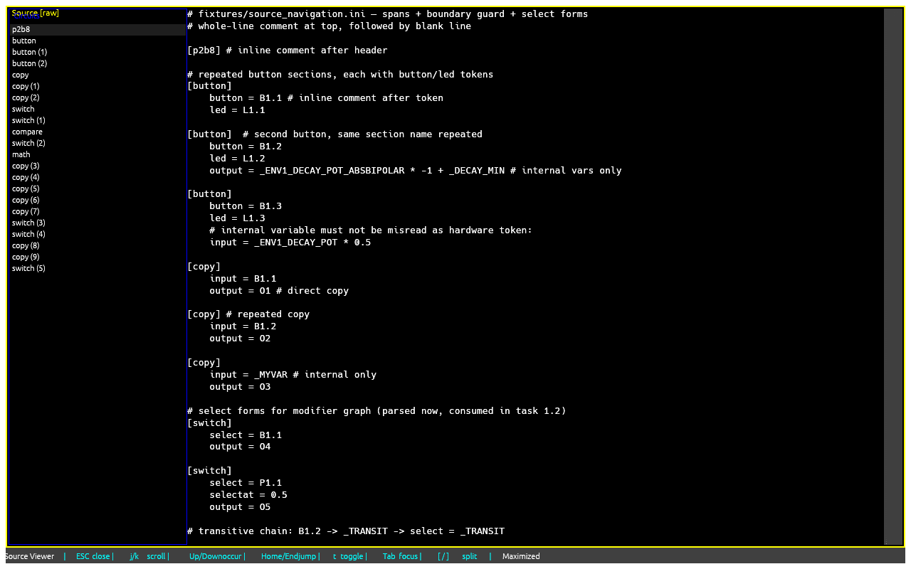
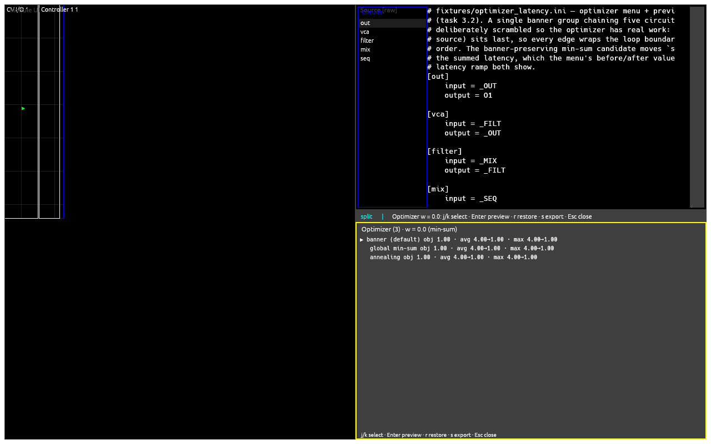

# droid_tui

A native desktop app for loading, inspecting, and interacting with
[DROID](https://dermannmitdermaschine.de) patch files (`.ini`) — without
touching the rack.

DROID patches are text, but they describe hardware: buttons, faders,
encoders, LEDs, CV ins and outs spread across controllers in a rack.
`droid_tui` shows you what a patch *does*: which physical controls it uses,
what the source says, how signals flow between circuits, and whether the
patch is valid — then sends it to the hardware over MIDI SysEx when you're
ready.

📖 Full user manual: [`docs/`](docs/README.md) — [getting
started](docs/getting-started.md), [views](docs/views.md),
[keys](docs/keys.md), [labels](docs/labels.md),
[uploading](docs/uploading.md), [configuration](docs/config.md),
[contributing](docs/contributing.md).

## ⚠️ DISCLAIMER — READ THIS FIRST

This software is **as-is, no responsibility whatever it causes you to do,
feel, or hear**. It talks to real synthesizer hardware. A wrong patch can
make very loud noises, very suddenly — protect your ears, your speakers,
and your nerves. Check levels before you upload, and never trust software
with your hearing.

That said: **participation is welcome**. Found a rough edge, missing
controller, or confusing view? [Open an
issue](https://github.com/moonstruxx/droid-buddy/issues) — pain points are
the roadmap.

## Screenshots

Rendered deterministically by the headless paint harness from fixed
fixtures, so what you see here is what the app draws.

### Module UI + source viewer


### Signal-flow graph


### Source viewer



### Latency optimizer



## What it does today

Curated from the capability specs under [`openspec/specs/`](openspec/specs/)
— the [manual](docs/README.md) has the full story.

- **Module UI** ([views](docs/views.md#module-ui)) — physical 1:1 faceplates
  of your controllers (P2B8, faderbank, …) with live element state, shift
  groups (`1`–`4`), and a modifier wash that recolors every cell a held or
  latched modifier influences. Click an element to *focus* it: the source
  viewer jumps to its occurrence and the graph highlights its signal path.
- **Source viewer** (`g v`, [views](docs/views.md#source-viewer-g-v)) —
  raw or prettified patch source with occurrence navigation, selection
  highlighting, and minimap.
- **Signal-flow graph** (`g g`,
  [views](docs/views.md#signal-flow-graph-g-g)) — circuits as nodes,
  virtual `_cable` connections as directed edges, banner groups as
  clusters; deterministic column layout by default, force solver on `h`,
  node dragging, topology-error highlighting, wiring-outlier detection.
- **Latency optimizer** (`g o`,
  [views](docs/views.md#latency-optimizer-g-o)) — proposes section
  reorderings that reduce forward-loop latency; preview, compare, export
  to `*-latopt.ini`.
- **Validation modal** (`e`,
  [views](docs/views.md#validation-modal-e)) — 9 schema-authoritative
  checks against the embedded DROID circuit schema; errors gate the load,
  warnings/hints still load.
- **Patch diff** (`g d`, then `d`,
  [views](docs/views.md#patch-diff-g-d-then-d)) — compare the loaded patch
  against a second one, colored on the graph.
- **Labels** ([labels](docs/labels.md)) — per-patch, per-shift-layer names
  for your controls plus per-circuit overrides, stored outside the `.ini`
  (your patch files are never modified).
- **Select-state menu** (`g s`,
  [views](docs/views.md#select-state-menu-g-s)) — assume `select` values
  and watch the graph reclassify; **dependency filter** (`f`) — isolate a
  node's upstream producers.
- **Upload to hardware** (`U`, [uploading](docs/uploading.md)) — one-way
  MIDI SysEx send (USB/DIN) with confirm modal and progress. Nothing is
  ever read back; component state stays simulated.
- **Configurable** ([config](docs/config.md)) — themes, label layers,
  latency costs, graph layout, rack geometry, plugin circuits
  (`config.toml` under `$XDG_CONFIG_HOME/droid-tui/`).

## What's next

Planned work is tracked as [GitHub
Issues](https://github.com/moonstruxx/droid-buddy/issues) and OpenSpec
changes under [`openspec/changes/`](openspec/changes/) — right now the
only active change is this documentation itself; everything else lives in
[`openspec/changes/archive/`](openspec/changes/archive/).

Tell us what hurts:

- **Missing controller or wrong faceplate?** Open an issue with the
  controller name and a photo/link — physical fidelity is the top
  priority.
- **Confusing view, key, or message?** Open an issue naming the surface
  and what you expected.
- **A feature you keep wishing for?** Open an issue describing the
  musical situation, not just the widget.

👉 [Open an issue](https://github.com/moonstruxx/droid-buddy/issues/new)
— one pain point per issue, with the patch (or a minimal version of it)
attached when possible.

## Build & run

```sh
git clone <repo> && cd droid_tui
git submodule update --init   # ext/droid-lsp: the circuit-schema source of truth
cargo build --release
./target/release/droid_tui [patch.ini]
```

With no argument the app opens an embedded demo patch. The picker (`l`)
loads any local `.ini`; per-patch labels live outside the patch files, so
trying things is safe.

## Contributing (short version)

Full onboarding: [docs/contributing.md](docs/contributing.md).

1. **Setup** — clone, `git submodule update --init`, `cargo build`.
2. **Four gates** — all must exit 0 before reporting completion:
   ```sh
   cargo fmt --check
   cargo clippy --all-targets --all-features --locked -- -D warnings
   cargo test
   cargo build --release --locked
   ```
3. **Derived docs rule** — `ARCHITECTURE.md` and `DESIGN.md` are
   *generated*, never hand-edit them. Regenerate via `/make-*`; flag stale
   wording in your report instead of patching inline.
4. **Workflow** — propose under `openspec/changes/`, implement, archive to
   `openspec/changes/archive/`, sync specs to `openspec/specs/`. Track all
   work with `bd` (beads): `bd ready`, `bd update <id> --claim`,
   `bd close <id> --reason` — no markdown TODO lists.

## Acknowledgements

Built with and on the shoulders of:

- [OpenCode](https://opencode.ai) — the agentic coding harness this
  project is developed in.
- [OMLX](https://github.com/moonstruxx/omlx) — shared agent infrastructure.
- [CortexAI](https://github.com/moonstruxx/cortex) — knowledge and memory
  layer.
- [OpenSpec](https://github.com/Fission-AI/OpenSpec) — the spec-driven
  change workflow (`openspec/`).
- [Unsloth](https://unsloth.ai) — efficient fine-tuning that powers the
  learned wiring-outlier detection tooling.

Plus the DROID community, whose patches are the real test suite.
