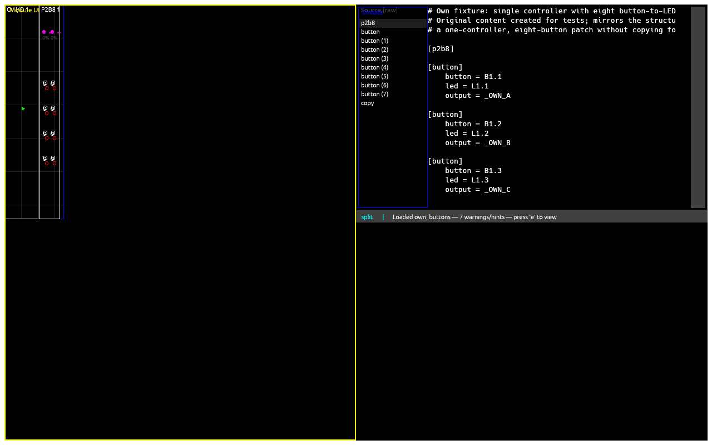
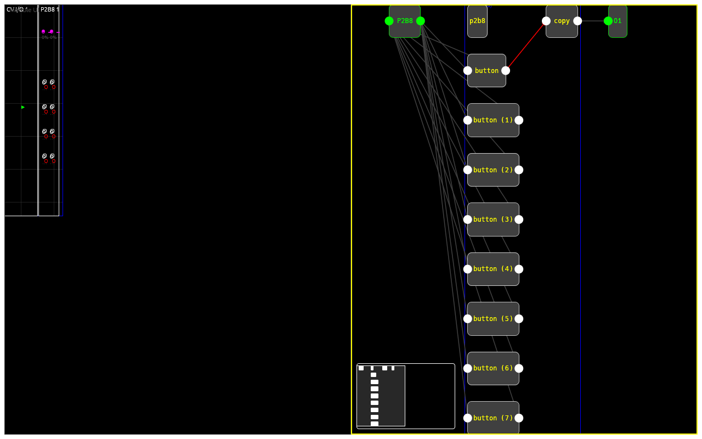

# Getting started

## What it is

`droid_tui` loads a DROID `.ini` patch and shows you what it does:
which hardware controls it uses, what the source says, how signals
flow between circuits, and whether the patch is valid. It can also
send the patch to DROID hardware over MIDI SysEx (see
[Uploading](uploading.md)).

It never edits your `.ini` files. Labels you assign are stored
separately per patch (see [Labels](labels.md)).

## Run it

```sh
cargo build --release
./target/release/droid_tui [patch.ini]
```

With no argument the app opens an embedded demo patch. (Full setup —
submodule, checks — is in [Contributing](contributing.md).)

## First five minutes

1. The app opens with the **Module UI** (left, big pane) and the
   **source viewer** (right, small pane).
   
2. Press `l` to open the file picker, navigate with `j`/`k`, and press
   `Enter` on an `.ini` file. The patch loads — or a validation modal
   tells you why it cannot (see [Views](views.md#validation-modal-e)).
3. Click a faceplate element (or hover it and press `Enter`/`Space` to
   toggle it). A click *focuses* the element: the source viewer jumps
   to its occurrence and the graph highlights its signal path. A click
   never toggles state — `Enter`/`Space` does that.
4. Press `g g` to open the **signal-flow graph** (big pane): circuits
   as nodes, virtual `_cable` connections as directed edges.
   
5. Press `?` any time for the key table of the focused view, and `q`
   to quit.

## Next steps

- [Views](views.md) — what each surface shows and how they link.
- [Keys](keys.md) — every binding, per view.
- [Labels](labels.md) — name your controls per shift layer.
- [Uploading](uploading.md) — send the patch to the rack.
- [Configuration](config.md) — themes, labels policy, layout mode.
